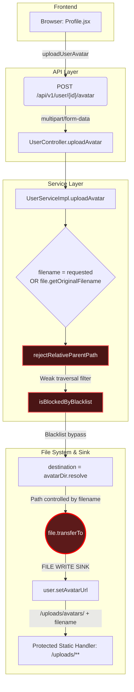

# FileUpload Vulnerability Flow
---

## 1. Kết luận nhanh cho FileUpload

| Thuộc tính         | Giá trị                                                                                                                                |
| ------------------ | -------------------------------------------------------------------------------------------------------------------------------------- |
| Entry point        | `POST /api/v1/user/{id}/avatar`                                                                                                        |
| Quyền truy cập     | `ROLE_USER` hoặc `ROLE_ADMIN`, và user chỉ upload cho chính mình nếu không phải admin                                                  |
| Source chính       | `MultipartFile file`, optional multipart field `filename`, `MultipartFile#getOriginalFilename()`                                       |
| Sink chính         | `file.transferTo(destination.toFile())`                                                                                                |
| Stored path        | `uploads/avatars/<filename>`                                                                                                           |
| Authenticated exposure | `/uploads/**` map thẳng tới `app.upload-dir`, anonymous bị chặn nhưng user/admin có JWT vẫn fetch được static file theo URL        |
| Lỗi blacklist      | Chỉ chặn đuôi file bằng `filename.endsWith(...)`, case-sensitive, không whitelist MIME/extension ảnh                                   |
| Lỗi path traversal | Dùng regex yếu để chặn `../`, sau đó `avatarDir.resolve(filename)` mà không `normalize()` + `startsWith(avatarDir)` trước khi ghi file |

> **Nhận định:** đây là vulnerable flow hoàn chỉnh: attacker điều khiển filename/file content, backend dùng filename đó để build path ghi file, blacklist không đủ mạnh, traversal filter có bypass, file được ghi vào upload root có route tĩnh được bảo vệ bằng JWT hoặc thoát khỏi `/avatars`.

---

## 2. Sơ đồ dữ liệu tổng quát



---

## 3. Hướng 1 - Truy vết từ sink đến source

### 3.0. Fuzz dangerous function để tìm sink candidate

Trước khi lần ngược về input, hướng sink -> source bắt đầu bằng bước fuzz/tìm kiếm các dangerous function. Mục tiêu là không đoán endpoint trước, mà quét các API có khả năng tạo tác động nguy hiểm rồi mới chọn sink thật để truy dataflow.

| Nhóm dangerous function | Pattern fuzz trong code | Candidate tìm thấy | Kết luận |
| --- | --- | --- | --- |
| File write từ upload | `transferTo`, `Files.write`, `Files.copy`, `Files.move` | `file.transferTo(destination.toFile())` trong `UserServiceImpl.uploadAvatar` | Sink chính của FileUpload |
| Path construction | `Path.resolve`, `Paths.get`, `new File` | `avatarDir.resolve(filename)` | Path phụ thuộc filename |
| Static exposure | `addResourceHandler`, `requestMatchers("/uploads/**")` | `WebConfig.addResourceHandlers`, `WebSecurityConfig` | File dưới upload root có HTTP route được bảo vệ bằng JWT |
| Filename source helper | `getOriginalFilename`, `@RequestParam("filename")` | `resolveUploadFilename(...)`, `UserController.uploadAvatar(...)` | Tìm được input điều khiển path |

Trình tự phân tích sink -> source trong report này:

1. Fuzz dangerous function để lấy danh sách sink candidate.
2. Chọn sink có tác động thật: `transferTo(...)`.
3. Lần ngược biến path: `destination` <- `avatarDir.resolve(filename)`.
4. Lần ngược sanitizer: `rejectRelativeParentPath(...)`, `isBlockedByBlacklist(...)`.
5. Lần ngược source: `requestedFilename` hoặc `file.getOriginalFilename()`.
6. Xác nhận entry point: `POST /api/v1/user/{id}/avatar`.
7. Xác nhận exposure sau ghi: `/uploads/**` cần JWT nhưng không có owner-check ở resource-handler layer.

### 3.1. Bắt đầu từ sink ghi file

**File:** `src/main/java/org/example/serviceImpl/UserServiceImpl.java`

```java
Path avatarDir = Paths.get(uploadDir, "avatars").toAbsolutePath().normalize();
Files.createDirectories(avatarDir);

String filename = resolveUploadFilename(file, requestedFilename);

rejectRelativeParentPath(filename, "Filename cannot contain ../");
if (isBlockedByBlacklist(filename)) {
    throw new IllegalArgumentException("This file type is not allowed");
}

Path destination = avatarDir.resolve(filename);       // [SINK-ADJACENT]
if (destination.getParent() != null) {
    Files.createDirectories(destination.getParent());  // [PATH WRITE PREP]
}

file.transferTo(destination.toFile());                // [SINK]
user.setAvatarUrl("/uploads/avatars/" + filename);    // [STORED OUTPUT]
```

| Dòng phân tích                | Ý nghĩa                                                                                                            |
| ----------------------------- | ------------------------------------------------------------------------------------------------------------------ |
| `avatarDir`                   | Base directory hợp lệ được normalize: `uploads/avatars` hoặc `/app/uploads/avatars` trong Docker                   |
| `filename`                    | Không phải server-generated; đến từ request hoặc `OriginalFilename`                                                |
| `rejectRelativeParentPath`    | Có kiểm tra traversal nhưng regex yếu (`Pattern.compile("(^\|/)\\.\\./(?!/)")`)                                    |
| `isBlockedByBlacklist`        | Chỉ blacklist một số đuôi nguy hiểm, không whitelist ảnh (`".exe", ".bat", ".cmd", ".sh", ".jar", ".jsp", ".xml"`) |
| `avatarDir.resolve(filename)` | Nếu `filename` chứa traversal/absolute path, path đích bị attacker ảnh hưởng                                       |
| `transferTo(...)`             | Sink ghi file thật lên filesystem                                                                                  |
| `setAvatarUrl(...)`           | Lưu URL dựa trên filename không chuẩn hóa                                                                          |

### 3.2. Kiểm tra path construction

```java
Path destination = avatarDir.resolve(filename);
```

Điểm cần đánh dấu khi review:

- Không gọi `normalize()` trên `destination` trước khi ghi file.
- Không kiểm tra `destination.startsWith(avatarDir)`.
- Không ép filename về basename bằng `Paths.get(filename).getFileName()`.
- Không tự sinh tên file server-side.
- Không giới hạn thư mục con hợp lệ dưới `avatars`.

Ví dụ logic fix đã được comment ngay dưới sink:

```java
String extension = getSafeImageExtension(contentType);
String safeFilename = UUID.randomUUID() + extension;
Path destination = avatarDir.resolve(safeFilename).normalize();
if (!destination.startsWith(avatarDir)) {
    throw new IllegalArgumentException("Invalid upload path");
}

file.transferTo(destination.toFile());
user.setAvatarUrl("/uploads/avatars/" + safeFilename);
```

### 3.3. Truy ngược validation blacklist

```java
private static final Set<String> BLOCKED_FILE_EXTENSIONS = Set.of(
        ".exe",
        ".bat",
        ".cmd",
        ".sh",
        ".jar",
        ".jsp",
        ".xml");

private boolean isBlockedByBlacklist(String filename) {
    return BLOCKED_FILE_EXTENSIONS.stream().anyMatch(filename::endsWith);
}
```

| Vấn đề                            | Vì sao nguy hiểm                                                                                                   |
| --------------------------------- | ------------------------------------------------------------------------------------------------------------------ |
| Blacklist thay vì whitelist       | File không nằm trong danh sách chặn vẫn được ghi, ví dụ `.html`, `.svg`, `.php`, `.phtml`, hoặc định dạng polyglot |
| `endsWith` case-sensitive         | `.JSP`, `.Xml`, `.Sh` không khớp blacklist hiện tại                                                                |
| Không kiểm tra MIME thật          | `file.getContentType()` không được dùng; magic bytes cũng không được kiểm tra                                      |
| Không tách extension cuối an toàn | Tên kiểu nhiều đuôi có thể bypass filter nếu đuôi cuối không bị blacklist                                          |
| Không đổi tên file                | Attacker giữ nguyên tên file và cấu trúc path                                                                      |

### 3.4. Truy ngược validation path traversal

```java
private static final Pattern OBVIOUS_PARENT_TRAVERSAL =
        Pattern.compile("(^|/)\\.\\./(?!/)");

private void rejectRelativeParentPath(String value, String message) {
    if (OBVIOUS_PARENT_TRAVERSAL.matcher(value).find()) {
        throw new IllegalArgumentException(message);
    }
}
```

| Dấu hiệu                     | Kết luận                                                              |
| ---------------------------- | --------------------------------------------------------------------- |
| Regex chỉ nhìn dấu `/`       | Không xử lý separator khác trong một số môi trường                    |
| Pattern có `(?!/)` sau `../` | Chặn `../file`, nhưng có thể bỏ sót dạng separator lặp như `..//file` |
| Không normalize sau filter   | Filesystem vẫn có thể resolve parent segment khi ghi                  |
| Không so sánh với root thật  | Không có invariant `finalPath.startsWith(avatarDir)`                  |

Comment fix hiện có trong code đã nêu đúng hướng:

```java
private static final Pattern OBVIOUS_PARENT_TRAVERSAL =
        Pattern.compile("(^|[\\\\/])\\.\\.(?:[\\\\/]+|$)");
```

Tuy nhiên, regex chỉ nên là lớp phụ. Fix chính vẫn là:

```java
Path destination = avatarDir.resolve(safeFilename).normalize();
if (!destination.startsWith(avatarDir)) {
    throw new IllegalArgumentException("Invalid upload path");
}
```

### 3.5. Truy ngược source filename

```java
private String resolveUploadFilename(MultipartFile file, String requestedFilename) {
    if (requestedFilename != null && !requestedFilename.isBlank()) {
        return requestedFilename.trim();       // [SOURCE-1] multipart field "filename"
    }
    return file.getOriginalFilename();         // [SOURCE-2] client-controlled original filename
}
```

| Source                       | Điều khiển bởi ai                     | Ghi chú                                            |
| ---------------------------- | ------------------------------------- | -------------------------------------------------- |
| `requestedFilename`          | Client gửi multipart field `filename` | UI hiện tại không gửi, nhưng API backend vẫn nhận  |
| `file.getOriginalFilename()` | Client multipart upload               | Không đáng tin; có thể chứa tên lạ/path tùy client |

### 3.6. Truy ngược controller endpoint

**File:** `src/main/java/org/example/controller/UserController.java`

```java
@PostMapping(value = "/{id}/avatar", consumes = MediaType.MULTIPART_FORM_DATA_VALUE)
public ResponseEntity<?> uploadAvatar(@PathVariable Integer id,
                                      @RequestParam("file") MultipartFile file,
                                      @RequestParam(value = "filename", required = false) String filename,
                                      Authentication authentication) {
    try {
        if (!canAccessUser(authentication, id)) {
            return ResponseEntity.status(403).body("Forbidden");
        }
        User user = userService.uploadAvatar(id, file, filename);
        return ResponseEntity.ok().body(user);
    }
}
```

| Điểm đọc | Kết luận |
| --- | --- |
| `@RequestParam("file") MultipartFile file` | Source file content |
| `@RequestParam(value = "filename", required = false)` | Source filename trực tiếp, dù UI không dùng |
| `canAccessUser(authentication, id)` | Giới hạn user upload avatar của chính mình hoặc admin |
| `userService.uploadAvatar(...)` | Data đi vào service sink không qua normalize/allowlist ở controller |

### 3.7. Truy ngược authenticated exposure

**File:** `src/main/java/org/example/config/WebConfig.java`

```java
Path uploadPath = Paths.get(uploadDir).toAbsolutePath().normalize();
registry.addResourceHandler("/uploads/**")
        .addResourceLocations(uploadPath.toUri().toString());
```

**File:** `src/main/java/org/example/security/WebSecurityConfig.java`

```java
.requestMatchers("/v3/**", "/swagger-ui/**", "/swagger-ui", "/swagger-ui.html").permitAll()
.requestMatchers("/uploads/**").hasAnyRole("USER", "ADMIN")
```

**File:** `frontend/src/services/api.js`

```js
export const getProtectedUpload = (url) => {
  const token = localStorage.getItem('token');
  return axios.get(resolveUploadUrl(url), {
    responseType: 'blob',
    headers: token ? { Authorization: `Bearer ${token}` } : {},
  });
};
```

**File:** `frontend/src/hooks/useProtectedUploadUrl.js`

```js
return url.startsWith('/uploads/') || url.includes('/uploads/');
```

| Ý nghĩa                                | Tác động |
| -------------------------------------- | -------- |
| `/uploads/**` map tới `app.upload-dir` | File ghi dưới upload root vẫn có HTTP route tĩnh |
| `/uploads/**` yêu cầu `hasAnyRole("USER", "ADMIN")` | Anonymous không xem được file upload nữa |
| Không có owner-check ở static resource handler | User đã đăng nhập có thể request file nếu biết URL |
| Frontend dùng `getProtectedUpload(...)` | Avatar/QR dưới `/uploads/**` được fetch bằng JWT rồi render qua blob URL |
| `avatarUrl` lưu relative URL | DB vẫn lưu đường dẫn dựa trên filename không chuẩn hóa |

---

## 5. Hướng 2 - Truy vết từ source đến sink

### 5.1. Source bình thường từ UI profile

**File:** `frontend/src/pages/Profile.jsx`

```jsx
const handleAvatarChange = async (e) => {
  const file = e.target.files?.[0];       // [SOURCE] file từ input browser
  e.target.value = '';

  if (!file) {
    return;
  }
  if (file.size > 5 * 1024 * 1024) {      // [CLIENT CHECK] chỉ size, không đủ bảo vệ server
    toast.error('Ảnh đại diện không được vượt quá 5MB');
    return;
  }

  const response = await uploadUserAvatar(user.id, file);
};

<input
  type="file"
  className="hidden"
  onChange={handleAvatarChange}
  disabled={avatarUploading}
/>
```

| Điểm đọc                    | Kết luận                                                                               |
| --------------------------- | -------------------------------------------------------------------------------------- |
| `type="file"`               | Người dùng chọn file ở browser                                                         |
| Check size ở client         | Có thể bypass bằng request trực tiếp; server chỉ dựa vào multipart max-size            |
| Không có `accept="image/*"` | UI không tự hạn chế ảnh, nhưng kể cả có cũng không phải boundary bảo mật               |
| Không gửi `filename`        | Flow bình thường dùng `OriginalFilename`; attacker vẫn có thể tự thêm field `filename` |

### 5.2. Source đi qua API client

**File:** `frontend/src/services/api.js`

```js
export const uploadUserAvatar = (userId, file) => {
  const formData = new FormData();
  formData.append('file', file);           // [SOURCE] multipart part "file"

  return api.post(`/user/${userId}/avatar`, formData);
};
```

| Điểm đọc | Kết luận |
| --- | --- |
| `FormData.append('file', file)` | Browser gửi filename mặc định của file |
| Không set `filename` field | UI sạch, nhưng backend vẫn expose parameter optional |
| `api` tự gắn JWT | Endpoint yêu cầu auth |

### 5.3. Source tới controller binding

```java
@RequestParam("file") MultipartFile file,
@RequestParam(value = "filename", required = false) String filename
```

Tại đây có hai nguồn input:
1. `file`: nội dung file và original filename.
2. `filename`: field multipart tùy ý nếu attacker gửi request thủ công.

### 5.4. Controller chuyển nguyên input xuống service

```java
User user = userService.uploadAvatar(id, file, filename);
```

Không có bước nào ở controller để:

- ép filename về basename;
- whitelist MIME/extension;
- sinh tên file mới;
- normalize path;
- chặn absolute path;
- kiểm tra final path còn nằm trong `avatarDir`.

### 5.5. Service nhận source và quyết định filename

```java
String filename = resolveUploadFilename(file, requestedFilename);
```

Luồng rẽ nhánh:

| Nhánh | Điều kiện | Filename dùng để ghi |
| --- | --- | --- |
| `requestedFilename` | Multipart có field `filename` không rỗng | `requestedFilename.trim()` |
| `OriginalFilename` | Không có field `filename` | `file.getOriginalFilename()` |

### 5.6. Validation không cắt được dữ liệu nguy hiểm

```java
rejectRelativeParentPath(filename, "Filename cannot contain ../");
if (isBlockedByBlacklist(filename)) {
    throw new IllegalArgumentException("This file type is not allowed");
}
```

| Dạng kiểm tra           | Có                                                                 | Thiếu                                                          |
| ----------------------- | ------------------------------------------------------------------ | -------------------------------------------------------------- |
| Chặn một vài extension  | Có blacklist `.exe`, `.bat`, `.cmd`, `.sh`, `.jar`, `.jsp`, `.xml` | Không whitelist ảnh                                            |
| Chặn traversal đơn giản | Có regex cho một số dạng `../`                                     | Không normalize, không `startsWith`, bypass được separator lặp |
| Chặn content độc hại    | Không                                                              | Không kiểm tra MIME thật/magic bytes                           |
| Chặn filename đặc biệt  | Không đầy đủ                                                       | Không reject absolute path, control chars, reserved names      |

### 5.7. Input chạm sink

```java
Path destination = avatarDir.resolve(filename);
file.transferTo(destination.toFile());
```

Từ góc nhìn source-to-sink, đây là điểm xác nhận lỗ hổng:

- Source `filename` vẫn giữ quyền điều khiển path.
- Sink `transferTo` nhận `destination` bị ảnh hưởng bởi source.
- Không có sanitizer mạnh nằm giữa source và sink.

### 5.8. Output được lưu và serve qua protected upload route

```java
user.setAvatarUrl("/uploads/avatars/" + filename);
return userRepository.save(user);
```

Sau ghi file:

- DB lưu `avatarUrl`.
- Profile render avatar bằng URL đó.
- Static route `/uploads/**` hiện yêu cầu JWT; file nằm dưới `app.upload-dir` không còn public anonymous nhưng vẫn được serve theo URL cho user/admin đã đăng nhập.

---

## 6. Hai biến thể phát hiện chính

### 6.1. Blacklist bypass

| Bước review | Dấu hiệu |
| --- | --- |
| Tìm extension policy | `BLOCKED_FILE_EXTENSIONS` là blacklist |
| Tìm cách so sánh | `filename::endsWith`, case-sensitive |
| Tìm allowlist ảnh | Không có `ALLOWED_IMAGE_TYPES`, không có `getSafeImageExtension` thật |
| Tìm server-generated filename | Không có `UUID.randomUUID()` trong code chạy thật |
| Tìm content validation | Không kiểm tra MIME/magic bytes |

Kết luận phát hiện:

```text
Nếu chỉ blacklist một số đuôi và vẫn cho client quyết định filename,
thì reviewer đánh dấu FileUpload blacklist bypass.
```

### 6.2. Path traversal

| Bước review | Dấu hiệu |
| --- | --- |
| Tìm nơi ghép path | `avatarDir.resolve(filename)` |
| Tìm sanitizer | Regex `OBVIOUS_PARENT_TRAVERSAL` |
| Kiểm tra normalize | Không có `destination.normalize()` trước `transferTo` |
| Kiểm tra boundary | Không có `destination.startsWith(avatarDir)` |
| Kiểm tra absolute path | Không reject filename absolute |
| Kiểm tra parent mkdir | `Files.createDirectories(destination.getParent())` có thể chuẩn bị thư mục theo path attacker chọn |

Kết luận phát hiện:

```text
Nếu attacker-controlled filename đi vào Path.resolve(...) rồi transferTo(...)
mà không có normalize + startsWith(baseDir), đánh dấu arbitrary file write/path traversal.
```

---

## 7. Checklist tái rà soát FileUpload

- [x] Tìm tất cả `MultipartFile`, `transferTo`, `Files.write`, `Files.copy`.
- [x] Xác định source: `file`, `filename`, `getOriginalFilename()`.
- [x] Xác định sink: `file.transferTo(destination.toFile())`.
- [x] Kiểm tra path building: `avatarDir.resolve(filename)`.
- [x] Kiểm tra sanitizer: regex yếu, không normalize boundary.
- [x] Kiểm tra file type policy: blacklist thay vì whitelist.
- [x] Kiểm tra authenticated serving: `/uploads/**` yêu cầu `hasAnyRole("USER", "ADMIN")`, không còn `permitAll` nhưng vẫn là static file route.
- [x] Kiểm tra stored output: `user.avatarUrl`.
- [x] Đối chiếu comment fix code ngay dưới sink.

---

## 8. Code fix tham chiếu từ comment hiện có

Code comment hiện tại trong `UserServiceImpl` đã nêu hướng fix đúng. Khi chuyển sang code thật, nên gom thành các invariant bắt buộc:

```java
String contentType = file.getContentType();
if (contentType == null ||
        !ALLOWED_IMAGE_TYPES.contains(contentType.toLowerCase(Locale.ROOT))) {
    throw new IllegalArgumentException("Only images are allowed");
}

String extension = getSafeImageExtension(contentType);
String safeFilename = UUID.randomUUID() + extension;

Path avatarDir = Paths.get(uploadDir, "avatars").toAbsolutePath().normalize();
Path destination = avatarDir.resolve(safeFilename).normalize();
if (!destination.startsWith(avatarDir)) {
    throw new IllegalArgumentException("Invalid upload path");
}

file.transferTo(destination.toFile());
user.setAvatarUrl("/uploads/avatars/" + safeFilename);
```

Checklist fix tối thiểu:

- [ ] Không dùng `requestedFilename` hoặc `getOriginalFilename()` làm stored filename.
- [ ] Dùng whitelist MIME/extension ảnh.
- [ ] Sinh filename server-side bằng UUID/random.
- [ ] Normalize final path.
- [ ] Bắt buộc final path nằm trong `avatarDir`.
- [ ] Giới hạn kích thước ở server.
- [ ] Cân nhắc strip metadata và re-encode ảnh nếu đây là production flow.

---

## 9. File và dòng quan trọng

| File | Dòng | Vai trò |
| --- | ---: | --- |
| `frontend/src/pages/Profile.jsx` | 230-263 | UI source: chọn file và gọi upload |
| `frontend/src/services/api.js` | 75-87 | API source: tạo multipart form và fetch protected upload bằng blob + Authorization |
| `frontend/src/hooks/useProtectedUploadUrl.js` | 4-53 | Nhận diện `/uploads/**` và chuyển protected file thành blob URL cho UI |
| `frontend/src/hooks/useProtectedUploadHtml.js` | 5-51 | Thay `img[src]` trỏ `/uploads/**` trong HTML SSR bằng blob URL có Authorization |
| `src/main/java/org/example/controller/UserController.java` | 142-158 | Backend source: bind multipart `file` và optional `filename` |
| `src/main/java/org/example/serviceImpl/UserServiceImpl.java` | 32-40 | Blacklist extension + regex traversal yếu |
| `src/main/java/org/example/serviceImpl/UserServiceImpl.java` | 98-151 | Core vulnerable upload flow |
| `src/main/java/org/example/serviceImpl/UserServiceImpl.java` | 154-168 | Helper blacklist/source filename/traversal filter |
| `src/main/java/org/example/config/WebConfig.java` | 31-35 | Static handler `/uploads/**` |
| `src/main/java/org/example/security/WebSecurityConfig.java` | 81-96 | `/uploads/**` yêu cầu user/admin, avatar upload cũng yêu cầu user/admin |
| `src/main/resources/application.properties` | 17, 27-28 | Upload dir + multipart max size |
| `docker-compose.yml` | 39, 52 | Docker upload dir `/app/uploads` mounted to `./uploads` |

---

## 10. Final reviewer note

FileUpload flow này không chỉ là "cho upload file sai đuôi". Điểm nguy hiểm nằm ở tổ hợp:

1. client kiểm soát filename;
2. blacklist yếu;
3. traversal filter yếu;
4. `Path.resolve(filename)` không kiểm tra boundary;
5. `transferTo` ghi file thật;
6. `/uploads/**` được serve qua static route cho user/admin đã đăng nhập, không có owner-check theo từng file.

Vì vậy khi trình bày trong báo cáo whitebox, nên đánh dấu sink tại `transferTo(...)`, source tại `@RequestParam filename` / `getOriginalFilename()`, và invariant bị thiếu là:

```text
finalPath = avatarDir.resolve(serverGeneratedSafeName).normalize()
finalPath must start with avatarDir
```
